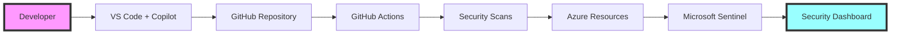

# 🛡️ Secure Code AI Development Workshop

> **Transform your development process with AI-powered security practices and DevSecOps automation**

[](https://github.com/paulasilvatech/Secure-Code-AI-Dev)
[](https://azure.microsoft.com)
[](https://opensource.org/licenses/MIT)


## 📋 Table of Contents

- [Overview](#-overview)
- [Features](#-features)
- [Learning Path](#-learning-path)
- [Prerequisites](#-prerequisites)
- [Quick Start](#-quick-start)
- [Architecture](#-architecture)
- [Modules](#-modules)
- [Resources](#-resources)
- [Contributing](#-contributing)
- [Related Projects](#-related-projects)
- [Support](#-support)
- [License](#-license)

## 🎯 Overview

The **Secure Code AI Development Workshop** is a comprehensive 19-hour training program that teaches developers, security engineers, and DevOps professionals how to build secure applications using AI-powered tools, GitHub Advanced Security, and modern DevSecOps practices.

### Why This Workshop?

- 🚀 **80% reduction** in security vulnerabilities through shift-left practices
- ⚡ **50% faster** secure development using AI tools
- 🤖 **30+ hours saved** per sprint through security automation
- 🏢 **Enterprise-ready** security across multi-cloud environments
- 📊 **Real-time visibility** with comprehensive security dashboards

## ✨ Features

### 🔐 Security-First Development
- Shift-left security integration
- AI-powered vulnerability prevention
- Automated security scanning
- Real-time threat detection

### 🤖 AI-Enhanced Workflows
- GitHub Copilot for secure coding
- Automated code remediation
- Intelligent security agents
- ML-based threat analysis

### ☁️ Multi-Cloud Security
- Azure-native security services
- Cross-cloud security policies
- Unified compliance management
- Centralized monitoring

### 📊 Comprehensive Monitoring
- Microsoft Sentinel SIEM/SOAR
- Custom security dashboards
- Automated incident response
- Security metrics and KPIs

## 📚 Learning Path


### 🎓 Three Learning Tracks

#### 🔵 Foundation Track (Modules 1-3) - 4 hours
Build core security knowledge and set up your environment

#### 🟢 AI-Powered Track (Modules 4-6) - 6 hours
Leverage AI tools for secure development and automation

#### 🟣 Enterprise Track (Modules 7-10) - 9 hours
Implement advanced security patterns and monitoring

## 🛠️ Prerequisites

### Technical Requirements
- **Operating System**: Windows 10/11, macOS, or Linux
- **Hardware**: 8GB RAM minimum, 20GB free disk space
- **Internet**: Stable connection for cloud services

### Software Requirements
```bash
# Required tools
- VS Code (latest version)
- Docker Desktop
- Git 2.30+
- Node.js 18+ and npm
- Python 3.8+
- Azure CLI
- GitHub CLI
```

### Accounts Needed
- [ ] GitHub account with Advanced Security access
- [ ] Azure subscription (free tier works)
- [ ] GitHub Copilot subscription
- [ ] Docker Hub account

## 🚀 Quick Start

### 1. Clone the Repository
```bash
git clone https://github.com/paulasilvatech/Secure-Code-AI-Dev.git
cd Secure-Code-AI-Dev
```

### 2. Run Setup Script
```bash
# For macOS/Linux
./scripts/setup-workshop.sh

# For Windows
.\scripts\setup-workshop.ps1
```

### 3. Verify Installation
```bash
# Check all tools are installed
./scripts/verify-setup.sh
```

### 4. Start Learning
Navigate to [Module 1: Shift-Left Security Fundamentals](modules/module-01-shift-left.md) to begin!

## 🏗️ Architecture

The workshop implements a complete end-to-end security pipeline:



## 📖 Modules

### Module 1: Shift-Left Security Fundamentals
**Duration**: 1.5 hours | **Level**: Beginner

Learn the principles of integrating security early in development.

**Key Topics**:
- Security-first mindset
- Cost of late-stage fixes
- DevSecOps culture
- Pre-commit security hooks

[📘 View Module](modules/module-01-shift-left.md) | [📁 Resources](resources/module-01-shift-left/)

---

### Module 2: GitHub Advanced Security (GHAS)
**Duration**: 1 hour | **Level**: Beginner

Master GitHub's built-in security features.

**Key Topics**:
- Code scanning setup
- Secret detection
- Dependency reviews
- Security policies

[📘 View Module](modules/module-02-ghas.md) | [📁 Resources](resources/module-02-ghas/)

---

### Module 3: Security Environment Setup
**Duration**: 1.5 hours | **Level**: Intermediate

Configure a complete security development environment.

**Key Topics**:
- VS Code security extensions
- Security tools installation
- Cloud environment setup
- Integration testing

[📘 View Module](modules/module-03-environment-setup.md) | [📁 Resources](resources/module-03-environment-setup/)

---

### Module 4: AI-Powered Secure Coding
**Duration**: 2 hours | **Level**: Intermediate

Use GitHub Copilot for secure code generation.

**Key Topics**:
- Security-focused prompts
- AI vulnerability prevention
- Secure code patterns
- Copilot best practices

[📘 View Module](modules/module-04-copilot.md) | [📁 Resources](resources/module-04-copilot/)

---

### Module 5: Container Security & DevSecOps
**Duration**: 2 hours | **Level**: Intermediate

Secure containerized applications with DevSecOps.

**Key Topics**:
- Container security scanning
- Secure CI/CD pipelines
- Kubernetes security
- Microsoft Defender integration

[📘 View Module](modules/module-05-container.md) | [📁 Resources](resources/module-05-container/)

---

### Module 6: Agentic AI for Security
**Duration**: 2 hours | **Level**: Advanced

Build AI agents for security automation.

**Key Topics**:
- Security agent architecture
- Automated threat response
- Agent orchestration
- Intelligent workflows

[📘 View Module](modules/module-06-agentic.md) | [📁 Resources](resources/module-06-agentic/)

---

### Module 7: Multi-Cloud Security
**Duration**: 2 hours | **Level**: Advanced

Implement security across cloud providers.

**Key Topics**:
- Cross-cloud architecture
- Unified security policies
- Multi-cloud compliance
- Centralized monitoring

[📘 View Module](modules/module-07-multicloud.md) | [📁 Resources](resources/module-07-multicloud/)

---

### Module 8: Microsoft Sentinel Integration
**Duration**: 2.5 hours | **Level**: Advanced

Deploy enterprise SIEM/SOAR with Sentinel.

**Key Topics**:
- Sentinel workspace setup
- Detection rules creation
- Incident automation
- Threat hunting

[📘 View Module](modules/module-08-sentinel.md) | [📁 Resources](resources/module-08-sentinel/)

---

### Module 9: Security Dashboards
**Duration**: 2 hours | **Level**: Intermediate

Create comprehensive security visualizations.

**Key Topics**:
- Dashboard design
- Security metrics
- Compliance reporting
- Executive dashboards

[📘 View Module](modules/module-09-dashboards.md) | [📁 Resources](resources/module-09-dashboards/)

---

### Module 10: Advanced Security Patterns
**Duration**: 2.5 hours | **Level**: Expert

Master enterprise security patterns.

**Key Topics**:
- Zero-trust architecture
- Advanced threat modeling
- Security at scale
- Enterprise patterns

[📘 View Module](modules/module-10-advanced.md) | [📁 Resources](resources/module-10-advanced/)

## 📁 Resources

### 📂 Repository Structure
```
Secure-Code-AI-Dev/
├── 📁 assets/          # Images and diagrams
├── 📁 docs/            # Documentation
├── 📁 modules/         # 10 workshop modules
├── 📁 resources/       # Module-specific resources
│   ├── common/         # Shared resources
│   └── module-*/       # Per-module resources
├── 📁 scripts/         # Setup and utility scripts
├── 📁 templates/       # Project templates
└── 📄 README.md        # This file
```

### 🔧 Available Tools
- **Security Scanners**: Trivy, Semgrep, Bandit
- **Container Security**: Defender, Falco, OPA
- **Cloud Security**: Sentinel, Azure Policy
- **Monitoring**: Grafana, Prometheus

### 📚 Documentation
- [Workshop Overview](docs/secure-code-ai-workshop.md)
- [Quick Start Guide](docs/QUICK_START.md)
- [Modules Overview](docs/modules-overview.md)
- [Workshop Summary](docs/workshop-summary.md)
- [FAQ](docs/workshop-faq.md)

## 🤝 Contributing

We welcome contributions! Please see our [Contributing Guidelines](CONTRIBUTING.md) for details.

### How to Contribute
1. Fork the repository
2. Create a feature branch (`git checkout -b feature/AmazingFeature`)
3. Commit your changes (`git commit -m 'Add some AmazingFeature'`)
4. Push to the branch (`git push origin feature/AmazingFeature`)
5. Open a Pull Request

## 🔗 Related Projects

Explore our complete AI development ecosystem:

### 🤖 [AI Code Development](https://github.com/paulasilvatech/AI-Code-Development)
Comprehensive guide to AI-powered software development with Copilot and ChatGPT.

### 🛡️ [Secure Code AI Development](https://github.com/paulasilvatech/Secure-Code-AI-Dev) *(This Workshop)*
Build secure applications with AI-powered tools and DevSecOps.

### 🚀 [Agentic Operations](https://github.com/paulasilvatech/Agentic-Ops)
Autonomous AI agents for IT operations and infrastructure management.

### 🎨 [Design to Code Development](https://github.com/paulasilvatech/Design-to-Code-Dev)
Transform designs into production-ready code using AI tools.

### 🖼️ [Figma to Code Development](https://github.com/paulasilvatech/Figma-to-Code-Dev)
Convert Figma designs directly into clean, maintainable code.

## 📞 Support

### Get Help
- 💬 [GitHub Discussions](https://github.com/paulasilvatech/Secure-Code-AI-Dev/discussions)
- 🐛 [Issue Tracker](https://github.com/paulasilvatech/Secure-Code-AI-Dev/issues)
- 📧 Email: workshop@secureaidev.com
- 🌐 [Documentation Site](https://secureaidev.com/docs)

### Community
- Join our [Discord Server](https://discord.gg/secureaidev)
- Follow us on [Twitter](https://twitter.com/secureaidev)
- Subscribe to our [YouTube Channel](https://youtube.com/@secureaidev)

## 📄 License

This project is licensed under the MIT License - see the [LICENSE](LICENSE) file for details.

---

<div align="center">

### 🌟 Star this repository if you find it helpful!

**Built with ❤️ by the Secure AI Development Team**

[Website](https://secureaidev.com) • [Blog](https://blog.secureaidev.com) • [Twitter](https://twitter.com/secureaidev)

</div> 