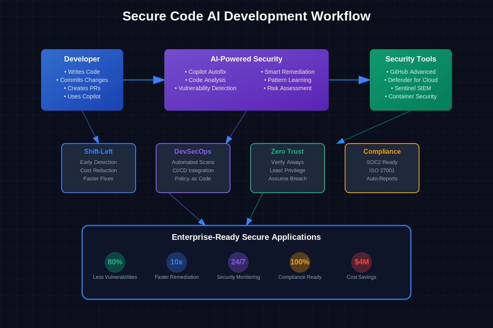
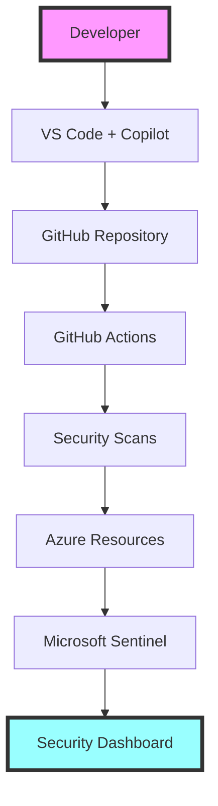

# 🛡️ Secure Code AI Development Workshop

Welcome to the **Secure Code AI Development Workshop** - your comprehensive guide to building secure applications with AI-powered tools and DevSecOps practices!



## 🎯 Workshop Overview

This hands-on workshop teaches you how to integrate security throughout the software development lifecycle using AI tools, GitHub Advanced Security, and Azure cloud services. Perfect for developers, security engineers, and DevOps professionals looking to enhance their security practices.

## 📊 Key Outcomes



## 🚀 What You'll Learn

- **AI-Powered Security**: Leverage GitHub Copilot for secure code generation
- **Shift-Left Security**: Implement security from the first line of code
- **DevSecOps Automation**: Build automated security pipelines
- **Cloud Security**: Deploy secure infrastructure on Azure
- **Container Security**: Secure containerized applications
- **Multi-Cloud Strategies**: Implement security across cloud providers
- **Compliance Automation**: Automate security compliance checks
- **Advanced Monitoring**: Set up comprehensive security monitoring

## 📚 Learning Path

### Module 1: [Shift-Left Security Fundamentals](modules/module-01-shift-left.md)
Learn the principles of integrating security early in the development process.

### Module 2: [GitHub Advanced Security (GHAS)](modules/module-02-ghas.md)
Master GitHub's built-in security features for code scanning and secret detection.

### Module 3: [Setting Up Your Security Environment](modules/module-03-environment-setup.md)
Configure a complete security development environment with tools and extensions.

### Module 4: [AI-Powered Secure Coding with GitHub Copilot](modules/module-04-copilot.md)
Use AI to generate secure code and avoid common vulnerabilities.

### Module 5: [Container Security & DevSecOps](modules/module-05-container.md)
Secure your containerized applications and implement DevSecOps practices.

### Module 6: [Agentic AI for Security Automation](modules/module-06-agentic.md)
Build AI agents that automate security tasks and responses.

### Module 7: [Multi-Cloud Security Strategies](modules/module-07-multicloud.md)
Implement consistent security across multiple cloud providers.

### Module 8: [Microsoft Sentinel Integration](modules/module-08-sentinel.md)
Set up advanced threat detection and response with Microsoft Sentinel.

### Module 9: [Security Dashboards & Reporting](modules/module-09-dashboards.md)
Create comprehensive security dashboards and compliance reports.

### Module 10: [Advanced Security Patterns](modules/module-10-advanced.md)
Implement zero-trust architecture and advanced security patterns.

## 🛠️ Prerequisites

- **GitHub Account** with access to GitHub Advanced Security
- **Azure Subscription** (free tier works for most exercises)
- **VS Code** with GitHub Copilot extension
- **Docker Desktop** installed and running
- **Basic knowledge** of Git, programming, and cloud concepts

## 🏗️ Workshop Architecture



## 🚦 Quick Start

1. **Clone this repository**
   ```bash
   git clone https://github.com/yourusername/Secure-Code-AI-Dev.git
   cd Secure-Code-AI-Dev
   ```

2. **Run the setup script**
   ```bash
   ./scripts/setup-workshop.sh
   ```

3. **Follow the modules** in order, starting with [Module 1](modules/module-01-shift-left.md)

## 📁 Repository Structure

```
Secure-Code-AI-Dev/
├── 📁 assets/               # Images and diagrams
├── 📁 config/              # Configuration templates
├── 📁 scripts/             # Setup and utility scripts
├── 📁 templates/           # Project templates
├── 📁 modules/             # Workshop modules (1-10)
├── 📁 docs/                # Additional documentation
├── 📁 resources/           # Module-specific resources
│   ├── common/            # Shared resources
│   ├── module-01-*/       # Resources for each module
│   └── module-10-*/       # Organized by module number
└── README.md              # You are here!
```

## 🎓 Workshop Format

Each module includes:
- **📋 Overview**: Module objectives and prerequisites
- **🎯 Learning Objectives**: What you'll accomplish
- **📚 Content**: Detailed instructions and explanations
- **💻 Hands-on Exercises**: Practical coding challenges
- **🔍 Security Scans**: Automated security checks
- **📊 Assessment**: Validate your learning

## 🏆 Certification Path

Complete all modules and exercises to receive:
- Workshop completion certificate
- Security implementation badges
- Portfolio-ready projects
- Real-world security experience

## 🌟 Key Features

- **🤖 AI-First Approach**: Use AI tools throughout the security lifecycle
- **🔄 Hands-On Learning**: Every concept includes practical exercises
- **☁️ Cloud-Native**: Built for modern cloud environments
- **🛡️ Security by Design**: Security integrated at every step
- **📈 Measurable Outcomes**: Track your security improvements

## 🤝 Contributing

We welcome contributions! Please see our [Contributing Guidelines](CONTRIBUTING.md) for details.

## 📚 Additional Resources

- [Workshop FAQ](docs/workshop-faq.md)
- [Troubleshooting Guide](docs/troubleshooting-guide.md)
- [Security Best Practices](docs/security-best-practices.md)
- [Additional Labs](docs/additional-labs.md)

## 🔗 Related Repositories

### 🤖 [AI Code Development](https://github.com/paulasilvatech/AI-Code-Development)
Comprehensive guide to AI-powered software development using GitHub Copilot, ChatGPT, and other AI tools.

### 🛡️ [Secure Code AI Development](https://github.com/paulasilvatech/Secure-Code-AI-Dev)
Learn to build secure applications with AI-powered tools and DevSecOps practices.

### 🚀 [Agentic Operations (Agentic Ops)](https://github.com/paulasilvatech/Agentic-Ops)
Implementation of autonomous AI agents for IT operations, DevOps automation, and infrastructure management.

### 🎨 [Design to Code Development](https://github.com/paulasilvatech/Design-to-Code-Dev)
Transform designs into production-ready code using AI tools and modern development practices.

### 🖼️ [Figma to Code Development](https://github.com/paulasilvatech/Figma-to-Code-Dev)
Convert Figma designs directly into clean, maintainable code with AI assistance.

## 📞 Support

- **Issues**: [GitHub Issues](https://github.com/yourusername/Secure-Code-AI-Dev/issues)
- **Discussions**: [GitHub Discussions](https://github.com/yourusername/Secure-Code-AI-Dev/discussions)
- **Email**: workshop@secureaidev.com

## 📄 License

This project is licensed under the MIT License - see the [LICENSE](LICENSE) file for details.

---

## 🚀 Ready to Start?

Begin your secure coding journey with [Module 1: Shift-Left Security Fundamentals](modules/module-01-shift-left.md) →

---

<div align="center">
  <strong>Build Secure. Build Smart. Build with AI.</strong>
  <br>
  Made with ❤️ by the Secure AI Development Team
</div> 