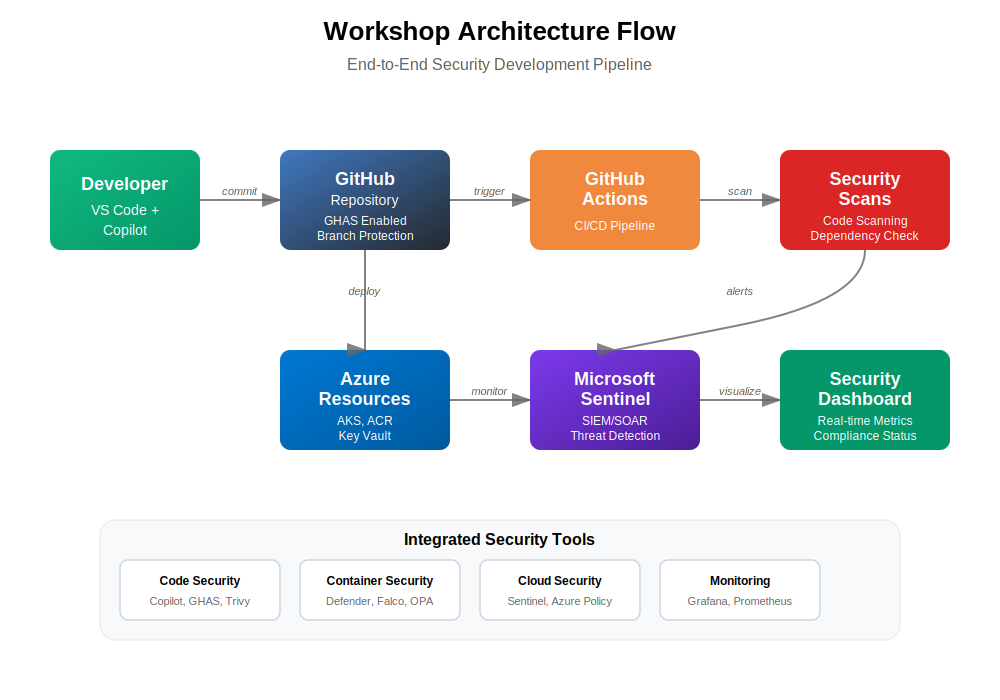

# 🛡️ Secure Code AI Development Workshop

Welcome to the **Secure Code AI Development** Workshop! This hands-on workshop guides you through implementing comprehensive secure coding practices using AI-powered tools, GitHub Advanced Security, and modern DevSecOps workflows for enterprise software development.

[](https://secure-code-ai.dev) [](https://github.com/paulasilvatech/Secure-Code-AI-Dev/stargazers) [](LICENSE)

## Secure AI Development Workflow - Enterprise-Grade Security

<div align="center">
  
</div>

## 🌐 Official Workshop Website: [secure-code-ai.dev](https://secure-code-ai.dev)

## 📖 The Journey to AI-Enhanced Secure Development

Welcome to the Secure Code AI Development Enterprise Workshop! This repository takes you on a transformative journey from traditional reactive security practices to the world of AI-assisted secure development workflows and proactive threat mitigation.

As a developer in today's rapidly evolving threat landscape, you face a critical challenge: **most of your time isn't spent building secure features from the start**. According to industry studies:

- Traditional security approaches are reactive, catching vulnerabilities too late in the development cycle
- High cost of security fixes increases exponentially with each stage of development
- Difficult to maintain security standards across multiple teams and projects
- Manual security reviews create bottlenecks and inconsistent coverage

This workshop provides hands-on guidance to implement modern secure development workflows using AI-powered tools. We'll demonstrate how GitHub Copilot, GitHub Advanced Security, and Azure AI services can transform your security strategy.

> *"Secure AI development is not about replacing security experts, but about amplifying every developer's ability to write secure code faster and more consistently than ever before."*

## ⭐ Business Impact

Organizations implementing comprehensive AI-enhanced secure development report significant benefits:

- **Shift-Left Security**: Reduce security issues by 80% through early detection and prevention
- **Faster Remediation**: Cut vulnerability fix time from weeks to hours with AI-guided solutions
- **Consistent Security Standards**: Maintain 95% compliance across all development teams
- **Reduced Security Debt**: 70% reduction in critical and high-severity vulnerabilities
- **Developer Productivity**: Shift from 60% reactive security fixing to 70% proactive feature development

Advanced secure development workflows enable progression through four maturity stages:

1. **Reactive**: Traditional security scanning and manual vulnerability remediation
2. **Assisted**: AI-powered vulnerability detection with guided remediation
3. **Proactive**: Integrated security controls with automated threat modeling
4. **Intelligent**: Self-healing code with predictive security analytics

<div align="center">
  
</div>

## 📋 Workshop Structure

The workshop is organized into progressive modules, allowing you to choose the depth of coverage based on your time and experience:

| Level         | Duration | Focus                           | Best For                               |
| ------------- | -------- | ------------------------------- | -------------------------------------- |
| **Basic**     | 90 min   | Core concepts and first scan    | Beginners, quick introductions         |
| **Intermediate** | 2-3 hours | Complete security pipeline     | Standard workshops, team training      |
| **Advanced**  | 6+ hours | Enterprise-scale implementation | Experienced practitioners, deep dives  |

## 🗺️ Learning Path

### Module 1: [Shift-Left Security Principles](modules/module-01-shift-left.md)

- Foundation concepts and modern security paradigms
- The secure development lifecycle: Code → Scan → Fix → Deploy
- Security tools ecosystem overview and integration strategies

### Module 2: [GitHub Advanced Security (GHAS)](modules/module-02-ghas.md)

- Setting up GitHub Advanced Security
- Code scanning, secret scanning, and dependency review
- Security policy configuration and compliance

### Module 3: [AI-Powered Secure Coding with GitHub Copilot](modules/module-04-copilot.md)

- GitHub Copilot for secure code generation
- Security-focused prompts and best practices
- Advanced secure coding patterns with AI assistance

### Module 4: [Container Security & DevSecOps](modules/module-05-container.md)

- Container image security and vulnerability scanning
- Secure container orchestration patterns
- DevSecOps pipeline integration

### Module 5: [Agentic AI Security Workflows](modules/module-06-agentic.md)

- AI agents for automated security testing
- Intelligent threat detection and response
- Advanced AI security automation patterns

### Module 6: [Multi-Cloud Security Implementation](modules/module-07-multicloud.md)

- Cross-cloud security strategies
- Cloud-native security tools integration
- Unified security posture management

### Module 7: [Azure Sentinel & Security Monitoring](modules/module-08-sentinel.md)

- Security Information and Event Management (SIEM)
- Threat hunting and incident response
- AI-powered security analytics

### Module 8: [Security Dashboards & Metrics](modules/module-09-dashboards.md)

- Security metrics visualization
- Compliance reporting and tracking
- Executive security dashboards

### Module 9: [Advanced Security Patterns](modules/module-10-advanced.md)

- Zero-trust architecture implementation
- Advanced threat modeling techniques
- Security automation at scale

### [Advanced Troubleshooting Guide](docs/troubleshooting-guide.md)

- Common security issues and solutions
- Advanced debugging techniques
- Performance optimization strategies

## 🔑 Prerequisites

### Required Accounts

- Create [Azure Free Account](https://go.microsoft.com/fwlink/?linkid=859151)
- GitHub account with [GitHub Advanced Security](https://github.com/features/security)
- [GitHub Copilot](https://github.com/features/copilot) subscription
- Download [VS Code](https://visualstudio.microsoft.com/downloads/)

### Technical Requirements

- Development environment: VS Code, Node.js 18+, Git, Docker
- Basic understanding of software security principles
- Familiarity with CI/CD pipelines and cloud platforms

## 🛠️ Getting Started

1. **Fork and Clone this Repository**
   ```bash
   git clone https://github.com/YourUsername/Secure-Code-AI-Dev.git
   cd Secure-Code-AI-Dev
   ```

2. **Quick Start (30 minutes)**
   - Follow our [Quick Start Guide](docs/secure-code-ai-workshop.md) for immediate hands-on experience
   - Complete setup verification and first security scan
   - Generate your first secure code with AI assistance

3. **Follow the Workshop Structure**
   - Start with [Shift-Left Security Principles](modules/module-01-shift-left.md)
   - Progress through modules based on your experience level
   - Use the [Troubleshooting Guide](docs/troubleshooting-guide.md) if needed

4. **🚀 Explore Practical Examples**
   - Check out real-world security scenarios in each module
   - Practice with authentic enterprise security challenges
   - Apply AI-powered security tools to your own projects

## 📁 Repository Structure

```
Secure-Code-AI-Dev/
├── assets/              # Visual resources and diagrams
│   └── workshop-architecture.svg
├── config/              # Configuration files and templates
├── scripts/             # Automation and setup scripts
├── templates/           # Security policy and workflow templates
├── modules/            # Workshop modules (sequential learning)
│   ├── module-01-shift-left.md
│   ├── module-02-ghas.md
│   ├── module-04-copilot.md
│   ├── module-05-container.md
│   ├── module-06-agentic.md
│   ├── module-07-multicloud.md
│   ├── module-08-sentinel.md
│   ├── module-09-dashboards.md
│   └── module-10-advanced.md
└── docs/               # General documentation
    ├── products-overview.md
    ├── secure-code-ai-workshop.md
    ├── troubleshooting-guide.md
    └── workshop-faq.md
```

## 🌟 Key Features

- **AI-Enhanced Security**: Learn to implement GitHub Copilot for intelligent secure code generation
- **Multi-Platform Support**: Build security controls for cloud, on-premises, and hybrid environments
- **Real-World Scenarios**: Practice with authentic enterprise security challenges
- **Progressive Learning**: Start from security basics and advance to enterprise-scale solutions
- **GitHub Integration**: Master GitHub Advanced Security and DevSecOps workflows

## 📚 Documentation

- **Workshop Overview**: [secure-code-ai-workshop.md](docs/secure-code-ai-workshop.md)
- **Products Overview**: [products-overview.md](docs/products-overview.md)
- **FAQ**: [workshop-faq.md](docs/workshop-faq.md)
- **Troubleshooting**: [troubleshooting-guide.md](docs/troubleshooting-guide.md)

## 🔗 Related Repositories

### [AI Code Development](https://github.com/paulasilvatech/Code-AI-Dev)
Complete workshop for leveraging AI tools like GitHub Copilot to optimize and improve code quality in enterprise environments. Learn advanced AI-assisted workflows, refactoring techniques, and best practices for integrating AI tools into development processes.

### [Secure Code AI Development](https://github.com/paulasilvatech/Secure-Code-AI-Dev)
Comprehensive workshop for implementing secure coding practices using AI-powered tools, GitHub Advanced Security, and modern DevSecOps workflows. Learn to shift-left security, reduce vulnerabilities significantly, and achieve enterprise-grade security compliance with AI assistance.

### [Agentic Operations & Observability](https://github.com/paulasilvatech/Agentic-Ops-Dev)
Hands-on workshop for implementing comprehensive observability solutions using Azure Monitor, Application Insights, and AI-powered tools. Learn to build modern monitoring systems, implement AI-enhanced observability, and create intelligent DevOps practices for cloud applications.

### [Design-to-Code Development](https://github.com/paulasilvatech/Design-to-Code-Dev)
Comprehensive workshop for implementing design-to-code workflows using AI-powered tools, Figma integration, and modern development practices. Learn to bridge the gap between design and development, creating consistent and maintainable user interfaces with intelligent automation.

### [Figma-to-Code Development](https://github.com/paulasilvatech/Figma-to-Code-Dev)
Hands-on workshop for transforming Figma designs into production-ready code using GitHub Copilot Agent Mode and AI-powered tools. Learn to convert sophisticated designs into fully functional applications, achieving significant time reduction in development cycles with enterprise-grade features.

## 👤 Credits

This Secure Code AI Development Workshop was developed by [Paula Silva](https://github.com/paulanunes85), Developer Productivity [Global Black Belt at Microsoft Americas](https://www.linkedin.com/in/paulanunes/), focusing on bridging the gap between security and development through AI-powered automation. The workshop provides a comprehensive approach to implementing modern secure development workflows for enterprise software applications.

## 📄 License

This project is licensed under the MIT License - see the [LICENSE](LICENSE) file for details. 