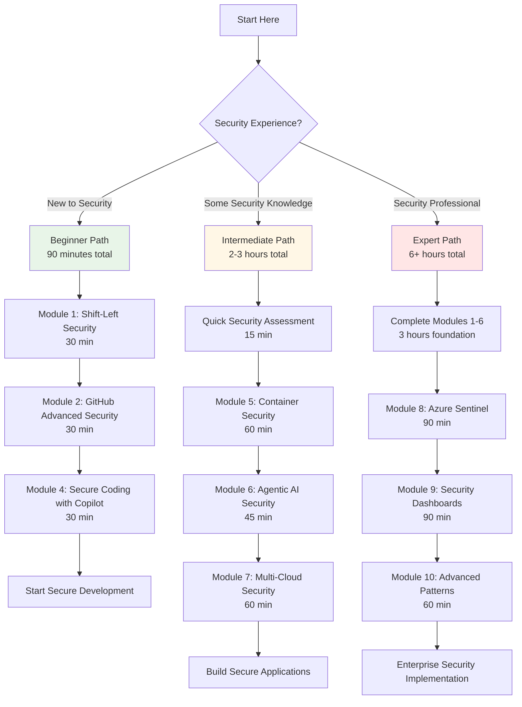

# 🚀 Quick Start Guide - Secure Code AI Development

Get up and running with secure AI-powered development practices in under 30 minutes!

[](../LICENSE)
[](#)
[](#)

## 📋 Prerequisites Checklist

Before you begin, make sure you have:

- [ ] **GitHub account** with GitHub Advanced Security ([Get GHAS](https://github.com/features/security))
- [ ] **GitHub Copilot** subscription ([Get Copilot](https://github.com/features/copilot))
- [ ] **Azure account** ([Sign up free](https://azure.microsoft.com/free/))
- [ ] **Node.js 18+** installed ([Download](https://nodejs.org))
- [ ] **VS Code** or preferred IDE ([Download](https://code.visualstudio.com))
- [ ] **Docker Desktop** installed ([Download](https://www.docker.com/products/docker-desktop/))
- [ ] Basic understanding of software security principles

## ⚡ 15-Minute Security Quick Demo

### Step 1: Clone and Setup (3 minutes)

```bash
git clone https://github.com/paulasilvatech/Secure-Code-AI-Dev.git
cd Secure-Code-AI-Dev
```

### Step 2: Enable Security Features (5 minutes)

Quick security setup:
- Enable GitHub Advanced Security on your repository
- Configure secret scanning and code scanning
- Set up security policies

### Step 3: Your First Secure Code Generation (7 minutes)

Follow these steps to see AI-powered secure coding in action:
1. Open VS Code with GitHub Copilot
2. Create a secure authentication component
3. See how AI suggests security best practices

## 🎯 Choose Your Security Learning Path

Based on your experience and security needs:



### 🟢 New to Security (90 minutes total)
1. Start with [Module 1: Shift-Left Security](../modules/module-01-shift-left.md) (30 min)
2. Continue to [Module 2: GitHub Advanced Security](../modules/module-02-ghas.md) (30 min)
3. Try [Module 4: Secure Coding with Copilot](../modules/module-04-copilot.md) (30 min)

### 🟡 Some Security Knowledge (2-3 hours total)
1. Review [Workshop Overview](secure-code-ai-workshop.md) (15 min)
2. Jump to [Module 5: Container Security](../modules/module-05-container.md) (60 min)
3. Explore [Module 6: Agentic AI Security](../modules/module-06-agentic.md) (45 min)
4. Practice with [Module 7: Multi-Cloud Security](../modules/module-07-multicloud.md) (60 min)

### 🔴 Security Professional (6+ hours total)
1. Complete Modules 1-7 as foundation (3 hours)
2. Deep dive into [Module 8: Azure Sentinel](../modules/module-08-sentinel.md) (90 min)
3. Master [Module 9: Security Dashboards](../modules/module-09-dashboards.md) (90 min)
4. Review [Module 10: Advanced Patterns](../modules/module-10-advanced.md) (60 min)

## 🛠️ Essential Security Tools Setup

### GitHub Advanced Security
```bash
# Enable in repository settings
# Navigate to Settings > Security & analysis
# Enable:
# - Dependency graph
# - Dependabot alerts
# - Code scanning
# - Secret scanning
```

### GitHub Copilot for Security
```bash
# Install VS Code extension
code --install-extension GitHub.copilot

# Configure for security-first suggestions
# Settings > GitHub Copilot > Include Security Context
```

### Azure Security Tools
```bash
# Install Azure CLI
curl -sL https://aka.ms/InstallAzureCLIDeb | sudo bash

# Login to Azure
az login

# Create security resource group
az group create --name SecureDevRG --location eastus
```

## 🔒 Sample Security Scenarios

Practice with these real-world security challenges:

- **Beginner**: Secure user authentication flow
- **Intermediate**: Container vulnerability scanning pipeline
- **Advanced**: Zero-trust architecture implementation

## 🚨 Common Security Setup Issues

### GitHub Advanced Security Not Available
```bash
# Check if GHAS is enabled for your organization
gh api /orgs/{org}/settings/security_analysis

# For personal repos, upgrade to GitHub Pro
```

### Copilot Security Suggestions Not Working
- Ensure security context is enabled in settings
- Update to latest Copilot version
- Check if repository has security policies defined

### Azure Security Center Access
```bash
# Check subscription access
az account show

# Enable Security Center
az security pricing create -n default --tier standard
```

## 📚 Key Security Concepts

### Shift-Left Security
Moving security earlier in the development lifecycle:
```javascript
// Example: Input validation at development time
function validateUserInput(input) {
  // AI suggests security validations
  const sanitized = DOMPurify.sanitize(input);
  const validated = validator.isAlphanumeric(sanitized);
  return validated ? sanitized : null;
}
```

### Security as Code
Defining security policies programmatically:
```yaml
# security-policy.yml
name: Security Policy
rules:
  - no-hardcoded-secrets
  - enforce-https
  - validate-inputs
  - secure-dependencies
```

### DevSecOps Integration

| Security Stage | Tools | Automation |
|---|---|---|
| **Code** | GitHub Copilot, SAST | Pre-commit hooks |
| **Build** | Container scanning | CI/CD pipelines |
| **Deploy** | Azure Security Center | Policy as Code |
| **Runtime** | Azure Sentinel | Real-time monitoring |

## 🎯 Success Metrics

After completing the quick start, you should be able to:

- [ ] Enable and configure GitHub Advanced Security
- [ ] Generate secure code with AI assistance
- [ ] Implement basic security controls
- [ ] Set up vulnerability scanning
- [ ] Create security monitoring dashboards

## 🆘 Need Help?

| Support Type | Resource | Best For |
|---|---|---|
| 🚨 **Immediate Help** | [Troubleshooting Guide](troubleshooting-guide.md) | Quick fixes and common issues |
| 🔍 **Security Issues** | [Security FAQ](workshop-faq.md) | Security-specific questions |
| 💬 **Community** | [GitHub Discussions](https://github.com/paulasilvatech/Secure-Code-AI-Dev/discussions) | Questions and collaboration |
| 🏢 **Enterprise** | [Products Overview](products-overview.md) | Enterprise security solutions |
| 🆕 **Report Issue** | [New Issue](https://github.com/paulasilvatech/Secure-Code-AI-Dev/issues/new) | Bug reports and feature requests |

## 🎉 What's Next?

Once you've completed the quick start:

1. **Build Secure Applications** following Modules 5-7
2. **Implement Security Monitoring** from Module 8
3. **Create Security Dashboards** with Module 9
4. **Share Your Experience** via [GitHub Discussions](https://github.com/paulasilvatech/Secure-Code-AI-Dev/discussions)

---

<div align="center">
  <strong>Ready to revolutionize your secure development workflow?</strong><br>
  <a href="secure-code-ai-workshop.md">Start with the Full Workshop Overview →</a>
</div>

---

## 🧭 Navigation

| Previous | Up | Next |
|----------|----|----- |
| [📖 Main README](../README.md) | [📚 Documentation](../README.md#-documentation) | [🚀 Workshop Overview](secure-code-ai-workshop.md) |

**Quick Links**: [🛡️ Security FAQ](workshop-faq.md) • [🔧 Troubleshooting](troubleshooting-guide.md) • [📦 Products](products-overview.md) 