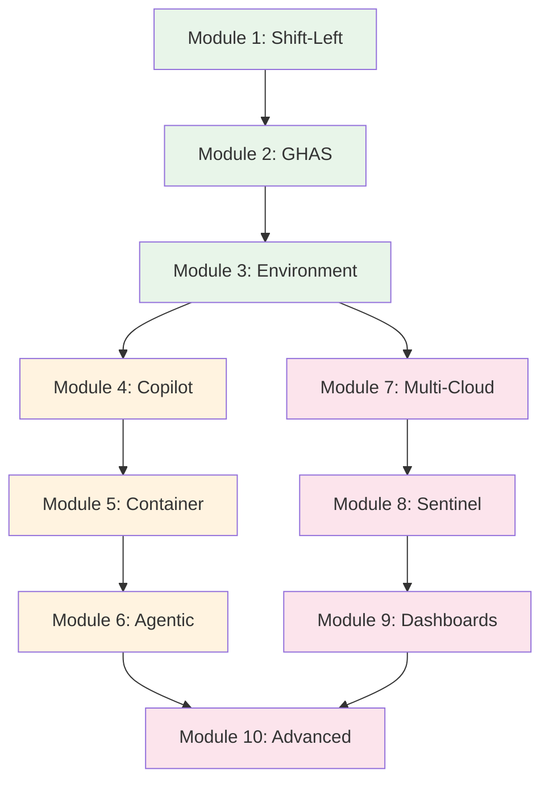

# 📚 Modules Overview

Complete overview of all 10 modules in the Secure Code AI Development Workshop.

## 🎯 Workshop Structure

The workshop is organized into 10 progressive modules across three learning tracks:

### 🔵 Foundation Track (Modules 1-3)
Build core security knowledge and set up your environment.

### 🟢 AI-Powered Track (Modules 4-6)
Leverage AI tools for secure development and automation.

### 🟣 Enterprise Track (Modules 7-10)
Implement advanced security patterns and monitoring.

## 🔄 Continuous Learning Approach

---

## 📋 Complete Module List

### Module 1: Shift-Left Security Fundamentals
**Duration**: 1.5 hours | **Level**: Beginner

**What You'll Learn**:
- Principles of shift-left security
- Security in the development lifecycle
- Cost benefits of early security
- Building security culture

**Key Outcomes**:
- Implement pre-commit security hooks
- Understand security ROI
- Create security-first workflows

**Resources**: [View Module](../modules/module-01-shift-left.md) | [Resources](../resources/module-01-shift-left/)

---

### Module 2: GitHub Advanced Security (GHAS)
**Duration**: 1 hour | **Level**: Beginner

**What You'll Learn**:
- Code scanning setup and configuration
- Secret scanning and prevention
- Dependency review workflows
- Security policies and alerts

**Key Outcomes**:
- Enable GHAS features
- Configure security rules
- Automate vulnerability detection

**Resources**: [View Module](../modules/module-02-ghas.md) | [Resources](../resources/module-02-ghas/)

---

### Module 3: Setting Up Your Security Environment
**Duration**: 1.5 hours | **Level**: Intermediate

**What You'll Learn**:
- Security tools installation
- VS Code security configuration
- Cloud environment setup
- Tool integration strategies

**Key Outcomes**:
- Complete security toolchain
- Configured development environment
- Integrated security scanning

**Resources**: [View Module](../modules/module-03-environment-setup.md) | [Resources](../resources/module-03-environment-setup/)

---

### Module 4: AI-Powered Secure Coding with GitHub Copilot
**Duration**: 2 hours | **Level**: Intermediate

**What You'll Learn**:
- Security-focused prompts
- AI-assisted vulnerability prevention
- Secure code patterns with Copilot
- Best practices for AI coding

**Key Outcomes**:
- Generate secure code with AI
- Prevent common vulnerabilities
- Accelerate secure development

**Resources**: [View Module](../modules/module-04-copilot.md) | [Resources](../resources/module-04-copilot/)

---

### Module 5: Container Security & DevSecOps
**Duration**: 2 hours | **Level**: Intermediate

**What You'll Learn**:
- Container security best practices
- Secure CI/CD pipelines
- Image scanning and compliance
- Kubernetes security

**Key Outcomes**:
- Secure containerized apps
- Automated security scanning
- DevSecOps pipeline

**Resources**: [View Module](../modules/module-05-container.md) | [Resources](../resources/module-05-container/)

---

### Module 6: Agentic AI for Security Automation
**Duration**: 2 hours | **Level**: Advanced

**What You'll Learn**:
- Building security AI agents
- Automated threat response
- Intelligent security workflows
- Agent orchestration

**Key Outcomes**:
- Autonomous security agents
- Automated incident response
- AI-driven security operations

**Resources**: [View Module](../modules/module-06-agentic.md) | [Resources](../resources/module-06-agentic/)

---

### Module 7: Multi-Cloud Security Strategies
**Duration**: 2 hours | **Level**: Advanced

**What You'll Learn**:
- Cross-cloud security architecture
- Unified security policies
- Multi-cloud compliance
- Centralized monitoring

**Key Outcomes**:
- Multi-cloud security posture
- Consistent security controls
- Cross-cloud visibility

**Resources**: [View Module](../modules/module-07-multicloud.md) | [Resources](../resources/module-07-multicloud/)

---

### Module 8: Microsoft Sentinel Integration
**Duration**: 2.5 hours | **Level**: Advanced

**What You'll Learn**:
- Sentinel workspace setup
- Detection rules creation
- Incident response automation
- Threat hunting

**Key Outcomes**:
- SIEM/SOAR implementation
- Automated threat detection
- Security orchestration

**Resources**: [View Module](../modules/module-08-sentinel.md) | [Resources](../resources/module-08-sentinel/)

---

### Module 9: Security Dashboards & Reporting
**Duration**: 2 hours | **Level**: Intermediate

**What You'll Learn**:
- Dashboard design principles
- Security metrics and KPIs
- Compliance reporting
- Executive dashboards

**Key Outcomes**:
- Real-time security dashboards
- Automated reporting
- Compliance tracking

**Resources**: [View Module](../modules/module-09-dashboards.md) | [Resources](../resources/module-09-dashboards/)

---

### Module 10: Advanced Security Patterns
**Duration**: 2.5 hours | **Level**: Expert

**What You'll Learn**:
- Zero-trust architecture
- Advanced threat modeling
- Security at scale
- Enterprise patterns

**Key Outcomes**:
- Zero-trust implementation
- Advanced security controls
- Enterprise-ready security

**Resources**: [View Module](../modules/module-10-advanced.md) | [Resources](../resources/module-10-advanced/)

---

## 📊 Module Dependencies

## 🎯 Learning Outcomes by Module

| Module | Primary Outcome | Time to Complete |
|--------|----------------|------------------|
| 1 | Understand shift-left principles | 1.5 hours |
| 2 | Enable GitHub security features | 1 hour |
| 3 | Set up security environment | 1.5 hours |
| 4 | Use AI for secure coding | 2 hours |
| 5 | Secure containerized apps | 2 hours |
| 6 | Build security automation | 2 hours |
| 7 | Implement multi-cloud security | 2 hours |
| 8 | Deploy SIEM/SOAR | 2.5 hours |
| 9 | Create security dashboards | 2 hours |
| 10 | Master advanced patterns | 2.5 hours |

**Total Workshop Duration**: 19 hours

## 🚀 Recommended Learning Paths

### Fast Track (6 hours)
- Module 1 → Module 2 → Module 4 → Module 5

### Standard Track (12 hours)
- Modules 1-7 in sequence

### Complete Track (19 hours)
- All modules 1-10 in order

## 📁 Resource Structure

Each module includes:
- 📝 Module content (markdown)
- 🔧 Scripts (automation)
- 🏗️ Bicep templates (IaC)
- 📋 Templates (configurations)
- 🔄 Workflows (CI/CD)

## 🏆 Certification Requirements

To receive the workshop certificate:
- ✅ Complete all 10 modules
- ✅ Submit exercise solutions
- ✅ Pass final assessment
- ✅ Deploy secure application

---

**Ready to start?** Begin with [Module 1: Shift-Left Security Fundamentals](../modules/module-01-shift-left.md) → 