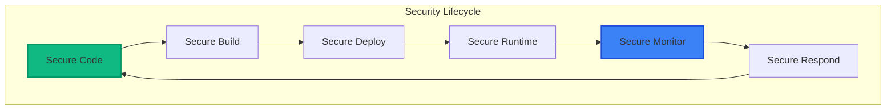
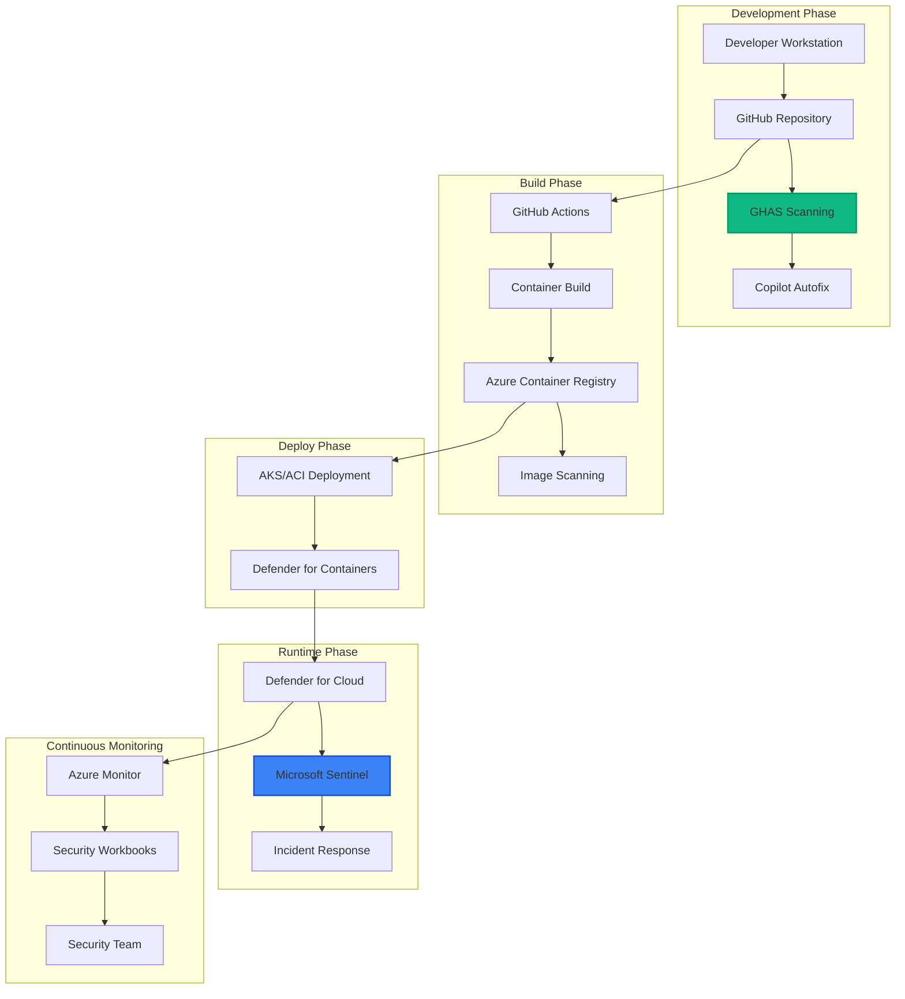
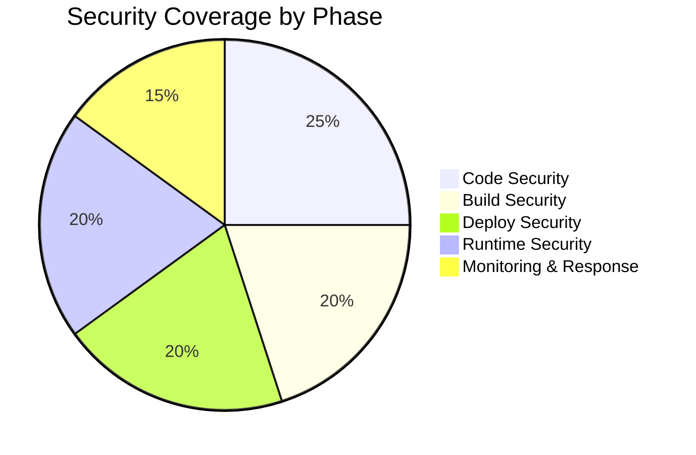

# 🛡️ Products and Solutions Overview

## Table of Contents

1. [Executive Summary](#executive-summary)
2. [GitHub Security Solutions](#github-security-solutions)
3. [Microsoft Security Solutions](#microsoft-security-solutions)
4. [Integration Architecture](#integration-architecture)
5. [Why This Stack?](#why-this-stack)
6. [Implementation Roadmap](#implementation-roadmap)

## Executive Summary

This workshop leverages a comprehensive security ecosystem that spans from code creation to cloud deployment. By integrating GitHub's developer-first security tools with Microsoft's enterprise-grade cloud security platform, we create a powerful shift-left security posture that protects applications throughout their entire lifecycle.

## GitHub Security Solutions

### GitHub Advanced Security (GHAS)

**What is it?**
GitHub Advanced Security is a comprehensive application security platform that helps developers find and fix vulnerabilities in their code before it reaches production.

**Key Components:**

#### 1. Code Scanning
- **Purpose**: Static Application Security Testing (SAST)
- **Technology**: Powered by CodeQL, a semantic code analysis engine
- **Languages**: Supports 10+ languages including JavaScript, Python, Java, C/C++, C#, Go
- **Benefits**: 
  - Finds complex vulnerabilities like SQL injection, XSS, and buffer overflows
  - Customizable with organization-specific queries
  - Integrates directly into pull requests

#### 2. Secret Scanning
- **Purpose**: Prevent credential leaks and token exposure
- **Features**:
  - Scans for 100+ token types from partners
  - Push protection blocks commits containing secrets
  - Custom pattern support for proprietary formats
  - Automatic revocation through partner program
- **Benefits**:
  - Prevents costly security breaches
  - Reduces incident response time
  - Protects intellectual property

#### 3. Dependency Review
- **Purpose**: Identify vulnerable dependencies before merging
- **Features**:
  - Shows vulnerability impact in pull requests
  - License compliance checking
  - Suggests secure versions
- **Integration**: Works with Dependabot for automated fixes

### Dependabot

**What is it?**
An automated dependency management tool that keeps your dependencies secure and up-to-date.

**Features:**
- **Security Updates**: Automatically creates PRs for vulnerable dependencies
- **Version Updates**: Keeps dependencies current with configurable schedules
- **Compatibility Scores**: Shows update safety based on community data
- **Multi-ecosystem**: Supports npm, pip, Maven, NuGet, Docker, and more

**Why it matters:**
- 84% of breaches involve vulnerable dependencies
- Manual dependency management doesn't scale
- Reduces technical debt automatically

### GitHub Copilot Autofix

**What is it?**
AI-powered vulnerability remediation that suggests fixes for security issues found by code scanning.

**How it works:**
1. Code scanning identifies vulnerability
2. Copilot analyzes the context and code patterns
3. Generates fix suggestions with explanations
4. Developer reviews and applies fixes

**Benefits:**
- Reduces Mean Time to Remediation (MTTR) by up to 80%
- Helps developers learn secure coding practices
- Maintains code style and patterns
- Provides explanations for better understanding

### GitHub Actions

**Security Integration:**
- Native GHAS integration for CI/CD
- Secure secrets management
- OIDC authentication with cloud providers
- Workflow security hardening
- Supply chain security with artifact signing

## Microsoft Security Solutions

### Microsoft Defender for Cloud

**What is it?**
A comprehensive Cloud Security Posture Management (CSPM) and Cloud Workload Protection Platform (CWPP) that provides unified security management and threat protection across hybrid cloud workloads.

**Key Capabilities:**

#### 1. Security Posture Management
- **Secure Score**: Quantifies security posture with actionable recommendations
- **Regulatory Compliance**: Built-in compliance dashboards for standards like PCI-DSS, ISO 27001
- **Cloud Security Graph**: Maps relationships and attack paths across resources

#### 2. Threat Protection
- **Advanced Threat Detection**: Uses AI to identify suspicious activities
- **Just-in-Time VM Access**: Reduces attack surface for management ports
- **Adaptive Application Controls**: Whitelisting for approved applications
- **File Integrity Monitoring**: Detects unauthorized changes

#### 3. Container Security
- **Registry Scanning**: Vulnerability assessment for container images
- **Runtime Protection**: Monitors running containers for threats
- **Kubernetes Security**: Admission control and workload protection
- **CI/CD Integration**: Shift-left container security

### Microsoft Sentinel

**What is it?**
A cloud-native Security Information and Event Management (SIEM) and Security Orchestration, Automation, and Response (SOAR) solution.

**Core Features:**

#### 1. Data Collection
- **Connectors**: 100+ built-in connectors for Microsoft and third-party solutions
- **Custom Ingestion**: Support for any data source via APIs
- **Intelligent Sampling**: Cost-effective data collection

#### 2. Threat Detection
- **Built-in Analytics**: 150+ detection rules out-of-the-box
- **Machine Learning**: Anomaly detection and user behavior analytics
- **Threat Intelligence**: Integration with threat feeds
- **Fusion Detection**: Correlates alerts across products

#### 3. Investigation & Response
- **Investigation Graph**: Visual investigation experience
- **Notebooks**: Jupyter notebooks for advanced hunting
- **Playbooks**: Automated response with Logic Apps
- **Incident Management**: Case management and collaboration

### Azure Monitor

**Role in Security:**
- **Log Analytics**: Centralized log storage and querying
- **Metrics & Alerts**: Real-time monitoring and alerting
- **Application Insights**: Application performance and security monitoring
- **Workbooks**: Custom security dashboards and reports

### Azure Key Vault

**What is it?**
A cloud service for securely storing and accessing secrets, keys, and certificates.

**Security Benefits:**
- **Hardware Security Modules**: FIPS 140-2 Level 2 validated
- **Access Policies**: Fine-grained access control
- **Audit Logging**: Complete audit trail of access
- **Integration**: Native integration with Azure services

## Integration Architecture

### How Components Work Together

### Data Flow

1. **Code Creation**: Developers write code with security guidance from Copilot
2. **Commit & Scan**: GHAS scans code on every commit
3. **Build & Package**: Secure CI/CD pipeline builds containers
4. **Registry Security**: ACR scans images for vulnerabilities
5. **Deployment**: Secure deployment to cloud environments
6. **Runtime Protection**: Defender monitors running workloads
7. **Centralized Monitoring**: Sentinel aggregates all security signals
8. **Automated Response**: Playbooks respond to threats automatically

## Why This Stack?

### 1. Comprehensive Coverage

### 2. Developer-First Approach
- Security integrated into developer workflows
- Fast feedback loops (seconds, not days)
- AI-assisted remediation reduces friction
- No context switching required

### 3. Enterprise Scale
- Handles thousands of repositories
- Millions of events per second
- Global availability and redundancy
- Multi-cloud support

### 4. Cost Optimization
- Shift-left reduces remediation costs by 100x
- Automated fixes reduce manual effort
- Unified platform reduces tool sprawl
- Pay-as-you-go pricing model

### 5. Compliance & Governance
- Built-in compliance frameworks
- Automated compliance reporting
- Audit trails for all activities
- Policy as code support

## Implementation Roadmap

### Phase 1: Foundation (Weeks 1-2)
- Set up GitHub organization
- Enable GHAS on critical repositories
- Configure basic Dependabot
- Create Azure environment

### Phase 2: Integration (Weeks 3-4)
- Connect GitHub Actions to Azure
- Set up container registry scanning
- Configure Defender for Cloud
- Implement basic monitoring

### Phase 3: Advanced Security (Weeks 5-6)
- Deploy Microsoft Sentinel
- Create security playbooks
- Implement custom CodeQL queries
- Build security dashboards

### Phase 4: Automation (Weeks 7-8)
- Enable Copilot Autofix
- Create automated response workflows
- Implement security gates in CI/CD
- Configure advanced threat detection

### Phase 5: Optimization (Ongoing)
- Tune detection rules
- Reduce false positives
- Optimize costs
- Continuous improvement

## Key Benefits Summary

### For Developers
- ✅ Security feedback in IDE
- ✅ Automated fix suggestions
- ✅ No workflow disruption
- ✅ Learning through AI assistance

### For Security Teams
- ✅ Centralized visibility
- ✅ Automated threat response
- ✅ Reduced alert fatigue
- ✅ Compliance automation

### For Management
- ✅ Reduced security costs
- ✅ Faster time to market
- ✅ Quantifiable security metrics
- ✅ Risk reduction

## Integration Points

### Critical Integrations

1. **GHAS → Sentinel**
   - Security alerts flow
   - Correlation with runtime events
   - Unified incident management

2. **GitHub Actions → Azure**
   - OIDC authentication
   - Secure deployment
   - Secret management

3. **Defender → Sentinel**
   - Runtime threat detection
   - Security posture data
   - Automated response

4. **Key Vault → Applications**
   - Runtime secret injection
   - Certificate management
   - Encryption key storage

## Success Metrics

### Leading Indicators
- Number of vulnerabilities fixed pre-production
- Percentage of repos with GHAS enabled
- Average time to fix vulnerabilities
- Developer adoption rate

### Lagging Indicators
- Security incidents in production
- Cost of security breaches
- Compliance audit findings
- Customer trust scores

## Conclusion

This integrated security stack represents the future of application security - where security is not a gate at the end of development, but a continuous process integrated throughout the software lifecycle. By combining GitHub's developer-first security tools with Microsoft's enterprise cloud security platform, organizations can achieve both speed and security in their software delivery.

---

## Quick Reference

### GitHub Products
- **GHAS**: Code scanning, secret scanning, dependency review
- **Dependabot**: Automated dependency updates
- **Copilot Autofix**: AI-powered vulnerability fixes
- **GitHub Actions**: Secure CI/CD pipelines

### Microsoft Products
- **Defender for Cloud**: CSPM and workload protection
- **Microsoft Sentinel**: SIEM and SOAR
- **Azure Monitor**: Logging and monitoring
- **Azure Key Vault**: Secret management

### Key Integrations
- GHAS → Sentinel for unified security monitoring
- GitHub Actions → Azure for secure deployment
- Defender → Sentinel for threat correlation
- All products → Azure Monitor for observability

---

**Next Steps**: Return to the [main workshop](./README.md) or continue to [Module 01](./modules/01-shift-left-fundamentals/README.md).

---

## 🧭 Navigation

| Previous | Up | Next |
|----------|----|----- |
| [🚀 Workshop Overview](secure-code-ai-workshop.md) | [📚 Documentation](../README.md#-documentation) | [🛡️ Security FAQ](workshop-faq.md) |

**Quick Links**: [🚀 Quick Start](QUICK_START.md) • [🔧 Troubleshooting](troubleshooting-guide.md) • [📋 All Modules](../modules/)
