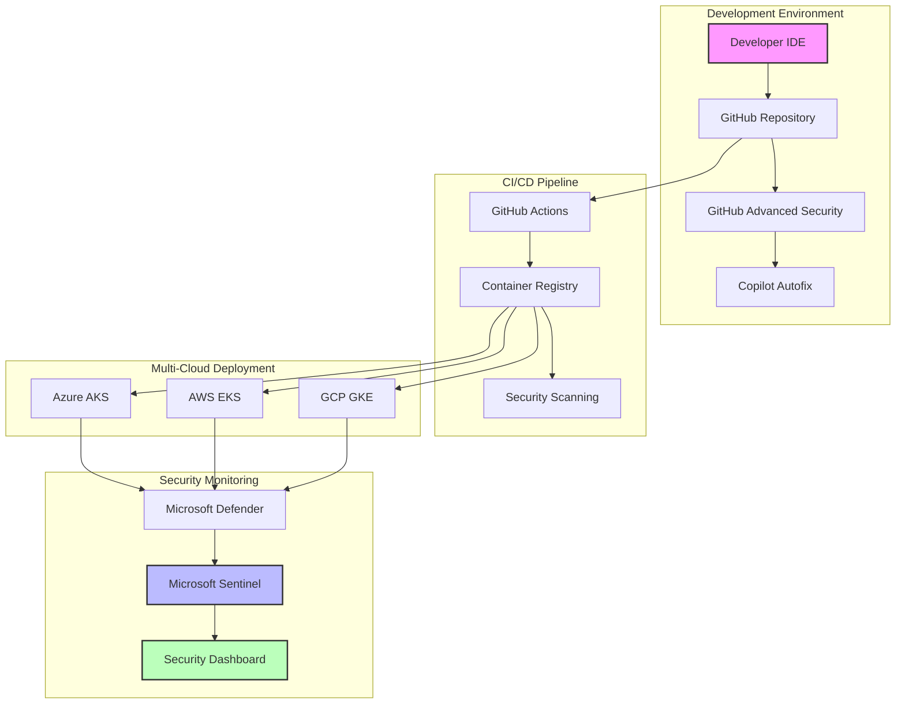

# 🔐 Secure Code AI Workshop

## 🎯 Workshop Overview

Welcome to the Secure Code AI Workshop! This comprehensive training program explores the integration of cutting-edge security tools including GitHub Advanced Security (GHAS), Copilot Autofix, Agentic DevOps, Microsoft Defender for Cloud, and Microsoft Sentinel in a multi-cloud environment.

### 📋 Table of Contents
- [Introduction](#introduction)
- [Prerequisites](#prerequisites)
- [Workshop Structure](#workshop-structure)
- [Learning Paths](#learning-paths)
- [Module Overview](#module-overview)
- [Getting Started](#getting-started)
- [Architecture Overview](#architecture-overview)

## 🌟 Introduction

In today's rapidly evolving threat landscape, securing your code and infrastructure from the very beginning - a practice known as "Shift Left" - is not just a best practice, it's a necessity. This workshop will teach you how to build a comprehensive security ecosystem that protects your applications from code to cloud.

### Why This Workshop?

- **Proactive Security**: Learn to identify and fix vulnerabilities before they reach production
- **AI-Powered Automation**: Leverage AI to automate security fixes and accelerate development
- **Multi-Cloud Security**: Manage security across Azure, AWS, and GCP from a central hub
- **Developer-First Approach**: Integrate security seamlessly into developer workflows
- **Real-Time Monitoring**: Build comprehensive dashboards with Microsoft Sentinel

### What You'll Learn

- Implement GitHub Advanced Security (GHAS) with Copilot Autofix
- Deploy and secure containerized applications across multiple clouds
- Build an agent-to-agent ecosystem for automated security
- Create centralized security monitoring with Microsoft Sentinel
- Integrate security into CI/CD pipelines
- Implement Infrastructure as Code (IaC) security

## 📚 Prerequisites

### Required Knowledge
- **Basic Level**: Git fundamentals and basic command line usage
- **Intermediate Level**: Understanding of CI/CD concepts
- **Advanced Level**: Container orchestration and cloud architecture

### Required Accounts (Free Trials Available)

1. **GitHub Account** 
   - Sign up at [github.com](https://github.com)
   - 30-day GHAS trial available

2. **Microsoft Azure Account**
   - [Azure Free Account](https://azure.microsoft.com/free/) with $200 credit
   - Valid for 30 days

3. **Optional Cloud Accounts**
   - AWS Free Tier (optional for multi-cloud scenarios)
   - GCP Free Tier (optional for multi-cloud scenarios)

### Software Requirements
- Git 2.30+
- Docker Desktop
- Visual Studio Code
- Azure CLI
- GitHub CLI
- Node.js 16+ (for some exercises)

## 🗂️ Workshop Structure

### Module Categories

| Level | Modules | Focus Area | Duration |
|-------|---------|------------|----------|
| **Basic** | 1-3 | Fundamentals & Setup | 4-6 hours |
| **Intermediate** | 4-7 | Integration & Automation | 6-8 hours |
| **Advanced** | 8-10 | Multi-cloud & Monitoring | 6-8 hours |

### Complete Module List

1. **[Module 01: Introduction to Shift-Left Security](./modules/01-shift-left-fundamentals/README.md)** ⏱️ 2 hours
2. **[Module 02: GitHub Advanced Security Fundamentals](./modules/02-ghas-fundamentals/README.md)** ⏱️ 2 hours
3. **[Module 03: Setting Up Your Security Environment](./modules/03-environment-setup/README.md)** ⏱️ 2.5 hours
4. **[Module 04: Copilot Autofix and AI-Powered Security](./modules/04-copilot-autofix/README.md)** ⏱️ 2 hours
5. **[Module 05: Container Security with Microsoft Defender](./modules/05-container-security/README.md)** ⏱️ 2.5 hours
6. **[Module 06: Agentic DevOps and Automation](./modules/06-agentic-devops/README.md)** ⏱️ 2 hours
7. **[Module 07: Multi-Cloud Security Architecture](./modules/07-multicloud-security/README.md)** ⏱️ 3 hours
8. **[Module 08: Microsoft Sentinel Integration](./modules/08-sentinel-integration/README.md)** ⏱️ 2.5 hours
9. **[Module 09: Building Security Dashboards](./modules/09-security-dashboards/README.md)** ⏱️ 2 hours
10. **[Module 10: Advanced Scenarios and Best Practices](./modules/10-advanced-scenarios/README.md)** ⏱️ 2.5 hours

## 🎓 Learning Paths

### 🚀 One-Day Fast Track (8 hours)
Perfect for getting started with core concepts:
- Module 1: Shift-Left Fundamentals (1 hour)
- Module 2: GHAS Fundamentals (2 hours)
- Module 3: Environment Setup (2 hours)
- Module 4: Copilot Autofix (2 hours)
- Module 8: Sentinel Integration Basics (1 hour)

### 📚 Complete Path (20+ hours)
Comprehensive coverage of all topics:
- Complete all 10 modules in sequence
- Includes all exercises and hands-on labs
- Suitable for self-paced learning over 1-2 weeks

### 🎯 Security Professional Path (12 hours)
For those focusing on security operations:
- Module 1, 2, 5, 7, 8, 9, 10
- Emphasis on monitoring and multi-cloud security

## 🏗️ Architecture Overview

Our workshop builds a comprehensive security architecture:



## 🚀 Getting Started

### Step 1: Fork This Repository
```bash
# Fork this repository to your GitHub account
# Then clone your fork
git clone https://github.com/YOUR-USERNAME/secure-code-ai-workshop
cd secure-code-ai-workshop
```

### Step 2: Set Up Your Environment
```bash
# Run the setup script
./scripts/setup-workshop.sh

# Verify installation
./scripts/verify-setup.sh
```

### Step 3: Choose Your Path
- **Beginners**: Start with Module 1
- **Intermediate**: Review Module 1-2, then jump to Module 4
- **Advanced**: Start with Module 7 for multi-cloud scenarios

## 📖 Key Concepts

### Shift-Left Security
Moving security practices earlier in the development lifecycle to:
- Reduce cost of fixing vulnerabilities
- Improve developer productivity
- Enhance overall security posture

### Agent-to-Agent Ecosystem
Automated security agents that:
- Communicate and coordinate security tasks
- Provide real-time threat response
- Enable autonomous security operations

### Multi-Cloud Security
Centralized security management across:
- Azure (primary)
- AWS (secondary)
- GCP (tertiary)

## 🛠️ Tools and Technologies

### Core Security Tools
- **GitHub Advanced Security**: Code scanning, secret scanning, dependency review
- **Copilot Autofix**: AI-powered vulnerability remediation
- **Microsoft Defender for Cloud**: Cloud security posture management
- **Microsoft Sentinel**: SIEM and SOAR capabilities

### Supporting Technologies
- **Docker & Kubernetes**: Container orchestration
- **Terraform**: Infrastructure as Code
- **Azure DevOps / GitHub Actions**: CI/CD pipelines

## 📊 Workshop Outcomes

By completing this workshop, you will be able to:

1. ✅ Implement comprehensive shift-left security practices
2. ✅ Configure and use GitHub Advanced Security features
3. ✅ Automate security fixes with AI-powered tools
4. ✅ Deploy secure containerized applications across multiple clouds
5. ✅ Build centralized security monitoring dashboards
6. ✅ Implement security best practices in CI/CD pipelines
7. ✅ Create automated security response workflows
8. ✅ Monitor and respond to security threats in real-time

## 🤝 Contributing

We welcome contributions! Please see our [Contributing Guide](./CONTRIBUTING.md) for details.

## 📝 License

This workshop is licensed under the MIT License. See [LICENSE](./LICENSE) for details.

## 🆘 Support

- **Workshop Issues**: [GitHub Issues](https://github.com/YOUR-USERNAME/secure-code-ai-workshop/issues)
- **Community Forum**: [Discussions](https://github.com/YOUR-USERNAME/secure-code-ai-workshop/discussions)
- **Documentation**: [Wiki](https://github.com/YOUR-USERNAME/secure-code-ai-workshop/wiki)

---

🎉 **Ready to start?** Head to [Module 01: Introduction to Shift-Left Security](./modules/01-shift-left-fundamentals/README.md) to begin your journey!

---

## 🧭 Navigation

| Previous | Up | Next |
|----------|----|----- |
| [🚀 Quick Start](QUICK_START.md) | [📚 Documentation](../README.md#-documentation) | [📦 Products Overview](products-overview.md) |

**Quick Links**: [🛡️ Security FAQ](workshop-faq.md) • [🔧 Troubleshooting](troubleshooting-guide.md) • [📋 All Modules](../modules/)
