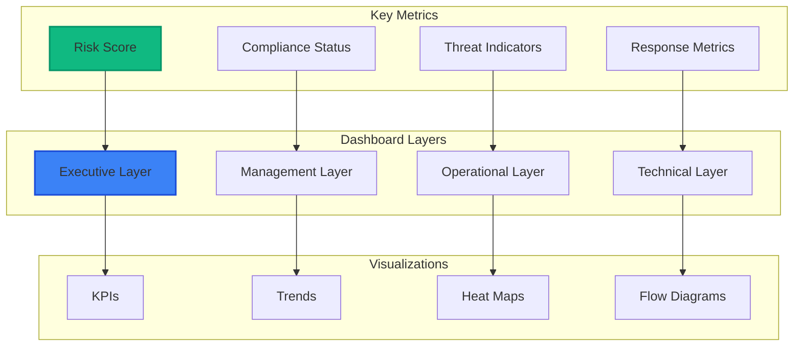

# Module 09: Building Security Dashboards

## 📋 Module Overview

**Duration**: 2 hours  
**Level**: Advanced  
**Prerequisites**: 
- Completed Modules 01-08
- Sentinel workspace with data
- Basic understanding of data visualization
- JSON and KQL knowledge

## 🎯 Learning Objectives

By the end of this module, you will:
- Design effective security dashboards
- Create interactive visualizations
- Build executive and operational dashboards
- Implement real-time monitoring displays
- Create mobile-responsive dashboards
- Export and share security insights

## 📚 Module Contents

1. [Dashboard Design Principles](#dashboard-design-principles)
2. [Executive Security Dashboard](#executive-security-dashboard)
3. [Operational Security Dashboard](#operational-security-dashboard)
4. [Real-time Monitoring](#real-time-monitoring)
5. [Advanced Visualizations](#advanced-visualizations)
6. [Exercises](#exercises)

## Dashboard Design Principles

### Security Dashboard Framework



### Design Best Practices

1. **Visual Hierarchy**
   - Most important metrics at top-left
   - Use size to indicate importance
   - Group related information

2. **Color Psychology**
   - Red: Critical/High severity
   - Orange: Medium severity
   - Green: Healthy/Resolved
   - Blue: Informational

3. **Performance**
   - Optimize queries for speed
   - Use caching where possible
   - Implement progressive loading

## Executive Security Dashboard

### Dashboard Template

```json
{
  "version": "1.0",
  "content": {
    "metadata": {
      "title": "Executive Security Dashboard",
      "description": "High-level security posture overview",
      "author": "Security Team",
      "refresh": "5m"
    },
    "layout": {
      "type": "grid",
      "columns": 12,
      "rows": 8
    },
    "widgets": [
      {
        "id": "security-score",
        "type": "scorecard",
        "position": {"x": 0, "y": 0, "w": 3, "h": 2},
        "config": {
          "title": "Security Score",
          "query": "SecurityScore_KQL",
          "format": "percentage",
          "thresholds": {
            "good": 80,
            "warning": 60,
            "critical": 40
          },
          "trend": true
        }
      },
      {
        "id": "active-incidents",
        "type": "metric",
        "position": {"x": 3, "y": 0, "w": 3, "h": 2},
        "config": {
          "title": "Active Incidents",
          "query": "ActiveIncidents_KQL",
          "icon": "alert",
          "color": "severity-based"
        }
      },
      {
        "id": "mttr",
        "type": "gauge",
        "position": {"x": 6, "y": 0, "w": 3, "h": 2},
        "config": {
          "title": "Mean Time to Respond",
          "query": "MTTR_KQL",
          "unit": "hours",
          "max": 24,
          "zones": [
            {"value": 4, "color": "green"},
            {"value": 8, "color": "yellow"},
            {"value": 24, "color": "red"}
          ]
        }
      },
      {
        "id": "compliance-status",
        "type": "donut",
        "position": {"x": 9, "y": 0, "w": 3, "h": 2},
        "config": {
          "title": "Compliance Status",
          "query": "ComplianceStatus_KQL",
          "legend": "bottom"
        }
      }
    ]
  }
}
```

### Executive KQL Queries

```kusto
// Security Score Calculation
let SecurityScore_KQL = 
SecurityRecommendation
| where TimeGenerated > ago(1d)
| summarize 
    TotalControls = count(),
    ImplementedControls = countif(State == "Completed"),
    HighPriorityImplemented = countif(State == "Completed" and RecommendationSeverity == "High")
| extend 
    BaseScore = (ImplementedControls * 100.0) / TotalControls,
    WeightedScore = ((HighPriorityImplemented * 2 + ImplementedControls) * 100.0) / (TotalControls + count())
| project Score = round(WeightedScore, 1);

// Active Incidents Summary
let ActiveIncidents_KQL =
SecurityIncident
| where Status in ("New", "Active", "InProgress")
| summarize 
    Total = count(),
    Critical = countif(Severity == "High"),
    High = countif(Severity == "Medium"),
    Medium = countif(Severity == "Low"),
    Low = countif(Severity == "Informational")
| extend DisplayValue = strcat(Total, " (", Critical, " critical)");

// Mean Time to Respond
let MTTR_KQL =
SecurityIncident
| where Status == "Closed"
| where TimeGenerated > ago(30d)
| extend ResponseTime = datetime_diff('hour', ClosedTime, CreatedTime)
| summarize 
    MTTR = round(avg(ResponseTime), 1),
    P95 = round(percentile(ResponseTime, 95), 1),
    Trend = round(avg(ResponseTime) - avg(prev(ResponseTime, 7d)), 1)
| project MTTR, P95, TrendDirection = iff(Trend > 0, "up", "down");

// Compliance Status
let ComplianceStatus_KQL =
ComplianceAssessment
| where TimeGenerated > ago(1d)
| summarize by Framework, Status
| summarize 
    Compliant = countif(Status == "Compliant"),
    NonCompliant = countif(Status == "NonCompliant"),
    NotAssessed = countif(Status == "NotAssessed")
    by Framework
| project Framework, Compliant, NonCompliant, NotAssessed;
```

## Operational Security Dashboard

### Real-time Operations View

```json
{
  "version": "1.0",
  "content": {
    "metadata": {
      "title": "Security Operations Center Dashboard",
      "refresh": "30s",
      "theme": "dark"
    },
    "widgets": [
      {
        "id": "threat-map",
        "type": "geo-map",
        "position": {"x": 0, "y": 0, "w": 6, "h": 4},
        "config": {
          "title": "Global Threat Map",
          "query": "ThreatMap_KQL",
          "visualization": {
            "type": "heat",
            "animation": true,
            "clustering": true
          }
        }
      },
      {
        "id": "live-feed",
        "type": "stream",
        "position": {"x": 6, "y": 0, "w": 6, "h": 4},
        "config": {
          "title": "Security Event Stream",
          "query": "LiveEvents_KQL",
          "maxItems": 20,
          "autoScroll": true,
          "highlighting": {
            "critical": "red",
            "high": "orange",
            "medium": "yellow"
          }
        }
      },
      {
        "id": "attack-timeline",
        "type": "timeline",
        "position": {"x": 0, "y": 4, "w": 12, "h": 3},
        "config": {
          "title": "Attack Chain Timeline",
          "query": "AttackTimeline_KQL",
          "groupBy": "TacticName",
          "colors": "mitre-attack"
        }
      }
    ]
  }
}
```

### Operational Queries

```kusto
// Threat Map Data
let ThreatMap_KQL =
union SecurityAlert, SecurityIncident
| where TimeGenerated > ago(1h)
| extend GeoLocation = geo_info_from_ip_address(SourceIP)
| project 
    Latitude = GeoLocation.latitude,
    Longitude = GeoLocation.longitude,
    Country = GeoLocation.country,
    Severity = coalesce(Severity, "Medium"),
    Count = 1
| summarize 
    ThreatCount = sum(Count),
    MaxSeverity = max(Severity)
    by Latitude, Longitude, Country
| project Latitude, Longitude, Country, ThreatCount, HeatIntensity = ThreatCount;

// Live Security Events
let LiveEvents_KQL =
union 
(
    SecurityAlert
    | where TimeGenerated > ago(5m)
    | project 
        TimeGenerated,
        EventType = "Alert",
        Title = AlertName,
        Severity,
        Source = ProviderName,
        Details = Description
),
(
    GitHubSecurityAlerts
    | where TimeGenerated > ago(5m)
    | project 
        TimeGenerated,
        EventType = "GitHub",
        Title = AlertName,
        Severity = AlertSeverity,
        Source = Repository,
        Details = pack("Type", AlertType, "State", State)
),
(
    ContainerSecurityAlert
    | where TimeGenerated > ago(5m)
    | project 
        TimeGenerated,
        EventType = "Container",
        Title = AlertName,
        Severity,
        Source = ContainerName,
        Details = pack("Namespace", Namespace, "Pod", PodName)
)
| order by TimeGenerated desc
| take 50;

// Attack Chain Timeline
let AttackTimeline_KQL =
SecurityAlert
| where TimeGenerated > ago(24h)
| where isnotempty(Tactics)
| mv-expand Tactic = Tactics
| extend TacticName = tostring(Tactic)
| join kind=leftouter (
    MitreAttackTactics
    | project TacticName, TacticOrder
) on TacticName
| project 
    TimeGenerated,
    TacticName,
    TacticOrder = coalesce(TacticOrder, 99),
    AlertName,
    Severity,
    EntityCount = array_length(Entities)
| order by TimeGenerated asc, TacticOrder asc;
```

## Real-time Monitoring

### WebSocket Integration

```javascript
// realtime-dashboard.js
class RealtimeDashboard {
    constructor(workspaceId, config) {
        this.workspaceId = workspaceId;
        this.config = config;
        this.widgets = new Map();
        this.ws = null;
        this.reconnectAttempts = 0;
    }
    
    async initialize() {
        // Connect to Sentinel streaming endpoint
        await this.connectWebSocket();
        
        // Initialize widgets
        this.initializeWidgets();
        
        // Start real-time updates
        this.startRealtimeUpdates();
    }
    
    async connectWebSocket() {
        const token = await this.getAccessToken();
        const wsUrl = `wss://api.securitycenter.microsoft.com/api/streams/security-events?token=${token}`;
        
        this.ws = new WebSocket(wsUrl);
        
        this.ws.onopen = () => {
            console.log('Connected to real-time feed');
            this.reconnectAttempts = 0;
            this.subscribeToEvents();
        };
        
        this.ws.onmessage = (event) => {
            this.handleRealtimeEvent(JSON.parse(event.data));
        };
        
        this.ws.onerror = (error) => {
            console.error('WebSocket error:', error);
            this.handleReconnect();
        };
    }
    
    handleRealtimeEvent(event) {
        // Route event to appropriate widget
        const eventType = event.type;
        
        switch(eventType) {
            case 'SecurityAlert':
                this.updateAlertWidget(event);
                this.updateThreatMap(event);
                break;
                
            case 'GitHubAlert':
                this.updateGitHubWidget(event);
                break;
                
            case 'ContainerEvent':
                this.updateContainerWidget(event);
                break;
                
            default:
                this.updateGeneralFeed(event);
        }
        
        // Update global metrics
        this.updateGlobalMetrics(event);
    }
    
    updateAlertWidget(event) {
        const widget = this.widgets.get('alerts');
        
        // Animate new alert
        widget.addAlert({
            id: event.id,
            time: new Date(event.timeGenerated),
            severity: event.severity,
            title: event.alertName,
            description: event.description,
            entities: event.entities
        });
        
        // Update count
        widget.incrementCount(event.severity);
        
        // Trigger notification for high severity
        if (event.severity === 'High') {
            this.triggerNotification(event);
        }
    }
    
    updateThreatMap(event) {
        if (event.sourceIP) {
            const location = this.getGeolocation(event.sourceIP);
            
            this.widgets.get('threatMap').addThreat({
                lat: location.lat,
                lng: location.lng,
                severity: event.severity,
                type: event.alertType,
                animate: true
            });
        }
    }
}
```

### Performance Optimization

```typescript
// dashboard-optimizer.ts
interface QueryOptimization {
    query: string;
    cacheKey: string;
    cacheDuration: number;
    priority: 'high' | 'medium' | 'low';
}

class DashboardOptimizer {
    private cache: Map<string, CachedResult>;
    private queryQueue: PriorityQueue<QueryOptimization>;
    
    constructor(private sentinelClient: SentinelClient) {
        this.cache = new Map();
        this.queryQueue = new PriorityQueue();
    }
    
    async optimizeQuery(query: string, options: OptimizationOptions): Promise<QueryResult> {
        // Check cache first
        const cacheKey = this.generateCacheKey(query, options);
        const cached = this.cache.get(cacheKey);
        
        if (cached && !this.isCacheExpired(cached)) {
            return cached.result;
        }
        
        // Optimize query
        const optimizedQuery = this.applyOptimizations(query, options);
        
        // Execute with priority
        const result = await this.executeWithPriority(optimizedQuery, options.priority);
        
        // Cache result
        this.cache.set(cacheKey, {
            result,
            timestamp: Date.now(),
            duration: options.cacheDuration
        });
        
        return result;
    }
    
    private applyOptimizations(query: string, options: OptimizationOptions): string {
        let optimized = query;
        
        // Add time range optimization
        if (options.timeRange) {
            optimized = this.addTimeRangeFilter(optimized, options.timeRange);
        }
        
        // Add sampling for large datasets
        if (options.sampling && options.sampling < 1) {
            optimized = this.addSampling(optimized, options.sampling);
        }
        
        // Add projection to reduce data transfer
        if (options.columns) {
            optimized = this.addProjection(optimized, options.columns);
        }
        
        return optimized;
    }
    
    private addTimeRangeFilter(query: string, timeRange: string): string {
        return `${query}\n| where TimeGenerated > ago(${timeRange})`;
    }
    
    private addSampling(query: string, rate: number): string {
        return `${query}\n| sample ${Math.floor(rate * 100)}`;
    }
}
```

## Advanced Visualizations

### Custom Widget Development

```javascript
// security-heatmap-widget.js
class SecurityHeatmapWidget extends BaseWidget {
    constructor(container, config) {
        super(container, config);
        this.heatmapInstance = null;
        this.data = [];
    }
    
    async initialize() {
        // Create heatmap structure
        this.createHeatmapStructure();
        
        // Load initial data
        await this.loadData();
        
        // Render heatmap
        this.render();
        
        // Start auto-refresh
        this.startAutoRefresh();
    }
    
    createHeatmapStructure() {
        const svg = d3.select(this.container)
            .append('svg')
            .attr('width', this.config.width)
            .attr('height', this.config.height);
            
        // Define scales
        this.xScale = d3.scaleBand()
            .range([0, this.config.width])
            .padding(0.05);
            
        this.yScale = d3.scaleBand()
            .range([this.config.height, 0])
            .padding(0.05);
            
        this.colorScale = d3.scaleSequential()
            .interpolator(d3.interpolateReds)
            .domain([0, 100]);
            
        // Add tooltip
        this.tooltip = d3.select('body')
            .append('div')
            .attr('class', 'heatmap-tooltip')
            .style('opacity', 0);
    }
    
    async loadData() {
        const query = `
        SecurityEvents
        | where TimeGenerated > ago(24h)
        | summarize Count = count() by Hour = bin(TimeGenerated, 1h), Category
        | extend HourOfDay = datetime_part("hour", Hour)
        | project HourOfDay, Category, Count
        `;
        
        const result = await this.executeQuery(query);
        this.data = this.transformData(result);
    }
    
    render() {
        const svg = d3.select(this.container).select('svg');
        
        // Update scales
        const categories = [...new Set(this.data.map(d => d.category))];
        const hours = d3.range(0, 24);
        
        this.xScale.domain(hours);
        this.yScale.domain(categories);
        
        // Create heatmap cells
        const cells = svg.selectAll('.heatmap-cell')
            .data(this.data);
            
        cells.enter()
            .append('rect')
            .attr('class', 'heatmap-cell')
            .merge(cells)
            .transition()
            .duration(750)
            .attr('x', d => this.xScale(d.hour))
            .attr('y', d => this.yScale(d.category))
            .attr('width', this.xScale.bandwidth())
            .attr('height', this.yScale.bandwidth())
            .attr('fill', d => this.colorScale(d.intensity))
            .attr('rx', 3);
            
        // Add interactions
        cells
            .on('mouseover', (event, d) => this.showTooltip(event, d))
            .on('mouseout', () => this.hideTooltip())
            .on('click', (event, d) => this.drillDown(d));
            
        cells.exit().remove();
        
        // Update axes
        this.updateAxes();
    }
    
    showTooltip(event, data) {
        this.tooltip
            .transition()
            .duration(200)
            .style('opacity', .9);
            
        this.tooltip
            .html(`
                <strong>${data.category}</strong><br/>
                Hour: ${data.hour}:00<br/>
                Events: ${data.count}<br/>
                Severity: ${data.maxSeverity}
            `)
            .style('left', (event.pageX + 10) + 'px')
            .style('top', (event.pageY - 28) + 'px');
    }
}
```

### Mobile-Responsive Dashboard

```css
/* responsive-dashboard.css */
.dashboard-container {
    display: grid;
    grid-template-columns: repeat(auto-fit, minmax(300px, 1fr));
    gap: 1rem;
    padding: 1rem;
}

.widget {
    background: var(--widget-bg);
    border-radius: 8px;
    padding: 1rem;
    box-shadow: 0 2px 4px rgba(0,0,0,0.1);
    transition: transform 0.2s;
}

.widget:hover {
    transform: translateY(-2px);
    box-shadow: 0 4px 8px rgba(0,0,0,0.15);
}

/* Mobile optimizations */
@media (max-width: 768px) {
    .dashboard-container {
        grid-template-columns: 1fr;
    }
    
    .widget-large {
        grid-column: 1;
    }
    
    .chart-container {
        height: 250px !important;
    }
    
    .metric-value {
        font-size: 2rem;
    }
}

/* Dark mode support */
@media (prefers-color-scheme: dark) {
    :root {
        --widget-bg: #1e293b;
        --text-primary: #f1f5f9;
        --text-secondary: #94a3b8;
    }
}
```

## 📝 Exercises

### Exercise 1: Create Executive Dashboard (30 minutes)

**Objective**: Build a C-level security dashboard

1. Design dashboard layout with:
   - Security score trending
   - Compliance overview
   - Top risks
   - Investment vs. risk reduction

2. Implement KQL queries:

```kusto
// Security Investment ROI
let SecurityROI_KQL = 
// Your implementation here
```

3. Create interactive elements
4. Add export functionality

**Deliverable**: Working executive dashboard

### Exercise 2: Build Real-time SOC Display (25 minutes)

**Objective**: Create operations center display

1. Design large-screen layout
2. Implement real-time feeds:
   - Alert stream
   - Threat map
   - Active incidents
   - Team status

3. Add sound alerts for critical events
4. Test with simulated data

**Deliverable**: SOC display dashboard

### Exercise 3: Mobile Security Dashboard (20 minutes)

**Objective**: Create mobile-responsive dashboard

1. Design mobile-first layout
2. Implement touch interactions
3. Optimize queries for performance
4. Add offline capability

**Deliverable**: Mobile dashboard app

### Exercise 4: Custom Visualization Widget (25 minutes)

**Objective**: Build advanced visualization

1. Choose visualization type:
   - Attack path diagram
   - Security timeline
   - Risk matrix
   - Dependency graph

2. Implement using D3.js or Chart.js
3. Add interactivity
4. Integrate with Sentinel data

**Deliverable**: Custom widget code

### Exercise 5: Dashboard Performance Tuning (20 minutes)

**Objective**: Optimize dashboard performance

1. Profile current dashboard:

```javascript
// Performance profiling
const profiler = new DashboardProfiler();
await profiler.measureQueryPerformance();
await profiler.measureRenderTime();
```

2. Implement optimizations:
   - Query caching
   - Lazy loading
   - Data aggregation
   - Progressive rendering

3. Measure improvements
4. Document best practices

**Deliverable**: Performance optimization report

## 🎯 Module Summary

### Key Takeaways

1. **Effective dashboards tell a story** not just display data
2. **Different audiences need different views** of security data
3. **Real-time monitoring requires** careful performance optimization
4. **Interactive visualizations** improve engagement and understanding
5. **Mobile accessibility** is crucial for security teams

### Skills Acquired

- ✅ Designing security dashboards
- ✅ Creating KQL visualizations
- ✅ Building real-time displays
- ✅ Implementing custom widgets
- ✅ Optimizing dashboard performance
- ✅ Creating mobile-responsive designs

## 📚 Additional Resources

### Visualization Libraries
- [D3.js Documentation](https://d3js.org/)
- [Chart.js](https://www.chartjs.org/)
- [Apache ECharts](https://echarts.apache.org/)

### Dashboard Frameworks
- [Azure Monitor Workbooks](https://docs.microsoft.com/en-us/azure/azure-monitor/visualize/workbooks-overview)
- [Grafana](https://grafana.com/)
- [Power BI Embedded](https://powerbi.microsoft.com/embedded/)

### Design Resources
- [Dashboard Design Patterns](https://www.nngroup.com/articles/dashboard-design/)
- [Security Visualization Guide](https://www.sans.org/white-papers/security-visualization/)

## ✅ Module Completion Checklist

Before moving to the next module, ensure you have:

- [ ] Created executive dashboard
- [ ] Built SOC display
- [ ] Implemented mobile dashboard
- [ ] Developed custom widget
- [ ] Optimized performance
- [ ] Documented design decisions

## 🚀 Next Steps

Continue to [Module 10: Advanced Scenarios and Best Practices](../10-advanced-scenarios/README.md) for the final module covering advanced implementations.

---

**Questions?** Check our [Dashboard FAQ](../../docs/dashboard-faq.md) or share your creations in [Discussions](https://github.com/YOUR-USERNAME/secure-code-ai-workshop/discussions).
