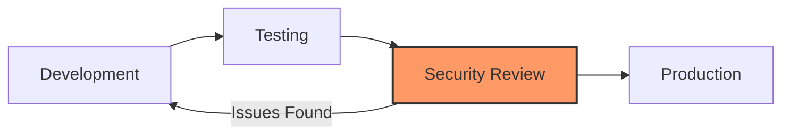
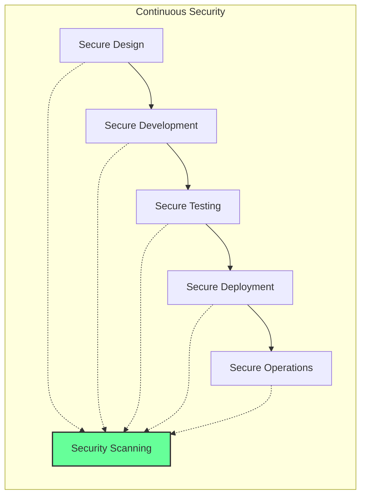
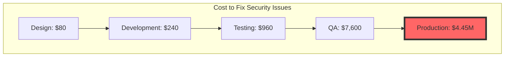
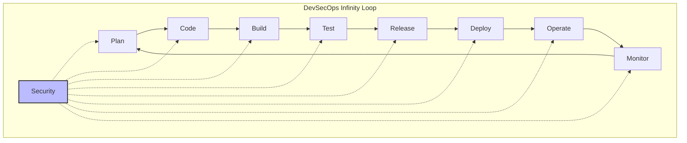

# Module 01: Introduction to Shift-Left Security

## 📋 Module Overview

**Duration**: 2 hours  
**Level**: Basic  
**Prerequisites**: Basic understanding of software development lifecycle

## 🎯 Learning Objectives

By the end of this module, you will:
- Understand the concept and importance of shift-left security
- Learn the cost implications of finding bugs at different stages
- Identify key security practices for each development phase
- Understand the DevSecOps culture and shared responsibility model
- Set up your initial development environment

## 📚 Module Contents

1. [Introduction](#introduction)
2. [The Evolution of Security](#the-evolution-of-security)
3. [Understanding Shift-Left](#understanding-shift-left)
4. [DevSecOps Fundamentals](#devsecops-fundamentals)
5. [Exercises](#exercises)

## Introduction

Security has traditionally been a gate at the end of the development process. This module explores why that approach is no longer sufficient and how shift-left security transforms the way we build secure applications.

## The Evolution of Security

### Traditional Security Model



**Problems with this approach:**
- Security issues found late are expensive to fix
- Delays in release cycles
- Security team becomes a bottleneck
- Developers lack security context

### Modern Shift-Left Approach



## Understanding Shift-Left

### The Cost of Security Issues

Research shows that fixing security issues becomes exponentially more expensive as they progress through the SDLC:



### Key Principles of Shift-Left Security

1. **Prevention over Detection**
   - Secure coding practices
   - Security requirements in design
   - Threat modeling early

2. **Automation First**
   - Automated security scanning
   - Policy as code
   - Continuous compliance

3. **Developer Empowerment**
   - Security training
   - Developer-friendly tools
   - Fast feedback loops

4. **Shared Responsibility**
   - Everyone owns security
   - Security champions in teams
   - Collaborative culture

## DevSecOps Fundamentals

### What is DevSecOps?

DevSecOps extends DevOps by embedding security practices throughout the entire software development lifecycle.



### Cultural Transformation

Moving from traditional security to DevSecOps requires:

1. **Breaking Down Silos**
   - Security teams collaborate with developers
   - Shared goals and metrics
   - Cross-functional teams

2. **Continuous Learning**
   - Security training for developers
   - Development understanding for security
   - Regular knowledge sharing

3. **Fail Fast, Fix Fast**
   - Embrace security findings
   - Quick remediation cycles
   - Learning from incidents

## 📝 Exercises

### Exercise 1: Understanding the Impact (20 minutes)

**Objective**: Calculate the potential cost savings of shift-left security

1. Consider a typical security vulnerability (e.g., SQL injection)
2. Research the average time to fix at each stage:
   - During coding: 30 minutes
   - During testing: 3 hours
   - In production: 10 hours + incident response

3. Calculate the cost difference using these hourly rates:
   - Developer: $100/hour
   - QA Engineer: $80/hour
   - Security Team: $150/hour
   - Incident Response: $500/hour

4. Document your findings in `exercises/01-cost-analysis.md`

**Expected Output**: A cost comparison showing ROI of shift-left practices

### Exercise 2: Security in Your SDLC (30 minutes)

**Objective**: Map security practices to your development lifecycle

1. Create a diagram of your current (or ideal) SDLC phases
2. For each phase, identify:
   - Current security practices (if any)
   - Potential security improvements
   - Tools that could help

3. Use this template:

```markdown
# SDLC Security Mapping

## Planning Phase
- **Current Practices**: [List current practices]
- **Improvements**: [List potential improvements]
- **Tools**: [List applicable tools]

## Development Phase
- **Current Practices**: [List current practices]
- **Improvements**: [List potential improvements]
- **Tools**: [List applicable tools]

[Continue for all phases...]
```

4. Save as `exercises/02-sdlc-mapping.md`

### Exercise 3: Setting Up Git Security (25 minutes)

**Objective**: Configure basic Git security settings

1. Configure Git with security in mind:

```bash
# Set up Git identity
git config --global user.name "Your Name"
git config --global user.email "your.email@example.com"

# Enable commit signing (optional but recommended)
git config --global commit.gpgsign true

# Set up credential helper
git config --global credential.helper cache
```

2. Create a `.gitignore` file for security:

```gitignore
# Security-sensitive files
.env
.env.*
*.key
*.pem
*.p12
*.pfx
secrets/
credentials/

# IDE and system files
.vscode/
.idea/
.DS_Store
Thumbs.db
```

3. Create pre-commit hooks for security:

Create `.git/hooks/pre-commit`:

```bash
#!/bin/bash
# Check for common security issues

# Check for AWS keys
if git diff --cached --name-only | xargs grep -E "AKIA[0-9A-Z]{16}" 2>/dev/null; then
    echo "ERROR: AWS Access Key detected in commit"
    exit 1
fi

# Check for private keys
if git diff --cached --name-only | xargs grep -E "BEGIN (RSA |DSA |EC |OPENSSH )?PRIVATE KEY" 2>/dev/null; then
    echo "ERROR: Private key detected in commit"
    exit 1
fi

echo "Security checks passed"
exit 0
```

4. Make the hook executable:
```bash
chmod +x .git/hooks/pre-commit
```

### Exercise 4: Create a Security Checklist (20 minutes)

**Objective**: Build a practical security checklist for development

1. Create a security checklist for your team covering:
   - Code review security items
   - Pre-commit checks
   - Dependencies management
   - Secrets handling

2. Use this template in `exercises/04-security-checklist.md`:

```markdown
# Development Security Checklist

## Code Review
- [ ] No hardcoded secrets or credentials
- [ ] Input validation implemented
- [ ] SQL queries use parameterization
- [ ] Error messages don't expose sensitive info
- [ ] [Add more items...]

## Before Committing
- [ ] Run security linter
- [ ] Check for exposed secrets
- [ ] Update dependencies
- [ ] [Add more items...]

## Dependencies
- [ ] All dependencies from trusted sources
- [ ] No known vulnerabilities
- [ ] Licenses reviewed
- [ ] [Add more items...]
```

### Exercise 5: Security Metrics Dashboard (25 minutes)

**Objective**: Design metrics for measuring security improvement

1. Identify key security metrics:
   - Mean Time to Detect (MTTD)
   - Mean Time to Remediate (MTTR)
   - Number of vulnerabilities by severity
   - Security training completion rate

2. Create a simple dashboard mockup showing these metrics
3. Document how you would collect each metric

Save your design in `exercises/05-metrics-dashboard.md`

## 🎯 Module Summary

### Key Takeaways

1. **Shift-left security** moves security practices earlier in the development lifecycle
2. **Cost savings** are dramatic when issues are caught early
3. **DevSecOps** requires cultural change, not just tools
4. **Automation** is key to scalable security
5. **Shared responsibility** means everyone owns security

### Skills Acquired

- ✅ Understanding of shift-left principles
- ✅ Basic Git security configuration
- ✅ Security checklist creation
- ✅ Cost-benefit analysis of security practices
- ✅ SDLC security mapping

## 📚 Additional Resources

### Required Reading
- [NIST Cybersecurity Framework](https://www.nist.gov/cyberframework)
- [OWASP DevSecOps Guideline](https://owasp.org/www-project-devsecops-guideline/)

### Recommended Videos
- [DevSecOps: Shifting Security Left](https://www.youtube.com/watch?v=example)
- [The True Cost of Security Breaches](https://www.youtube.com/watch?v=example)

### Tools to Explore
- [Git Secrets](https://github.com/awslabs/git-secrets)
- [Pre-commit Framework](https://pre-commit.com/)
- [SonarQube Community Edition](https://www.sonarqube.org/)

## ✅ Module Completion Checklist

Before moving to the next module, ensure you have:

- [ ] Completed all 5 exercises
- [ ] Created your security checklist
- [ ] Configured Git security settings
- [ ] Understood the cost implications of shift-left
- [ ] Mapped security to SDLC phases

## 🚀 Next Steps

Ready to dive deeper? Continue to [Module 02: GitHub Advanced Security Fundamentals](../02-ghas-fundamentals/README.md) where we'll explore powerful security tools built into GitHub.

---

**Questions or Issues?** Check our [FAQ](../../docs/faq.md) or open an [issue](https://github.com/YOUR-USERNAME/secure-code-ai-workshop/issues).
