# Module 04: Copilot Autofix and AI-Powered Security

## 📋 Module Overview

**Duration**: 2 hours  
**Level**: Intermediate  
**Prerequisites**: 
- Completed Modules 01-03
- GitHub repository with GHAS enabled
- GitHub Copilot access (trial available)
- Sample vulnerable code for testing

## 🎯 Learning Objectives

By the end of this module, you will:
- Understand how AI enhances security practices
- Configure and use GitHub Copilot for secure coding
- Implement Copilot Autofix for vulnerability remediation
- Create AI-assisted security workflows
- Measure the impact of AI on security metrics
- Build custom prompts for security-focused code generation

## 📚 Module Contents

1. [Introduction to AI-Powered Security](#introduction-to-ai-powered-security)
2. [GitHub Copilot for Secure Coding](#github-copilot-for-secure-coding)
3. [Copilot Autofix Deep Dive](#copilot-autofix-deep-dive)
4. [AI Security Workflows](#ai-security-workflows)
5. [Measuring AI Impact](#measuring-ai-impact)
6. [Exercises](#exercises)

## Introduction to AI-Powered Security

### The Evolution of Security Tools


### Benefits of AI in Security

1. **Speed**: Reduce fix time from hours to minutes
2. **Consistency**: Apply security best practices uniformly
3. **Learning**: Improve from patterns across millions of repositories
4. **Context**: Understand code intent, not just syntax
5. **Accessibility**: Make security expertise available to all developers

### AI Security Components in Our Stack

| Component | Purpose | AI Capability |
|-----------|---------|---------------|
| GitHub Copilot | Code completion | Suggests secure code patterns |
| Copilot Autofix | Vulnerability fixes | Generates contextual remediation |
| Defender for Cloud | Threat detection | ML-based anomaly detection |
| Microsoft Sentinel | SIEM/SOAR | AI-driven threat correlation |

## GitHub Copilot for Secure Coding

### Setting Up Copilot for Security

1. **Enable Copilot in VS Code**:
```bash
# Install Copilot extension
code --install-extension GitHub.copilot
code --install-extension GitHub.copilot-labs
```

2. **Configure Security-Focused Settings**:

Create `.vscode/settings.json`:
```json
{
  "github.copilot.enable": {
    "*": true,
    "yaml": true,
    "plaintext": false,
    "markdown": true
  },
  "github.copilot.advanced": {
    "inlineSuggest.enable": true,
    "listCount": 10,
    "lengthThreshold": 15,
    "temperature": 0.1,  // Lower = more conservative suggestions
    "top_p": 0.95
  }
}
```

### Security-Focused Prompting

#### Example 1: Secure Input Validation
```javascript
// Prompt: Create a secure function to validate user email with protection against injection

// Copilot suggestion:
function validateEmail(email) {
  // Input validation
  if (typeof email !== 'string' || !email) {
    return { valid: false, error: 'Email must be a non-empty string' };
  }
  
  // Length check to prevent DoS
  if (email.length > 254) {
    return { valid: false, error: 'Email too long' };
  }
  
  // RFC 5322 compliant regex
  const emailRegex = /^[a-zA-Z0-9.!#$%&'*+/=?^_`{|}~-]+@[a-zA-Z0-9](?:[a-zA-Z0-9-]{0,61}[a-zA-Z0-9])?(?:\.[a-zA-Z0-9](?:[a-zA-Z0-9-]{0,61}[a-zA-Z0-9])?)*$/;
  
  if (!emailRegex.test(email)) {
    return { valid: false, error: 'Invalid email format' };
  }
  
  // Additional security checks
  const sanitized = email.toLowerCase().trim();
  
  // Check for common injection patterns
  const injectionPatterns = ['<script', 'javascript:', 'onclick', 'onerror'];
  for (const pattern of injectionPatterns) {
    if (sanitized.includes(pattern)) {
      return { valid: false, error: 'Invalid characters detected' };
    }
  }
  
  return { valid: true, email: sanitized };
}
```

#### Example 2: Secure Database Query
```python
# Prompt: Create a secure function to query user by ID preventing SQL injection

# Copilot suggestion:
import sqlite3
from typing import Optional, Dict, Any
import logging

def get_user_by_id(user_id: int, db_path: str) -> Optional[Dict[str, Any]]:
    """
    Securely fetch user by ID with SQL injection prevention.
    
    Args:
        user_id: The user ID to query
        db_path: Path to the SQLite database
        
    Returns:
        User dict or None if not found
    """
    # Input validation
    if not isinstance(user_id, int) or user_id <= 0:
        logging.warning(f"Invalid user_id attempt: {user_id}")
        return None
    
    try:
        # Use context manager for automatic connection cleanup
        with sqlite3.connect(db_path) as conn:
            conn.row_factory = sqlite3.Row
            cursor = conn.cursor()
            
            # Use parameterized query to prevent SQL injection
            query = "SELECT id, username, email, created_at FROM users WHERE id = ?"
            cursor.execute(query, (user_id,))
            
            row = cursor.fetchone()
            
            if row:
                # Convert to dict for easier handling
                return dict(row)
            return None
            
    except sqlite3.Error as e:
        logging.error(f"Database error: {e}")
        return None
    except Exception as e:
        logging.error(f"Unexpected error: {e}")
        return None
```

### Copilot Security Patterns

Create a file `.github/copilot-security-patterns.md`:

```markdown
# Security Patterns for Copilot

## Authentication
- Always use parameterized queries
- Hash passwords with bcrypt or argon2
- Implement rate limiting
- Use secure session management

## Input Validation
- Validate all user inputs
- Use allowlists over denylists
- Sanitize for the specific context (HTML, SQL, etc.)
- Set reasonable length limits

## Error Handling
- Never expose sensitive information in errors
- Log security events
- Use generic error messages for users
- Implement proper exception handling

## Cryptography
- Use established libraries (don't roll your own)
- Use secure random number generation
- Implement proper key management
- Use TLS for data in transit
```

## Copilot Autofix Deep Dive

### How Copilot Autofix Works


### Enabling Copilot Autofix

1. **Repository Level**:
   - Navigate to Settings → Code security and analysis
   - Enable "Copilot Autofix for CodeQL alerts"

2. **Organization Level**:
   - Go to Organization Settings → Code security and analysis
   - Enable for all repositories

### Understanding Autofix Suggestions

#### Example: SQL Injection Fix

**Vulnerable Code**:
```python
def search_products(search_term):
    query = f"SELECT * FROM products WHERE name LIKE '%{search_term}%'"
    return db.execute(query)
```

**Copilot Autofix Suggestion**:
```python
def search_products(search_term):
    # Fix: Use parameterized query to prevent SQL injection
    query = "SELECT * FROM products WHERE name LIKE ?"
    search_pattern = f"%{search_term}%"
    return db.execute(query, (search_pattern,))
```

**Fix Explanation**:
- Uses parameterized queries
- Separates data from SQL structure
- Maintains functionality while adding security

### Autofix Configuration

Create `.github/autofix-config.yml`:

```yaml
# Copilot Autofix Configuration
autofix:
  enabled: true
  
  # Languages to enable autofix for
  languages:
    - javascript
    - typescript
    - python
    - java
    - csharp
    - go
  
  # Severity levels to auto-fix
  severity:
    - critical
    - high
    - medium
  
  # Categories to prioritize
  categories:
    - security
    - quality
    - performance
  
  # Custom rules
  rules:
    - id: "custom-auth-check"
      description: "Ensure authentication checks"
      enabled: true
    
    - id: "input-validation"
      description: "Enforce input validation"
      enabled: true
```

## AI Security Workflows

### Workflow 1: Automated Security PR Review

Create `.github/workflows/ai-security-review.yml`:

```yaml
name: AI Security Review

on:
  pull_request:
    types: [opened, synchronize]

jobs:
  ai-review:
    runs-on: ubuntu-latest
    permissions:
      contents: read
      pull-requests: write
      security-events: write
      
    steps:
    - name: Checkout code
      uses: actions/checkout@v3
      
    - name: Run CodeQL Analysis
      uses: github/codeql-action/analyze@v2
      id: codeql
      
    - name: Check for Autofix Suggestions
      uses: github/codeql-action/autofix@v2
      with:
        check-id: ${{ steps.codeql.outputs.check-id }}
        
    - name: Comment PR with Security Summary
      uses: actions/github-script@v6
      with:
        script: |
          const summary = `## 🤖 AI Security Review
          
          ### CodeQL Findings
          - Critical: ${{ steps.codeql.outputs.critical-count }}
          - High: ${{ steps.codeql.outputs.high-count }}
          - Medium: ${{ steps.codeql.outputs.medium-count }}
          
          ### Autofix Available
          - ${{ steps.codeql.outputs.autofix-count }} fixes available
          
          Click "Details" to view and apply AI-generated fixes.
          `;
          
          github.rest.issues.createComment({
            owner: context.repo.owner,
            repo: context.repo.repo,
            issue_number: context.issue.number,
            body: summary
          });
```

### Workflow 2: Security Training Bot

```yaml
name: Security Training Bot

on:
  pull_request_review_comment:
    types: [created]

jobs:
  security-education:
    if: contains(github.event.comment.body, '/security-explain')
    runs-on: ubuntu-latest
    
    steps:
    - name: Analyze Security Context
      id: analyze
      uses: github/security-education-action@v1
      with:
        comment: ${{ github.event.comment.body }}
        
    - name: Provide Security Guidance
      uses: actions/github-script@v6
      with:
        script: |
          const guidance = await github.copilot.getSecurityGuidance({
            code: context.payload.comment.diff_hunk,
            language: context.payload.pull_request.language
          });
          
          github.rest.issues.createComment({
            owner: context.repo.owner,
            repo: context.repo.repo,
            issue_number: context.issue.number,
            body: `## 🎓 Security Education\n\n${guidance}`
          });
```

## Measuring AI Impact

### Key Metrics to Track

```mermaid
graph TB
    subgraph "Before AI"
        A[Manual Fix Time: 3 hours] 
        B[False Positive Rate: 30%]
        C[Developer Satisfaction: 6/10]
    end
    
    subgraph "After AI"
        D[AI-Assisted Fix Time: 20 min ⬇️]
        E[False Positive Rate: 10% ⬇️]
        F[Developer Satisfaction: 9/10 ⬆️]
    end
    
    A -.-> D
    B -.-> E
    C -.-> F
    
    style D fill:#10b981,stroke:#059669,stroke-width:2px
    style E fill:#10b981,stroke:#059669,stroke-width:2px
    style F fill:#10b981,stroke:#059669,stroke-width:2px
```



### Implementation Metrics Dashboard

```javascript
// metrics-collector.js
class SecurityMetricsCollector {
  constructor() {
    this.metrics = {
      vulnerabilitiesFound: 0,
      autofixesApplied: 0,
      timeToFix: [],
      developerAcceptanceRate: 0,
      falsePositives: 0
    };
  }
  
  async collectAutofixMetrics(repository) {
    const alerts = await github.getSecurityAlerts(repository);
    
    for (const alert of alerts) {
      this.metrics.vulnerabilitiesFound++;
      
      if (alert.autofix_available) {
        if (alert.autofix_applied) {
          this.metrics.autofixesApplied++;
          this.metrics.timeToFix.push(alert.time_to_fix);
        }
      }
      
      if (alert.dismissed_as_false_positive) {
        this.metrics.falsePositives++;
      }
    }
    
    this.calculateAcceptanceRate();
    return this.generateReport();
  }
  
  calculateAcceptanceRate() {
    if (this.metrics.vulnerabilitiesFound > 0) {
      this.metrics.developerAcceptanceRate = 
        (this.metrics.autofixesApplied / this.metrics.vulnerabilitiesFound) * 100;
    }
  }
  
  generateReport() {
    return {
      summary: {
        totalVulnerabilities: this.metrics.vulnerabilitiesFound,
        autofixesApplied: this.metrics.autofixesApplied,
        acceptanceRate: `${this.metrics.developerAcceptanceRate.toFixed(2)}%`,
        averageTimeToFix: this.calculateAverageTime(),
        falsePositiveRate: this.calculateFalsePositiveRate()
      },
      recommendation: this.generateRecommendations()
    };
  }
}
```

## 📝 Exercises

### Exercise 1: Enable and Test Copilot Autofix (20 minutes)

**Objective**: Experience Copilot Autofix in action

1. Create a vulnerable Node.js application:

```javascript
// vulnerable-app.js
const express = require('express');
const sqlite3 = require('sqlite3');
const app = express();

// Vulnerability 1: SQL Injection
app.get('/user/:id', (req, res) => {
  const query = `SELECT * FROM users WHERE id = ${req.params.id}`;
  db.get(query, (err, row) => {
    res.json(row);
  });
});

// Vulnerability 2: XSS
app.get('/search', (req, res) => {
  const searchTerm = req.query.q;
  res.send(`<h1>Results for: ${searchTerm}</h1>`);
});

// Vulnerability 3: Path Traversal
app.get('/file', (req, res) => {
  const filename = req.query.name;
  res.sendFile(`./uploads/${filename}`);
});
```

2. Push to GitHub and wait for CodeQL scan
3. Review Autofix suggestions
4. Apply fixes and compare with manual fixes

**Deliverable**: Before/after code with fix explanations

### Exercise 2: Create Security-Focused Copilot Prompts (25 minutes)

**Objective**: Master prompting for secure code generation

1. Create prompts for common security scenarios:

```javascript
// security-prompts.js

// Prompt 1: Secure password reset function with CSRF protection
// Your implementation here...

// Prompt 2: Rate-limited API endpoint with JWT validation  
// Your implementation here...

// Prompt 3: Secure file upload with type validation
// Your implementation here...

// Prompt 4: OAuth2 implementation with PKCE
// Your implementation here...

// Prompt 5: Encrypted data storage with key rotation
// Your implementation here...
```

2. Document which prompts produced the most secure code
3. Create a prompt library for your team

**Deliverable**: `exercises/security-prompt-library.md`

### Exercise 3: Build AI Security Metrics Dashboard (30 minutes)

**Objective**: Track AI impact on security metrics

1. Create a metrics collection script:

```python
# collect_metrics.py
import requests
import json
from datetime import datetime, timedelta

class AISecurityMetrics:
    def __init__(self, github_token, repo):
        self.token = github_token
        self.repo = repo
        self.headers = {
            'Authorization': f'token {github_token}',
            'Accept': 'application/vnd.github.v3+json'
        }
    
    def collect_autofix_metrics(self, days=30):
        # Implement metrics collection
        # - Count vulnerabilities with autofix
        # - Track acceptance rate
        # - Measure time savings
        pass
    
    def generate_dashboard_data(self):
        # Create dashboard JSON
        pass

# Usage
metrics = AISecurityMetrics(token='YOUR_TOKEN', repo='owner/repo')
dashboard_data = metrics.generate_dashboard_data()
```

2. Create visualization using Chart.js or similar
3. Compare metrics before and after AI adoption

**Deliverable**: Working metrics dashboard

### Exercise 4: Implement AI-Powered Security Workflow (25 minutes)

**Objective**: Create an end-to-end AI security workflow

1. Create workflow that:
   - Scans code on PR
   - Applies Copilot Autofix
   - Runs security tests
   - Auto-merges if all pass

2. Implement the workflow:

```yaml
name: AI Security Pipeline

on:
  pull_request:
    branches: [main]

jobs:
  ai-security:
    runs-on: ubuntu-latest
    steps:
      # Your implementation here
```

3. Test with intentionally vulnerable code
4. Document the workflow behavior

**Deliverable**: Working AI security pipeline

### Exercise 5: Custom Autofix Rules (30 minutes)

**Objective**: Extend Autofix with organization-specific rules

1. Create custom CodeQL queries:

```ql
// custom-auth-check.ql
import javascript

from FunctionDeclaration f, CallExpression auth
where
  f.getName().matches("%Controller%") and
  not exists(CallExpression authCheck |
    authCheck.getCalleeName() = "requireAuth" and
    authCheck.getEnclosingFunction() = f
  )
select f, "Controller function missing authentication check"
```

2. Configure Autofix templates:

```yaml
# autofix-templates.yml
templates:
  - id: "missing-auth"
    pattern: "function.*Controller"
    fix: |
      requireAuth();
      $ORIGINAL_CODE
    
  - id: "missing-validation"
    pattern: "req\\.body\\.\\w+"
    fix: |
      const validated = validate($MATCH);
      if (!validated.success) {
        return res.status(400).json({ error: validated.error });
      }
```

3. Test custom rules and fixes
4. Measure improvement in code security

**Deliverable**: Custom rules with documentation

## 🎯 Module Summary

### Key Takeaways

1. **AI dramatically accelerates security fixes** from hours to minutes
2. **Copilot helps write secure code** from the start
3. **Autofix provides contextual remediation** that developers accept
4. **AI workflows can automate** entire security processes
5. **Metrics prove AI impact** on security posture

### Skills Acquired

- ✅ Using Copilot for secure coding
- ✅ Implementing Copilot Autofix
- ✅ Creating AI security workflows
- ✅ Measuring AI security metrics
- ✅ Building custom autofix rules

## 📚 Additional Resources

### Documentation
- [GitHub Copilot Documentation](https://docs.github.com/copilot)
- [Copilot Autofix Guide](https://docs.github.com/code-security/code-scanning/managing-code-scanning-alerts/about-autofix-for-codeql-code-scanning)
- [AI Security Best Practices](https://github.blog/2023-ai-security-best-practices/)

### Learning Materials
- [Secure Coding with AI](https://learn.microsoft.com/security/ai-security)
- [Copilot for Security](https://www.microsoft.com/security/copilot)
- [AI in DevSecOps](https://www.devsecops.org/ai-security)

### Tools
- [GitHub Copilot](https://github.com/features/copilot)
- [Copilot Labs](https://githubnext.com/projects/copilot-labs)
- [Security Copilot](https://www.microsoft.com/security/business/ai-machine-learning/microsoft-security-copilot)

## ✅ Module Completion Checklist

Before moving to the next module, ensure you have:

- [ ] Enabled Copilot Autofix on repositories
- [ ] Created security-focused prompts
- [ ] Built metrics dashboard
- [ ] Implemented AI security workflow
- [ ] Created custom autofix rules
- [ ] Measured AI impact on security

## 🚀 Next Steps

Continue to [Module 05: Container Security with Microsoft Defender](../05-container-security/README.md) where we'll secure containerized applications.

---

**Questions?** Visit our [AI Security FAQ](../../docs/ai-security-faq.md) or join the [discussion](https://github.com/YOUR-USERNAME/secure-code-ai-workshop/discussions).

---

## 🧭 Navigation

| Previous | Up | Next |
|----------|----|----- |
| [← Module 03: Environment Setup](module-03-environment-setup.md) | [📚 All Modules](../README.md#-learning-path) | [Module 05: Container Security →](module-05-container.md) |

**Quick Links**: [🏠 Home](../README.md) • [📖 Workshop Overview](../docs/secure-code-ai-workshop.md) • [🛡️ Security FAQ](../docs/workshop-faq.md)
