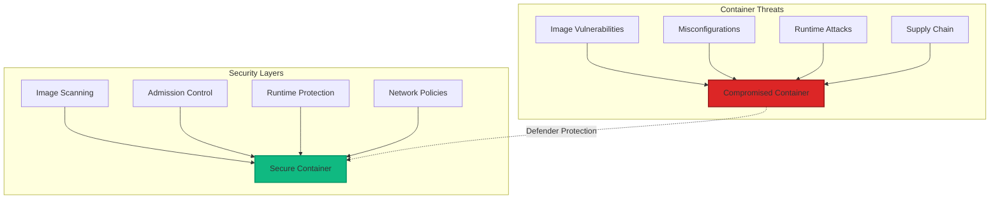
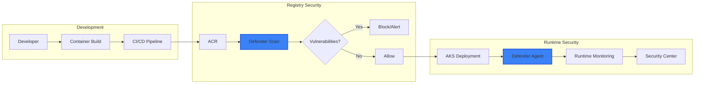

# Module 05: Container Security with Microsoft Defender

## 📋 Module Overview

**Duration**: 2.5 hours  
**Level**: Intermediate  
**Prerequisites**: 
- Completed Modules 01-04
- Docker Desktop installed and running
- Azure Container Registry created
- Basic understanding of containers and Kubernetes

## 🎯 Learning Objectives

By the end of this module, you will:
- Implement container security best practices
- Configure Microsoft Defender for Containers
- Scan container images for vulnerabilities
- Secure Kubernetes deployments
- Monitor runtime container security
- Implement container security policies

## 📚 Module Contents

1. [Container Security Fundamentals](#container-security-fundamentals)
2. [Microsoft Defender for Containers](#microsoft-defender-for-containers)
3. [Container Image Security](#container-image-security)
4. [Kubernetes Security](#kubernetes-security)
5. [Runtime Protection](#runtime-protection)
6. [Exercises](#exercises)

## Container Security Fundamentals

### The Container Attack Surface



### Container Security Best Practices

1. **Build Security**
   - Use minimal base images
   - Don't run as root
   - Remove unnecessary tools
   - Sign and verify images

2. **Registry Security**
   - Scan images before storage
   - Implement access controls
   - Enable content trust
   - Regular vulnerability updates

3. **Runtime Security**
   - Resource limits
   - Read-only filesystems
   - Network segmentation
   - Security monitoring

## Microsoft Defender for Containers

### Architecture Overview



### Enabling Defender for Containers

```bash
# Enable Defender for Containers
az security pricing create \
  --name Containers \
  --tier Standard

# Enable for specific subscription
az account set --subscription "YOUR-SUBSCRIPTION-ID"
az security pricing create \
  --name Containers \
  --tier Standard \
  --subscription "YOUR-SUBSCRIPTION-ID"

# Verify status
az security pricing show \
  --name Containers \
  --query "pricingTier"
```

### Defender Components

| Component | Purpose | Features |
|-----------|---------|----------|
| **Registry Scanning** | Image vulnerability assessment | CVE detection, OS & app scanning |
| **Runtime Protection** | Active threat detection | Behavioral analysis, anomaly detection |
| **Kubernetes Security** | Cluster protection | Admission control, workload protection |
| **CI/CD Integration** | Shift-left security | Build-time scanning, policy gates |

The following diagram shows how different security services integrate through APIs:


## Container Image Security

### Secure Dockerfile Practices

```dockerfile
# Good: Multi-stage build with minimal final image
FROM node:16-alpine AS builder
WORKDIR /app
COPY package*.json ./
RUN npm ci --only=production

FROM node:16-alpine
# Create non-root user
RUN addgroup -g 1001 -S nodejs && \
    adduser -S nodejs -u 1001

WORKDIR /app
# Copy only necessary files
COPY --from=builder --chown=nodejs:nodejs /app/node_modules ./node_modules
COPY --chown=nodejs:nodejs . .

# Security configurations
USER nodejs
EXPOSE 3000
# Read-only root filesystem
RUN chmod -R a-w /app

# Health check
HEALTHCHECK --interval=30s --timeout=3s --start-period=5s --retries=3 \
  CMD node healthcheck.js

CMD ["node", "server.js"]
```

### Container Scanning Pipeline

Create `.github/workflows/container-security.yml`:

```yaml
name: Container Security Pipeline

on:
  push:
    branches: [main, develop]
  pull_request:
    branches: [main]

env:
  REGISTRY: ${{ secrets.ACR_LOGIN_SERVER }}
  IMAGE_NAME: secure-app

jobs:
  build-and-scan:
    runs-on: ubuntu-latest
    permissions:
      contents: read
      packages: write
      security-events: write
      
    steps:
    - name: Checkout code
      uses: actions/checkout@v3
      
    - name: Set up Docker Buildx
      uses: docker/setup-buildx-action@v2
      
    - name: Log in to ACR
      uses: azure/docker-login@v1
      with:
        login-server: ${{ secrets.ACR_LOGIN_SERVER }}
        username: ${{ secrets.ACR_USERNAME }}
        password: ${{ secrets.ACR_PASSWORD }}
        
    - name: Build image
      uses: docker/build-push-action@v4
      with:
        context: .
        push: false
        tags: ${{ env.REGISTRY }}/${{ env.IMAGE_NAME }}:${{ github.sha }}
        cache-from: type=gha
        cache-to: type=gha,mode=max
        
    - name: Run Trivy vulnerability scanner
      uses: aquasecurity/trivy-action@master
      with:
        image-ref: ${{ env.REGISTRY }}/${{ env.IMAGE_NAME }}:${{ github.sha }}
        format: 'sarif'
        output: 'trivy-results.sarif'
        severity: 'CRITICAL,HIGH'
        
    - name: Upload Trivy scan results
      uses: github/codeql-action/upload-sarif@v2
      with:
        sarif_file: 'trivy-results.sarif'
        
    - name: Run Defender for Containers scan
      uses: azure/defender-for-containers-scan@v0
      with:
        image-ref: ${{ env.REGISTRY }}/${{ env.IMAGE_NAME }}:${{ github.sha }}
        
    - name: Push image if secure
      if: success()
      uses: docker/build-push-action@v4
      with:
        context: .
        push: true
        tags: |
          ${{ env.REGISTRY }}/${{ env.IMAGE_NAME }}:${{ github.sha }}
          ${{ env.REGISTRY }}/${{ env.IMAGE_NAME }}:latest
```

### Image Security Policies

```yaml
# image-security-policy.yaml
apiVersion: security.microsoft.com/v1
kind: ImageSecurityPolicy
metadata:
  name: production-image-policy
spec:
  rules:
    - name: "no-root-user"
      match:
        any:
        - resources:
            kinds:
            - Pod
      validate:
        message: "Containers must not run as root"
        pattern:
          spec:
            containers:
            - name: "*"
              securityContext:
                runAsNonRoot: true
                
    - name: "require-image-scanning"
      match:
        any:
        - resources:
            kinds:
            - Pod
      validate:
        message: "Images must be scanned before deployment"
        pattern:
          metadata:
            annotations:
              defender.security.microsoft.com/scan-status: "passed"
              
    - name: "trusted-registries"
      match:
        any:
        - resources:
            kinds:
            - Pod
      validate:
        message: "Images must come from trusted registries"
        pattern:
          spec:
            containers:
            - name: "*"
              image: "${{ env.REGISTRY }}/*"
```

## Kubernetes Security

### AKS Security Configuration

```bash
# Create secure AKS cluster
az aks create \
  --resource-group $RESOURCE_GROUP \
  --name aks-secure-workshop \
  --node-count 3 \
  --enable-addons monitoring,azure-policy,azure-keyvault-secrets-provider \
  --enable-defender \
  --enable-managed-identity \
  --network-plugin azure \
  --network-policy calico \
  --enable-private-cluster \
  --enable-aad \
  --aad-admin-group-object-ids "YOUR-AAD-GROUP-ID"

# Configure kubectl
az aks get-credentials \
  --resource-group $RESOURCE_GROUP \
  --name aks-secure-workshop

# Verify Defender is enabled
kubectl get pods -n kube-system | grep defender
```

### Network Policies

```yaml
# network-policy.yaml
apiVersion: networking.k8s.io/v1
kind: NetworkPolicy
metadata:
  name: secure-app-network-policy
  namespace: production
spec:
  podSelector:
    matchLabels:
      app: secure-app
  policyTypes:
  - Ingress
  - Egress
  ingress:
  - from:
    - namespaceSelector:
        matchLabels:
          name: production
    - podSelector:
        matchLabels:
          app: api-gateway
    ports:
    - protocol: TCP
      port: 3000
  egress:
  - to:
    - namespaceSelector:
        matchLabels:
          name: production
    ports:
    - protocol: TCP
      port: 5432  # PostgreSQL
  - to:
    - namespaceSelector:
        matchLabels:
          name: kube-system
    - podSelector:
        matchLabels:
          k8s-app: kube-dns
    ports:
    - protocol: UDP
      port: 53
```

### Pod Security Standards

```yaml
# pod-security-policy.yaml
apiVersion: policy/v1beta1
kind: PodSecurityPolicy
metadata:
  name: restricted
spec:
  privileged: false
  allowPrivilegeEscalation: false
  requiredDropCapabilities:
    - ALL
  volumes:
    - 'configMap'
    - 'emptyDir'
    - 'projected'
    - 'secret'
    - 'downwardAPI'
    - 'persistentVolumeClaim'
  hostNetwork: false
  hostIPC: false
  hostPID: false
  runAsUser:
    rule: 'MustRunAsNonRoot'
  seLinux:
    rule: 'RunAsAny'
  supplementalGroups:
    rule: 'RunAsAny'
  fsGroup:
    rule: 'RunAsAny'
  readOnlyRootFilesystem: true
```

## Runtime Protection

### Defender Runtime Agent

```yaml
# defender-daemonset.yaml
apiVersion: apps/v1
kind: DaemonSet
metadata:
  name: microsoft-defender-collector
  namespace: microsoft-defender
spec:
  selector:
    matchLabels:
      app: microsoft-defender-collector
  template:
    metadata:
      labels:
        app: microsoft-defender-collector
    spec:
      serviceAccountName: microsoft-defender
      containers:
      - name: collector
        image: mcr.microsoft.com/defender-for-cloud/collector:latest
        env:
        - name: DEFENDER_CLUSTER_ID
          valueFrom:
            configMapKeyRef:
              name: defender-config
              key: cluster-id
        - name: DEFENDER_LOG_LEVEL
          value: "info"
        resources:
          limits:
            memory: "256Mi"
            cpu: "200m"
          requests:
            memory: "128Mi"
            cpu: "100m"
        securityContext:
          privileged: true
        volumeMounts:
        - name: docker-sock
          mountPath: /var/run/docker.sock
        - name: proc
          mountPath: /host/proc
          readOnly: true
        - name: sys
          mountPath: /host/sys
          readOnly: true
      volumes:
      - name: docker-sock
        hostPath:
          path: /var/run/docker.sock
      - name: proc
        hostPath:
          path: /proc
      - name: sys
        hostPath:
          path: /sys
```

### Runtime Security Monitoring

```bash
# Create monitoring dashboard
cat <<EOF > runtime-monitoring.json
{
  "apiVersion": "v1",
  "kind": "ConfigMap",
  "metadata": {
    "name": "defender-runtime-dashboard",
    "namespace": "microsoft-defender"
  },
  "data": {
    "dashboard.json": |
      {
        "widgets": [
          {
            "title": "Container Runtime Threats",
            "query": "SecurityAlert | where AlertType contains 'Container'"
          },
          {
            "title": "Anomalous Process Execution",
            "query": "SecurityEvent | where EventID == 4688"
          },
          {
            "title": "Network Connections",
            "query": "NetworkCommunicationEvents | summarize by RemoteIP"
          }
        ]
      }
  }
}
EOF

kubectl apply -f runtime-monitoring.json
```

## 📝 Exercises

### Exercise 1: Build Secure Container Image (25 minutes)

**Objective**: Create a secure container image following best practices

1. Create a vulnerable Dockerfile:

```dockerfile
# vulnerable.dockerfile
FROM ubuntu:latest
RUN apt-get update && apt-get install -y curl wget netcat
COPY . /app
WORKDIR /app
RUN chmod 777 -R /app
USER root
CMD ["python", "app.py"]
```

2. Scan with Trivy and document vulnerabilities
3. Create secure version:

```dockerfile
# secure.dockerfile
FROM python:3.11-alpine
RUN addgroup -g 1001 -S appuser && \
    adduser -S appuser -u 1001
WORKDIR /app
COPY --chown=appuser:appuser requirements.txt .
RUN pip install --no-cache-dir -r requirements.txt
COPY --chown=appuser:appuser . .
USER appuser
EXPOSE 8000
CMD ["gunicorn", "--bind", "0.0.0.0:8000", "app:app"]
```

4. Compare scan results
5. Document security improvements

**Deliverable**: Comparison report in `exercises/01-secure-container.md`

### Exercise 2: Configure Defender for Containers (30 minutes)

**Objective**: Set up comprehensive container security monitoring

1. Enable Defender for Containers:

```bash
# Enable Defender
az security pricing create --name Containers --tier Standard

# Configure ACR integration
az acr update --name $ACR_NAME --sku Standard
az security container-registry-scan enable --name $ACR_NAME

# Create alert rule
az monitor metrics alert create \
  --name "High Severity Container Vulnerabilities" \
  --resource-group $RESOURCE_GROUP \
  --scopes "/subscriptions/$(az account show --query id -o tsv)" \
  --condition "count VulnerabilityAssessmentScanFindings > 0" \
  --window-size 5m \
  --evaluation-frequency 5m
```

2. Push test images with vulnerabilities
3. Review Defender findings
4. Create remediation plan

**Deliverable**: Security findings report with remediation steps

### Exercise 3: Implement Container Security Pipeline (30 minutes)

**Objective**: Build end-to-end secure container pipeline

1. Create GitHub Actions workflow:

```yaml
name: Secure Container Pipeline

on:
  push:
    branches: [main]

jobs:
  security-pipeline:
    runs-on: ubuntu-latest
    steps:
      # Your implementation here
      # Must include:
      # - Multi-stage build
      # - Vulnerability scanning
      # - Signing
      # - Policy validation
      # - Secure deployment
```

2. Implement security gates
3. Test with vulnerable image
4. Document pipeline stages

**Deliverable**: Working security pipeline with documentation

### Exercise 4: Kubernetes Security Hardening (25 minutes)

**Objective**: Secure AKS cluster configuration

1. Create namespace with security policies:

```bash
# Create namespace
kubectl create namespace secure-app

# Apply PSP
kubectl apply -f pod-security-policy.yaml

# Create RBAC
cat <<EOF | kubectl apply -f -
apiVersion: rbac.authorization.k8s.io/v1
kind: Role
metadata:
  name: secure-app-role
  namespace: secure-app
rules:
- apiGroups: [""]
  resources: ["pods", "services"]
  verbs: ["get", "list", "watch"]
---
apiVersion: rbac.authorization.k8s.io/v1
kind: RoleBinding
metadata:
  name: secure-app-binding
  namespace: secure-app
roleRef:
  apiGroup: rbac.authorization.k8s.io
  kind: Role
  name: secure-app-role
subjects:
- kind: ServiceAccount
  name: secure-app-sa
  namespace: secure-app
EOF
```

2. Deploy application with security context
3. Test security policies
4. Verify restrictions work

**Deliverable**: Secured namespace configuration

### Exercise 5: Runtime Threat Detection (30 minutes)

**Objective**: Detect and respond to runtime threats

1. Deploy Defender agents:

```bash
# Install Defender extension
az k8s-extension create \
  --name microsoft-defender \
  --extension-type Microsoft.AzureDefender.Kubernetes \
  --resource-group $RESOURCE_GROUP \
  --cluster-name aks-secure-workshop \
  --cluster-type managedClusters
```

2. Simulate security incidents:

```bash
# Test 1: Suspicious process
kubectl exec -it test-pod -- /bin/sh -c "curl http://malicious-site.com"

# Test 2: Cryptocurrency mining
kubectl exec -it test-pod -- /bin/sh -c "echo 'mining simulation'"

# Test 3: Privilege escalation
kubectl exec -it test-pod -- /bin/sh -c "sudo su"
```

3. Review alerts in Defender
4. Create incident response playbook

**Deliverable**: Incident response documentation

## 🎯 Module Summary

### Key Takeaways

1. **Container security is multi-layered** - build, registry, and runtime
2. **Defender provides comprehensive protection** across the container lifecycle
3. **Shift-left container security** prevents production issues
4. **Runtime protection** catches zero-day threats
5. **Policy as code** ensures consistent security

### Skills Acquired

- ✅ Building secure container images
- ✅ Configuring Defender for Containers
- ✅ Implementing security scanning pipelines
- ✅ Hardening Kubernetes deployments
- ✅ Runtime threat detection and response

## 📚 Additional Resources

### Documentation
- [Microsoft Defender for Containers](https://docs.microsoft.com/en-us/azure/defender-for-cloud/defender-for-containers-introduction)
- [AKS Security Best Practices](https://docs.microsoft.com/en-us/azure/aks/security-best-practices)
- [Container Security Guide](https://docs.microsoft.com/en-us/azure/container-instances/container-instances-image-security)

### Tools
- [Trivy Scanner](https://github.com/aquasecurity/trivy)
- [Falco Runtime Security](https://falco.org/)
- [OPA Gatekeeper](https://github.com/open-policy-agent/gatekeeper)

### Training
- [AKS Security Workshop](https://docs.microsoft.com/en-us/learn/modules/secure-aks-deployment/)
- [Container Security Course](https://docs.microsoft.com/en-us/learn/paths/secure-containers-kubernetes/)

## ✅ Module Completion Checklist

Before moving to the next module, ensure you have:

- [ ] Built secure container images
- [ ] Enabled Defender for Containers
- [ ] Created security scanning pipeline
- [ ] Hardened Kubernetes cluster
- [ ] Implemented runtime protection
- [ ] Completed all exercises

## 🚀 Next Steps

Continue to [Module 06: Agentic DevOps and Automation](../06-agentic-devops/README.md) where we'll explore agent-based security automation.

---

**Need Help?** Check our [Container Security FAQ](../../docs/container-security-faq.md) or post in [Discussions](https://github.com/YOUR-USERNAME/secure-code-ai-workshop/discussions).

---

## 🧭 Navigation

| Previous | Up | Next |
|----------|----|----- |
| [← Module 04: Copilot Security](module-04-copilot.md) | [📚 All Modules](../README.md#-learning-path) | [Module 06: Agentic AI Security →](module-06-agentic.md) |

**Quick Links**: [🏠 Home](../README.md) • [📖 Workshop Overview](../docs/secure-code-ai-workshop.md) • [🔧 Troubleshooting](../docs/troubleshooting-guide.md)
