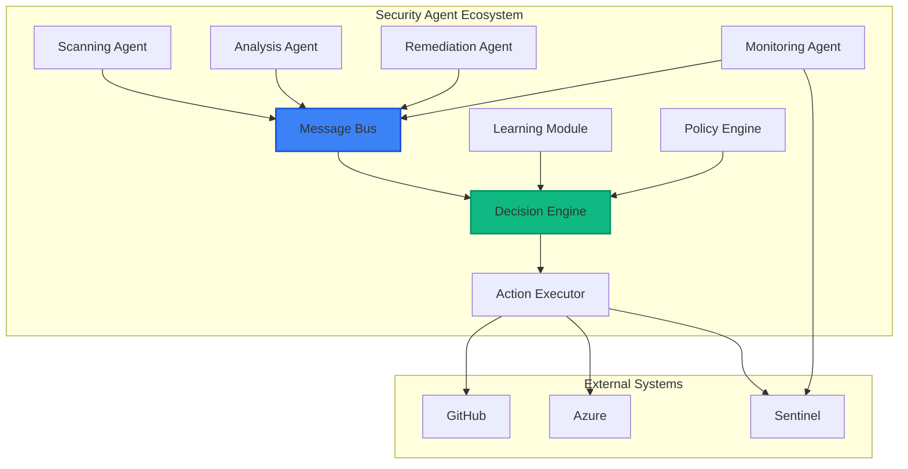
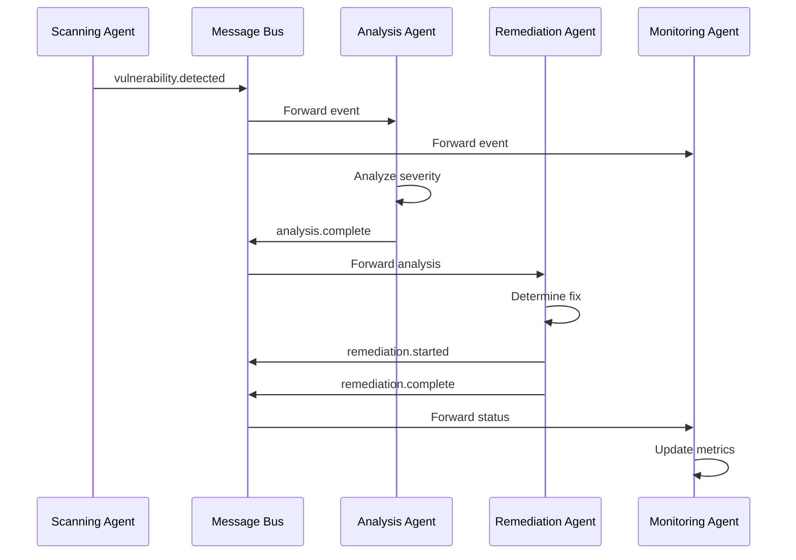
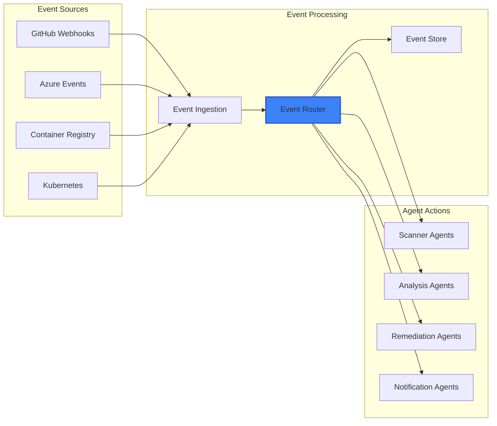

# Module 06: Agentic DevOps and Automation

## 📋 Module Overview

**Duration**: 2 hours  
**Level**: Intermediate  
**Prerequisites**: 
- Completed Modules 01-05
- Understanding of CI/CD concepts
- Basic knowledge of event-driven architecture
- Azure Functions or Logic Apps experience (helpful)

## 🎯 Learning Objectives

By the end of this module, you will:
- Understand the concept of Agentic DevOps
- Build autonomous security agents
- Create agent-to-agent communication systems
- Implement self-healing security workflows
- Design event-driven security responses
- Measure agent effectiveness

## 📚 Module Contents

1. [Introduction to Agentic DevOps](#introduction-to-agentic-devops)
2. [Building Security Agents](#building-security-agents)
3. [Agent-to-Agent Communication](#agent-to-agent-communication)
4. [Self-Healing Security](#self-healing-security)
5. [Event-Driven Architecture](#event-driven-architecture)
6. [Exercises](#exercises)

## Introduction to Agentic DevOps

### What is Agentic DevOps?

Agentic DevOps represents the evolution from reactive to proactive security operations through autonomous agents that can:
- Detect security issues independently
- Communicate with other agents
- Make decisions based on context
- Execute remediation actions
- Learn from outcomes

### Agent Architecture



### Key Principles

1. **Autonomy**: Agents operate independently
2. **Communication**: Agents share information
3. **Intelligence**: Decision-making capabilities
4. **Scalability**: Distributed architecture
5. **Resilience**: Self-healing and fault-tolerant

## Building Security Agents

### Agent Framework

```python
# security_agent_framework.py
import asyncio
import json
from abc import ABC, abstractmethod
from typing import Dict, Any, List
from azure.servicebus.aio import ServiceBusClient
from azure.identity import DefaultAzureCredential

class SecurityAgent(ABC):
    """Base class for all security agents"""
    
    def __init__(self, agent_id: str, config: Dict[str, Any]):
        self.agent_id = agent_id
        self.config = config
        self.message_bus = MessageBus(config['service_bus_connection'])
        self.state = AgentState.IDLE
        self.capabilities = self._define_capabilities()
        
    @abstractmethod
    def _define_capabilities(self) -> List[str]:
        """Define what this agent can do"""
        pass
        
    @abstractmethod
    async def process_event(self, event: Dict[str, Any]) -> Dict[str, Any]:
        """Process incoming security event"""
        pass
        
    async def start(self):
        """Start the agent"""
        self.state = AgentState.RUNNING
        await self._register_agent()
        await self._listen_for_events()
        
    async def _register_agent(self):
        """Register agent with the ecosystem"""
        registration = {
            'agent_id': self.agent_id,
            'capabilities': self.capabilities,
            'status': 'online',
            'timestamp': datetime.utcnow().isoformat()
        }
        await self.message_bus.publish('agent.registration', registration)
        
    async def _listen_for_events(self):
        """Listen for relevant events"""
        async for event in self.message_bus.subscribe(self.capabilities):
            try:
                result = await self.process_event(event)
                await self._publish_result(result)
            except Exception as e:
                await self._handle_error(e, event)

class VulnerabilityScanner(SecurityAgent):
    """Agent for scanning vulnerabilities"""
    
    def _define_capabilities(self) -> List[str]:
        return ['code.scan', 'container.scan', 'dependency.scan']
        
    async def process_event(self, event: Dict[str, Any]) -> Dict[str, Any]:
        scan_type = event.get('scan_type')
        target = event.get('target')
        
        if scan_type == 'code':
            return await self._scan_code(target)
        elif scan_type == 'container':
            return await self._scan_container(target)
        elif scan_type == 'dependency':
            return await self._scan_dependencies(target)
            
    async def _scan_code(self, repository: str) -> Dict[str, Any]:
        # Implement code scanning logic
        vulnerabilities = await self._run_codeql_scan(repository)
        return {
            'agent_id': self.agent_id,
            'scan_type': 'code',
            'repository': repository,
            'vulnerabilities': vulnerabilities,
            'severity_summary': self._summarize_severities(vulnerabilities)
        }

class RemediationAgent(SecurityAgent):
    """Agent for automated remediation"""
    
    def _define_capabilities(self) -> List[str]:
        return ['vulnerability.fix', 'configuration.update', 'policy.enforce']
        
    async def process_event(self, event: Dict[str, Any]) -> Dict[str, Any]:
        if event.get('type') == 'vulnerability.detected':
            return await self._remediate_vulnerability(event)
        elif event.get('type') == 'misconfiguration.detected':
            return await self._fix_configuration(event)
            
    async def _remediate_vulnerability(self, vulnerability: Dict[str, Any]) -> Dict[str, Any]:
        # Determine remediation strategy
        strategy = await self._get_remediation_strategy(vulnerability)
        
        if strategy['type'] == 'autofix':
            result = await self._apply_autofix(vulnerability, strategy)
        elif strategy['type'] == 'update_dependency':
            result = await self._update_dependency(vulnerability, strategy)
        elif strategy['type'] == 'manual':
            result = await self._create_issue(vulnerability, strategy)
            
        return {
            'agent_id': self.agent_id,
            'action': 'remediation',
            'vulnerability_id': vulnerability['id'],
            'strategy': strategy,
            'result': result
        }
```

### Agent Deployment

```yaml
# agent-deployment.yaml
apiVersion: apps/v1
kind: Deployment
metadata:
  name: security-agent-scanner
  namespace: security-agents
spec:
  replicas: 3
  selector:
    matchLabels:
      app: security-scanner
  template:
    metadata:
      labels:
        app: security-scanner
        agent-type: scanner
    spec:
      serviceAccountName: security-agent
      containers:
      - name: scanner-agent
        image: $ACR_NAME.azurecr.io/security-scanner-agent:latest
        env:
        - name: AGENT_ID
          valueFrom:
            fieldRef:
              fieldPath: metadata.name
        - name: SERVICE_BUS_CONNECTION
          valueFrom:
            secretKeyRef:
              name: agent-secrets
              key: service-bus-connection
        - name: GITHUB_TOKEN
          valueFrom:
            secretKeyRef:
              name: agent-secrets
              key: github-token
        resources:
          requests:
            memory: "256Mi"
            cpu: "100m"
          limits:
            memory: "512Mi"
            cpu: "500m"
```

## Agent-to-Agent Communication

### Message Bus Architecture



### Communication Protocol

```python
# agent_communication.py
from dataclasses import dataclass
from enum import Enum
from typing import Optional, List, Any
import uuid

class MessageType(Enum):
    COMMAND = "command"
    EVENT = "event"
    QUERY = "query"
    RESPONSE = "response"

@dataclass
class AgentMessage:
    id: str
    type: MessageType
    source_agent: str
    target_agent: Optional[str]  # None for broadcast
    topic: str
    payload: Dict[str, Any]
    correlation_id: Optional[str]
    timestamp: datetime
    
    @classmethod
    def create_event(cls, source: str, topic: str, payload: Dict[str, Any]):
        return cls(
            id=str(uuid.uuid4()),
            type=MessageType.EVENT,
            source_agent=source,
            target_agent=None,
            topic=topic,
            payload=payload,
            correlation_id=None,
            timestamp=datetime.utcnow()
        )

class MessageBus:
    """Central message bus for agent communication"""
    
    def __init__(self, connection_string: str):
        self.client = ServiceBusClient.from_connection_string(connection_string)
        self.topic_client = self.client.get_topic_sender("agent-events")
        self.subscriptions = {}
        
    async def publish(self, message: AgentMessage):
        """Publish message to the bus"""
        serialized = json.dumps({
            'id': message.id,
            'type': message.type.value,
            'source': message.source_agent,
            'target': message.target_agent,
            'topic': message.topic,
            'payload': message.payload,
            'correlation_id': message.correlation_id,
            'timestamp': message.timestamp.isoformat()
        })
        
        await self.topic_client.send_messages(
            ServiceBusMessage(
                body=serialized,
                subject=message.topic,
                application_properties={
                    'source_agent': message.source_agent,
                    'message_type': message.type.value
                }
            )
        )
        
    async def subscribe(self, agent_id: str, topics: List[str]):
        """Subscribe to specific topics"""
        subscription_client = self.client.get_subscription_receiver(
            topic_name="agent-events",
            subscription_name=agent_id
        )
        
        async with subscription_client:
            async for message in subscription_client:
                decoded = json.loads(str(message))
                if decoded['topic'] in topics or decoded['target'] == agent_id:
                    yield AgentMessage(**decoded)
                await subscription_client.complete_message(message)
```

## Self-Healing Security

### Self-Healing Workflow

```python
# self_healing_workflow.py
class SelfHealingOrchestrator:
    """Orchestrates self-healing security workflows"""
    
    def __init__(self, config: Dict[str, Any]):
        self.config = config
        self.agents = {}
        self.healing_policies = self._load_policies()
        self.metrics = MetricsCollector()
        
    async def register_agent(self, agent: SecurityAgent):
        """Register an agent with the orchestrator"""
        self.agents[agent.agent_id] = agent
        await agent.start()
        
    async def handle_security_event(self, event: Dict[str, Any]):
        """Handle incoming security event"""
        event_type = event.get('type')
        severity = event.get('severity')
        
        # Determine if self-healing is possible
        if self._can_self_heal(event_type, severity):
            await self._execute_self_healing(event)
        else:
            await self._escalate_to_human(event)
            
    def _can_self_heal(self, event_type: str, severity: str) -> bool:
        """Check if event can be self-healed"""
        policy = self.healing_policies.get(event_type)
        if not policy:
            return False
            
        return (
            severity in policy['auto_heal_severities'] and
            policy['confidence_threshold'] >= 0.8
        )
        
    async def _execute_self_healing(self, event: Dict[str, Any]):
        """Execute self-healing workflow"""
        workflow = {
            'id': str(uuid.uuid4()),
            'event': event,
            'steps': [],
            'status': 'initiated'
        }
        
        try:
            # Step 1: Validate the issue
            validation = await self._validate_issue(event)
            workflow['steps'].append(validation)
            
            if not validation['valid']:
                return await self._log_false_positive(event)
                
            # Step 2: Determine remediation
            remediation = await self._determine_remediation(event)
            workflow['steps'].append(remediation)
            
            # Step 3: Apply fix
            fix_result = await self._apply_remediation(remediation)
            workflow['steps'].append(fix_result)
            
            # Step 4: Verify fix
            verification = await self._verify_remediation(event, fix_result)
            workflow['steps'].append(verification)
            
            workflow['status'] = 'completed' if verification['success'] else 'failed'
            
        except Exception as e:
            workflow['status'] = 'error'
            workflow['error'] = str(e)
            await self._escalate_to_human(event)
            
        finally:
            await self.metrics.record_healing_workflow(workflow)
```

### Healing Policies

```yaml
# healing-policies.yaml
policies:
  - name: "dependency-vulnerability"
    event_type: "vulnerability.dependency"
    auto_heal_severities: ["low", "medium"]
    confidence_threshold: 0.9
    actions:
      - type: "update_dependency"
        conditions:
          - "patch_available"
          - "no_breaking_changes"
      - type: "create_pr"
        conditions:
          - "fix_available"
    rollback_enabled: true
    
  - name: "container-misconfiguration"
    event_type: "misconfiguration.container"
    auto_heal_severities: ["low", "medium", "high"]
    confidence_threshold: 0.85
    actions:
      - type: "update_deployment"
        conditions:
          - "known_fix"
          - "test_environment"
      - type: "apply_policy"
        conditions:
          - "policy_exists"
    rollback_enabled: true
    
  - name: "exposed-secret"
    event_type: "secret.exposed"
    auto_heal_severities: ["critical"]
    confidence_threshold: 1.0
    actions:
      - type: "rotate_secret"
        immediate: true
      - type: "update_references"
      - type: "notify_security_team"
    rollback_enabled: false
```

## Event-Driven Architecture

### Security Event Flow



### Event Processing Pipeline

```python
# event_processor.py
from azure.eventhub.aio import EventHubConsumerClient
from azure.eventhub.extensions.checkpointstoreblobaio import BlobCheckpointStore

class SecurityEventProcessor:
    """Processes security events from multiple sources"""
    
    def __init__(self, config: Dict[str, Any]):
        self.config = config
        self.checkpoint_store = BlobCheckpointStore.from_connection_string(
            config['storage_connection'],
            config['checkpoint_container']
        )
        self.event_hub_client = EventHubConsumerClient.from_connection_string(
            config['eventhub_connection'],
            consumer_group="security-agents",
            checkpoint_store=self.checkpoint_store
        )
        self.event_handlers = self._register_handlers()
        
    def _register_handlers(self) -> Dict[str, Callable]:
        """Register event handlers"""
        return {
            'github.push': self.handle_github_push,
            'github.pull_request': self.handle_pull_request,
            'acr.push': self.handle_container_push,
            'aks.deployment': self.handle_deployment,
            'defender.alert': self.handle_security_alert
        }
        
    async def process_events(self):
        """Main event processing loop"""
        async with self.event_hub_client:
            await self.event_hub_client.receive(
                on_event=self.on_event,
                starting_position="-1",
            )
            
    async def on_event(self, partition_context, events):
        """Handle batch of events"""
        for event in events:
            try:
                event_data = json.loads(event.body_as_str())
                event_type = event_data.get('type')
                
                handler = self.event_handlers.get(event_type)
                if handler:
                    await handler(event_data)
                else:
                    await self.handle_unknown_event(event_data)
                    
            except Exception as e:
                await self.handle_event_error(event, e)
                
        await partition_context.update_checkpoint()
        
    async def handle_github_push(self, event: Dict[str, Any]):
        """Handle GitHub push events"""
        repository = event['repository']['full_name']
        branch = event['ref'].split('/')[-1]
        
        # Trigger security scans
        scan_message = AgentMessage.create_event(
            source='event_processor',
            topic='scan.requested',
            payload={
                'scan_type': 'code',
                'repository': repository,
                'branch': branch,
                'commit': event['after']
            }
        )
        
        await self.message_bus.publish(scan_message)
```

## 📝 Exercises

### Exercise 1: Build Your First Security Agent (30 minutes)

**Objective**: Create a functional security agent

1. Implement a DependencyScanner agent:

```python
# exercises/dependency_scanner_agent.py
class DependencyScanner(SecurityAgent):
    """Scans for vulnerable dependencies"""
    
    def _define_capabilities(self) -> List[str]:
        return ['dependency.scan', 'sbom.generate']
        
    async def process_event(self, event: Dict[str, Any]) -> Dict[str, Any]:
        # Your implementation here
        # Should:
        # 1. Parse package files (package.json, requirements.txt, etc.)
        # 2. Check against vulnerability database
        # 3. Generate SBOM
        # 4. Return findings
        pass
```

2. Deploy the agent
3. Test with vulnerable dependencies
4. Verify agent communication

**Deliverable**: Working agent with test results

### Exercise 2: Implement Agent Communication (25 minutes)

**Objective**: Create agent-to-agent communication

1. Build message flow between agents:

```python
# exercises/agent_communication_test.py
async def test_agent_communication():
    # Create scanner agent
    scanner = VulnerabilityScanner("scanner-01", config)
    
    # Create remediation agent
    remediator = RemediationAgent("remediator-01", config)
    
    # Start agents
    await scanner.start()
    await remediator.start()
    
    # Simulate vulnerability detection
    # Verify remediation agent receives and processes
```

2. Implement correlation tracking
3. Add message retry logic
4. Test failure scenarios

**Deliverable**: Communication test results and logs

### Exercise 3: Create Self-Healing Workflow (30 minutes)

**Objective**: Build automated remediation workflow

1. Define healing policy:

```yaml
# exercises/custom-healing-policy.yaml
name: "sql-injection-fix"
event_type: "vulnerability.sql_injection"
auto_heal_severities: ["high", "critical"]
confidence_threshold: 0.95
actions:
  - type: "apply_parameterized_query"
    validation: "code_review"
  - type: "create_fix_pr"
    require_approval: false
rollback_enabled: true
test_required: true
```

2. Implement the workflow
3. Test with SQL injection vulnerability
4. Verify automated fix

**Deliverable**: Self-healing demonstration with metrics

### Exercise 4: Build Event-Driven Pipeline (20 minutes)

**Objective**: Create event-driven security pipeline

1. Set up event sources:

```bash
# Configure GitHub webhook
curl -X POST https://api.github.com/repos/OWNER/REPO/hooks \
  -H "Authorization: token $GITHUB_TOKEN" \
  -H "Content-Type: application/json" \
  -d '{
    "config": {
      "url": "https://your-function-app.azurewebsites.net/api/github-webhook",
      "content_type": "json"
    },
    "events": ["push", "pull_request", "security_alert"]
  }'
```

2. Create event processor
3. Route events to appropriate agents
4. Monitor event flow

**Deliverable**: Working event pipeline with documentation

### Exercise 5: Agent Metrics Dashboard (25 minutes)

**Objective**: Monitor agent ecosystem health

1. Create metrics collection:

```python
# exercises/agent_metrics.py
class AgentMetricsCollector:
    def __init__(self):
        self.metrics = {
            'events_processed': Counter('agent_events_total'),
            'processing_time': Histogram('agent_processing_seconds'),
            'active_agents': Gauge('agent_active_count'),
            'remediation_success': Counter('agent_remediation_success')
        }
    
    async def collect_metrics(self):
        # Implement metrics collection
        # Track:
        # - Agent health
        # - Event processing rate
        # - Remediation success rate
        # - Communication latency
        pass
```

2. Create Grafana dashboard
3. Set up alerts for agent failures
4. Document key metrics

**Deliverable**: Metrics dashboard with alerting

## 🎯 Module Summary

### Key Takeaways

1. **Agentic DevOps enables autonomous security** operations
2. **Agent-to-agent communication** creates intelligent systems
3. **Self-healing workflows** reduce manual intervention
4. **Event-driven architecture** enables real-time response
5. **Metrics are crucial** for agent ecosystem health

### Skills Acquired

- ✅ Building autonomous security agents
- ✅ Implementing agent communication
- ✅ Creating self-healing workflows
- ✅ Designing event-driven systems
- ✅ Monitoring agent ecosystems

## 📚 Additional Resources

### Documentation
- [Azure Event Grid](https://docs.microsoft.com/en-us/azure/event-grid/)
- [Azure Service Bus](https://docs.microsoft.com/en-us/azure/service-bus-messaging/)
- [Kubernetes Operators](https://kubernetes.io/docs/concepts/extend-kubernetes/operator/)

### Frameworks
- [KEDA - Event-driven Autoscaling](https://keda.sh/)
- [Argo Events](https://argoproj.github.io/argo-events/)
- [Temporal Workflow](https://temporal.io/)

### Examples
- [Security Automation Examples](https://github.com/Azure/Azure-Security-Center/tree/master/Workflow%20automation)
- [GitHub Security Advisories API](https://docs.github.com/en/rest/security-advisories)

## ✅ Module Completion Checklist

Before moving to the next module, ensure you have:

- [ ] Built a functional security agent
- [ ] Implemented agent communication
- [ ] Created self-healing workflow
- [ ] Built event-driven pipeline
- [ ] Set up agent metrics monitoring
- [ ] Completed all exercises

## 🚀 Next Steps

Continue to [Module 07: Multi-Cloud Security Architecture](../07-multicloud-security/README.md) where we'll implement security across multiple cloud providers.

---

**Need Help?** Check our [Agentic DevOps FAQ](../../docs/agentic-devops-faq.md) or ask in [Discussions](https://github.com/YOUR-USERNAME/secure-code-ai-workshop/discussions).
