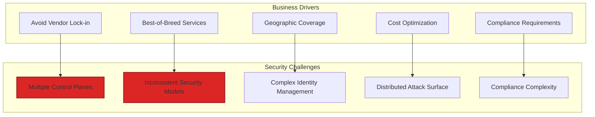
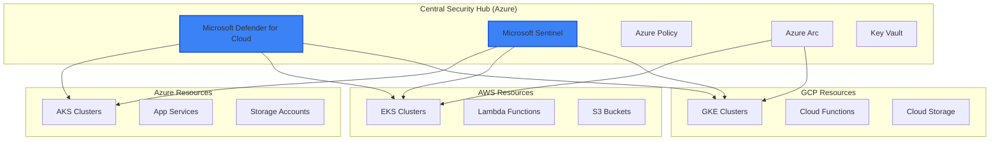

# Module 07: Multi-Cloud Security Architecture

## 📋 Module Overview

**Duration**: 3 hours  
**Level**: Intermediate to Advanced  
**Prerequisites**: 
- Completed Modules 01-06
- Azure account (primary)
- AWS account (optional but recommended)
- GCP account (optional but recommended)
- Understanding of cloud networking basics

## 🎯 Learning Objectives

By the end of this module, you will:
- Design secure multi-cloud architectures
- Implement centralized security management
- Deploy applications across multiple clouds
- Configure cross-cloud networking securely
- Unify security monitoring with Microsoft Defender
- Create multi-cloud incident response workflows

## 📚 Module Contents

1. [Multi-Cloud Security Challenges](#multi-cloud-security-challenges)
2. [Centralized Security Architecture](#centralized-security-architecture)
3. [Cross-Cloud Deployment](#cross-cloud-deployment)
4. [Unified Security Management](#unified-security-management)
5. [Multi-Cloud Monitoring](#multi-cloud-monitoring)
6. [Exercises](#exercises)

## Multi-Cloud Security Challenges

### Why Multi-Cloud?



### Security Considerations

| Challenge | Impact | Solution |
|-----------|--------|----------|
| **Identity Sprawl** | Multiple identity providers | Centralized identity with federation |
| **Policy Inconsistency** | Security gaps | Unified policy engine |
| **Visibility Gaps** | Blind spots in monitoring | Centralized SIEM (Sentinel) |
| **Skill Requirements** | Need expertise in all clouds | Automation and abstraction |
| **Cost Management** | Security tool duplication | Unified security platform |

## Centralized Security Architecture

### Architecture Overview



### Setting Up Azure Arc

```bash
# Register Azure Arc providers
az provider register --namespace Microsoft.HybridCompute
az provider register --namespace Microsoft.GuestConfiguration
az provider register --namespace Microsoft.HybridConnectivity

# Create resource group for Arc resources
az group create \
  --name rg-arc-multicloud \
  --location eastus

# For AWS EKS clusters
# First, get EKS credentials
aws eks update-kubeconfig --name eks-cluster-name --region us-east-1

# Connect EKS to Arc
az connectedk8s connect \
  --name arc-eks-cluster \
  --resource-group rg-arc-multicloud \
  --location eastus

# For GCP GKE clusters
# First, get GKE credentials
gcloud container clusters get-credentials gke-cluster-name --zone us-central1-a

# Connect GKE to Arc
az connectedk8s connect \
  --name arc-gke-cluster \
  --resource-group rg-arc-multicloud \
  --location eastus
```

### Identity Federation

```yaml
# azure-ad-federation.yaml
apiVersion: v1
kind: ConfigMap
metadata:
  name: identity-federation-config
data:
  aws-role-mapping: |
    {
      "roleArn": "arn:aws:iam::123456789012:role/AzureADFederatedRole",
      "audienceClaim": "api://AzureADTokenExchange",
      "issuer": "https://sts.windows.net/YOUR-TENANT-ID/"
    }
  gcp-workload-identity: |
    {
      "serviceAccount": "azure-federated@project.iam.gserviceaccount.com",
      "workloadIdentityPool": "projects/PROJECT_NUMBER/locations/global/workloadIdentityPools/azure-pool",
      "provider": "projects/PROJECT_NUMBER/locations/global/workloadIdentityPools/azure-pool/providers/azure-provider"
    }
```

## Cross-Cloud Deployment

### Multi-Cloud Application Architecture

```python
# multicloud_deployer.py
import asyncio
from typing import Dict, List, Any
from azure.mgmt.containerservice import ContainerServiceClient
import boto3
from google.cloud import container_v1

class MultiCloudDeployer:
    """Deploy applications across multiple cloud providers"""
    
    def __init__(self, config: Dict[str, Any]):
        self.config = config
        self.azure_client = ContainerServiceClient(
            credential=DefaultAzureCredential(),
            subscription_id=config['azure_subscription_id']
        )
        self.aws_client = boto3.client('eks', region_name=config['aws_region'])
        self.gcp_client = container_v1.ClusterManagerClient()
        
    async def deploy_application(self, app_config: Dict[str, Any]):
        """Deploy application to all clouds"""
        deployment_tasks = []
        
        if app_config.get('deploy_to_azure'):
            deployment_tasks.append(
                self.deploy_to_azure(app_config)
            )
            
        if app_config.get('deploy_to_aws'):
            deployment_tasks.append(
                self.deploy_to_aws(app_config)
            )
            
        if app_config.get('deploy_to_gcp'):
            deployment_tasks.append(
                self.deploy_to_gcp(app_config)
            )
            
        results = await asyncio.gather(*deployment_tasks)
        return self.aggregate_results(results)
        
    async def deploy_to_azure(self, app_config: Dict[str, Any]):
        """Deploy to Azure AKS"""
        manifest = self.generate_k8s_manifest(app_config, 'azure')
        
        # Apply security policies
        secured_manifest = await self.apply_azure_security_policies(manifest)
        
        # Deploy using kubectl or Azure SDK
        result = await self.kubectl_apply(
            cluster='aks-secure-workshop',
            manifest=secured_manifest
        )
        
        # Enable monitoring
        await self.enable_azure_monitoring(app_config['name'])
        
        return result
        
    async def deploy_to_aws(self, app_config: Dict[str, Any]):
        """Deploy to AWS EKS"""
        manifest = self.generate_k8s_manifest(app_config, 'aws')
        
        # Apply AWS security policies
        secured_manifest = await self.apply_aws_security_policies(manifest)
        
        # Deploy
        result = await self.kubectl_apply(
            cluster='eks-secure-cluster',
            manifest=secured_manifest
        )
        
        # Configure CloudWatch integration
        await self.configure_cloudwatch_to_sentinel(app_config['name'])
        
        return result
        
    def generate_k8s_manifest(self, app_config: Dict[str, Any], cloud: str) -> Dict:
        """Generate cloud-specific Kubernetes manifest"""
        base_manifest = {
            'apiVersion': 'apps/v1',
            'kind': 'Deployment',
            'metadata': {
                'name': app_config['name'],
                'labels': {
                    'app': app_config['name'],
                    'cloud': cloud,
                    'managed-by': 'multicloud-deployer'
                }
            },
            'spec': {
                'replicas': app_config.get('replicas', 3),
                'selector': {
                    'matchLabels': {
                        'app': app_config['name']
                    }
                },
                'template': {
                    'metadata': {
                        'labels': {
                            'app': app_config['name'],
                            'cloud': cloud
                        }
                    },
                    'spec': {
                        'containers': [{
                            'name': app_config['name'],
                            'image': self.get_cloud_specific_image(app_config, cloud),
                            'ports': [{'containerPort': app_config.get('port', 8080)}],
                            'env': self.get_cloud_specific_env(cloud),
                            'resources': app_config.get('resources', {
                                'requests': {'memory': '256Mi', 'cpu': '100m'},
                                'limits': {'memory': '512Mi', 'cpu': '500m'}
                            })
                        }]
                    }
                }
            }
        }
        
        # Add cloud-specific configurations
        if cloud == 'azure':
            base_manifest['spec']['template']['spec']['nodeSelector'] = {
                'agentpool': 'secure'
            }
        elif cloud == 'aws':
            base_manifest['spec']['template']['spec']['nodeSelector'] = {
                'eks.amazonaws.com/nodegroup': 'secure-nodes'
            }
        elif cloud == 'gcp':
            base_manifest['spec']['template']['spec']['nodeSelector'] = {
                'cloud.google.com/gke-nodepool': 'secure-pool'
            }
            
        return base_manifest
```

### Cross-Cloud Networking

```terraform
# multicloud-networking.tf
# Azure Virtual Network
resource "azurerm_virtual_network" "hub" {
  name                = "vnet-security-hub"
  location            = var.azure_location
  resource_group_name = var.resource_group_name
  address_space       = ["10.0.0.0/16"]
}

# AWS VPC
resource "aws_vpc" "spoke_aws" {
  cidr_block = "10.1.0.0/16"
  
  tags = {
    Name = "vpc-multicloud-spoke"
  }
}

# GCP VPC
resource "google_compute_network" "spoke_gcp" {
  name                    = "vpc-multicloud-spoke"
  auto_create_subnetworks = false
}

# Azure to AWS VPN
resource "azurerm_virtual_network_gateway" "azure_vpn" {
  name                = "vpn-azure-to-aws"
  location            = var.azure_location
  resource_group_name = var.resource_group_name
  type                = "Vpn"
  vpn_type            = "RouteBased"
  sku                 = "VpnGw2"
  
  ip_configuration {
    name                          = "vnetGatewayConfig"
    public_ip_address_id          = azurerm_public_ip.vpn_ip.id
    private_ip_address_allocation = "Dynamic"
    subnet_id                     = azurerm_subnet.gateway_subnet.id
  }
}

# AWS Customer Gateway
resource "aws_customer_gateway" "azure_gateway" {
  bgp_asn    = 65000
  ip_address = azurerm_public_ip.vpn_ip.ip_address
  type       = "ipsec.1"
  
  tags = {
    Name = "Azure-VPN-Gateway"
  }
}

# Site-to-Site VPN Connection
resource "aws_vpn_connection" "azure_aws" {
  vpn_gateway_id      = aws_vpn_gateway.aws_vpn.id
  customer_gateway_id = aws_customer_gateway.azure_gateway.id
  type                = "ipsec.1"
  static_routes_only  = true
}
```

## Unified Security Management

### Microsoft Defender for Multi-Cloud

```bash
# Enable Defender for Cloud for AWS
az security pricing create --name CloudPosture --tier Standard

# Add AWS account to Defender
az security aws-connector create \
  --name aws-production-account \
  --hierarchy-identifier "123456789012" \
  --environment-name AWS_PRODUCTION \
  --offerings "[{\"offeringType\":\"DefenderForContainersAws\"}]"

# Add GCP project to Defender
az security gcp-connector create \
  --name gcp-production-project \
  --hierarchy-identifier "my-gcp-project" \
  --environment-name GCP_PRODUCTION \
  --offerings "[{\"offeringType\":\"DefenderForContainersGcp\"}]"
```

### Unified Policy Management

```python
# unified_policy_engine.py
class UnifiedPolicyEngine:
    """Manage security policies across multiple clouds"""
    
    def __init__(self):
        self.policies = self.load_policies()
        self.translators = {
            'azure': AzurePolicyTranslator(),
            'aws': AWSPolicyTranslator(),
            'gcp': GCPPolicyTranslator()
        }
        
    async def apply_policy(self, policy: Dict[str, Any], clouds: List[str]):
        """Apply policy across specified clouds"""
        results = {}
        
        for cloud in clouds:
            translator = self.translators.get(cloud)
            if translator:
                cloud_specific_policy = translator.translate(policy)
                results[cloud] = await self.deploy_policy(
                    cloud, 
                    cloud_specific_policy
                )
                
        return results
        
    def create_unified_policy(self, name: str, rules: List[Dict]) -> Dict:
        """Create a unified policy definition"""
        return {
            'name': name,
            'version': '1.0',
            'rules': rules,
            'enforcement': 'mandatory',
            'clouds': ['azure', 'aws', 'gcp']
        }

# Example unified policy
container_security_policy = {
    'name': 'container-security-baseline',
    'rules': [
        {
            'id': 'no-privileged-containers',
            'resource': 'container',
            'condition': 'privileged == false',
            'severity': 'high'
        },
        {
            'id': 'require-resource-limits',
            'resource': 'container',
            'condition': 'resources.limits != null',
            'severity': 'medium'
        },
        {
            'id': 'no-root-user',
            'resource': 'container',
            'condition': 'securityContext.runAsNonRoot == true',
            'severity': 'high'
        }
    ]
}
```

### Cross-Cloud RBAC

```yaml
# cross-cloud-rbac.yaml
apiVersion: v1
kind: ConfigMap
metadata:
  name: cross-cloud-rbac-mapping
data:
  role-mapping.json: |
    {
      "roles": [
        {
          "name": "security-reader",
          "azure_role": "Security Reader",
          "aws_role": "arn:aws:iam::123456789012:role/SecurityAudit",
          "gcp_role": "roles/iam.securityReviewer"
        },
        {
          "name": "security-admin",
          "azure_role": "Security Admin",
          "aws_role": "arn:aws:iam::123456789012:role/SecurityAdmin",
          "gcp_role": "roles/iam.securityAdmin"
        },
        {
          "name": "devops-engineer",
          "azure_role": "Contributor",
          "aws_role": "arn:aws:iam::123456789012:role/DevOpsRole",
          "gcp_role": "roles/editor"
        }
      ]
    }
```

## Multi-Cloud Monitoring

### Sentinel Data Connectors

```python
# sentinel_multicloud_connector.py
from azure.monitor.query import LogsQueryClient
from azure.identity import DefaultAzureCredential

class MultiCloudSentinelConnector:
    """Connect multiple cloud providers to Microsoft Sentinel"""
    
    def __init__(self, workspace_id: str):
        self.workspace_id = workspace_id
        self.credential = DefaultAzureCredential()
        self.logs_client = LogsQueryClient(self.credential)
        
    async def configure_aws_connector(self, aws_config: Dict[str, Any]):
        """Configure AWS CloudTrail connector"""
        connector_config = {
            "kind": "AmazonWebServicesCloudTrail",
            "properties": {
                "dataTypes": {
                    "logs": {"state": "Enabled"}
                },
                "awsRoleArn": aws_config['role_arn'],
                "awsRegion": aws_config['region']
            }
        }
        
        # Deploy connector using ARM template
        await self.deploy_connector(connector_config)
        
    async def configure_gcp_connector(self, gcp_config: Dict[str, Any]):
        """Configure GCP Cloud Logging connector"""
        connector_config = {
            "kind": "GoogleCloudPlatform",
            "properties": {
                "dataTypes": {
                    "logs": {"state": "Enabled"}
                },
                "projectId": gcp_config['project_id'],
                "workloadIdentityConfig": gcp_config['workload_identity']
            }
        }
        
        await self.deploy_connector(connector_config)
        
    async def create_unified_dashboard(self):
        """Create multi-cloud security dashboard"""
        dashboard_query = """
        union 
        (
            SecurityAlert
            | where TimeGenerated > ago(24h)
            | extend Cloud = "Azure"
            | project TimeGenerated, Cloud, AlertName, Severity, Description
        ),
        (
            AWSCloudTrail
            | where TimeGenerated > ago(24h)
            | where EventName contains "Security"
            | extend Cloud = "AWS", 
                     AlertName = EventName,
                     Severity = iff(ErrorCode != "", "High", "Medium")
            | project TimeGenerated, Cloud, AlertName, Severity, Description = ErrorMessage
        ),
        (
            GCPAuditLogs
            | where TimeGenerated > ago(24h)
            | where protoPayload.methodName contains "security"
            | extend Cloud = "GCP",
                     AlertName = protoPayload.methodName,
                     Severity = iff(severity == "ERROR", "High", "Medium")
            | project TimeGenerated, Cloud, AlertName, Severity, Description = protoPayload.status.message
        )
        | summarize Count = count() by Cloud, Severity
        """
        
        return dashboard_query
```

### Multi-Cloud Alerting

```yaml
# multicloud-alert-rules.yaml
alertRules:
  - name: "Cross-Cloud Privilege Escalation"
    description: "Detect privilege escalation across any cloud"
    severity: "High"
    query: |
      union
      (
        SecurityAlert
        | where AlertType contains "PrivilegeEscalation"
      ),
      (
        AWSCloudTrail
        | where EventName in ("AssumeRole", "AttachUserPolicy", "PutUserPolicy")
        | where ResponseElements contains "Unauthorized"
      ),
      (
        GCPAuditLogs
        | where protoPayload.methodName contains "setIamPolicy"
        | where protoPayload.authorizationInfo.granted == false
      )
    frequency: "PT5M"
    suppressionDuration: "PT1H"
    
  - name: "Multi-Cloud Crypto Mining Detection"
    description: "Detect crypto mining activity across clouds"
    severity: "High"
    query: |
      union
      (
        AzureActivity
        | where OperationName contains "Microsoft.Compute/virtualMachines/write"
        | where Properties contains "Standard_NC" or Properties contains "Standard_ND"
      ),
      (
        AWSCloudTrail
        | where EventName == "RunInstances"
        | where RequestParameters contains "p3." or RequestParameters contains "g4dn."
      )
    frequency: "PT10M"
```

## 📝 Exercises

### Exercise 1: Deploy Multi-Cloud Application (30 minutes)

**Objective**: Deploy the same application across three clouds

1. Create a simple application:

```dockerfile
# Dockerfile
FROM node:16-alpine
WORKDIR /app
COPY package*.json ./
RUN npm install
COPY . .
EXPOSE 3000
CMD ["node", "server.js"]
```

```javascript
// server.js
const express = require('express');
const app = express();

app.get('/', (req, res) => {
  res.json({
    message: 'Multi-Cloud App',
    cloud: process.env.CLOUD_PROVIDER,
    region: process.env.CLOUD_REGION,
    timestamp: new Date()
  });
});

app.get('/health', (req, res) => {
  res.json({ status: 'healthy' });
});

app.listen(3000);
```

2. Deploy to all three clouds using the multicloud deployer
3. Verify deployments are running
4. Test cross-cloud connectivity

**Deliverable**: Running application URLs from all clouds

### Exercise 2: Implement Unified Security Policy (25 minutes)

**Objective**: Create and enforce security policy across clouds

1. Define security policy:

```yaml
# exercises/unified-security-policy.yaml
name: "web-app-security"
version: "1.0"
rules:
  - id: "https-only"
    description: "Enforce HTTPS for all web traffic"
    clouds: ["azure", "aws", "gcp"]
    
  - id: "waf-enabled"
    description: "Web Application Firewall must be enabled"
    clouds: ["azure", "aws", "gcp"]
    
  - id: "encryption-at-rest"
    description: "All data must be encrypted at rest"
    clouds: ["azure", "aws", "gcp"]
```

2. Translate to cloud-specific policies
3. Apply across all environments
4. Verify compliance

**Deliverable**: Policy compliance report

### Exercise 3: Configure Cross-Cloud Monitoring (30 minutes)

**Objective**: Set up unified monitoring in Sentinel

1. Configure cloud connectors:

```bash
# Azure (already connected)
# Configure AWS
aws iam create-role --role-name SentinelIntegration \
  --assume-role-policy-document file://sentinel-trust-policy.json

# Configure GCP
gcloud iam workload-identity-pools create sentinel-pool \
  --location="global" \
  --display-name="Microsoft Sentinel Pool"
```

2. Create data collection rules
3. Build unified dashboard
4. Test with sample events

**Deliverable**: Working Sentinel dashboard with multi-cloud data

### Exercise 4: Multi-Cloud Incident Response (30 minutes)

**Objective**: Create automated incident response across clouds

1. Create incident response playbook:

```python
# exercises/multicloud_incident_response.py
class MultiCloudIncidentResponder:
    async def respond_to_incident(self, incident: Dict[str, Any]):
        cloud = incident['cloud']
        severity = incident['severity']
        
        if cloud == 'azure':
            await self.azure_response(incident)
        elif cloud == 'aws':
            await self.aws_response(incident)
        elif cloud == 'gcp':
            await self.gcp_response(incident)
            
        # Common actions
        await self.notify_security_team(incident)
        await self.create_timeline(incident)
        await self.gather_forensics(incident)
```

2. Test with simulated incidents
3. Verify cross-cloud coordination
4. Document response times

**Deliverable**: Incident response test results

### Exercise 5: Cost Optimization Analysis (25 minutes)

**Objective**: Analyze security costs across clouds

1. Create cost analysis script:

```python
# exercises/security_cost_analyzer.py
class MultiCloudSecurityCostAnalyzer:
    def analyze_costs(self):
        costs = {
            'azure': self.get_azure_security_costs(),
            'aws': self.get_aws_security_costs(),
            'gcp': self.get_gcp_security_costs()
        }
        
        # Calculate potential savings with unified approach
        unified_cost = self.calculate_unified_cost()
        current_total = sum(costs.values())
        savings = current_total - unified_cost
        
        return {
            'current_costs': costs,
            'unified_cost': unified_cost,
            'potential_savings': savings,
            'recommendations': self.generate_recommendations()
        }
```

2. Run analysis
3. Identify optimization opportunities
4. Create recommendations report

**Deliverable**: Cost optimization report with recommendations

## 🎯 Module Summary

### Key Takeaways

1. **Multi-cloud requires unified security strategy** to avoid complexity
2. **Centralized management through Azure** simplifies operations
3. **Policy translation** enables consistent security across clouds
4. **Microsoft Sentinel provides** unified visibility
5. **Cost optimization** comes from consolidation

### Skills Acquired

- ✅ Designing multi-cloud architectures
- ✅ Implementing cross-cloud security
- ✅ Configuring unified monitoring
- ✅ Managing multi-cloud policies
- ✅ Optimizing security costs

## 📚 Additional Resources

### Documentation
- [Microsoft Defender for Multi-cloud](https://docs.microsoft.com/en-us/azure/defender-for-cloud/multicloud)
- [Azure Arc Documentation](https://docs.microsoft.com/en-us/azure/azure-arc/)
- [Sentinel Multi-cloud Connectors](https://docs.microsoft.com/en-us/azure/sentinel/connect-data-sources)

### Best Practices
- [Multi-cloud Security Best Practices](https://docs.microsoft.com/en-us/azure/architecture/guide/multi-cloud/security)
- [Zero Trust for Multi-cloud](https://docs.microsoft.com/en-us/security/zero-trust/deploy/multi-cloud)

### Tools
- [Cloud Security Posture Management](https://docs.microsoft.com/en-us/azure/defender-for-cloud/concept-cloud-security-posture-management)
- [Azure Policy for Multi-cloud](https://docs.microsoft.com/en-us/azure/governance/policy/concepts/guest-configuration)

## ✅ Module Completion Checklist

Before moving to the next module, ensure you have:

- [ ] Deployed application to multiple clouds
- [ ] Implemented unified security policy
- [ ] Configured Sentinel for multi-cloud
- [ ] Created incident response workflow
- [ ] Analyzed security costs
- [ ] Completed all exercises

## 🚀 Next Steps

Continue to [Module 08: Microsoft Sentinel Integration](../08-sentinel-integration/README.md) where we'll deep dive into advanced SIEM capabilities.

---

**Questions?** Visit our [Multi-cloud Security FAQ](../../docs/multicloud-faq.md) or join the [discussion](https://github.com/YOUR-USERNAME/secure-code-ai-workshop/discussions).

---

## 🧭 Navigation

| Previous | Up | Next |
|----------|----|----- |
| [← Module 06: Agentic AI Security](module-06-agentic.md) | [📚 All Modules](../README.md#-learning-path) | [Module 08: Azure Sentinel →](module-08-sentinel.md) |

**Quick Links**: [🏠 Home](../README.md) • [📖 Workshop Overview](../docs/secure-code-ai-workshop.md) • [🔧 Troubleshooting](../docs/troubleshooting-guide.md)
