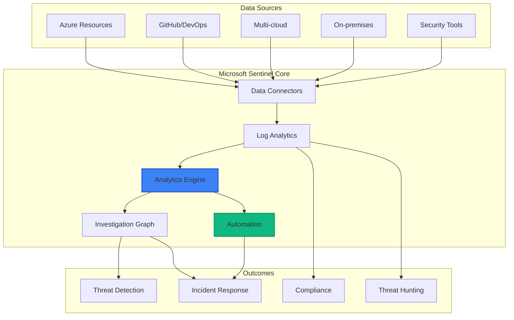

# Module 08: Microsoft Sentinel Integration

## 📋 Module Overview

**Duration**: 2.5 hours  
**Level**: Advanced  
**Prerequisites**: 
- Completed Modules 01-07
- Azure subscription with Sentinel enabled
- Log Analytics workspace created
- Basic understanding of SIEM concepts
- KQL (Kusto Query Language) basics helpful

## 🎯 Learning Objectives

By the end of this module, you will:
- Deploy and configure Microsoft Sentinel
- Create data connectors for security sources
- Build detection rules and analytics
- Design investigation workbooks
- Implement automated response playbooks
- Create comprehensive security dashboards

## 📚 Module Contents

1. [Introduction to Microsoft Sentinel](#introduction-to-microsoft-sentinel)
2. [Data Collection and Connectors](#data-collection-and-connectors)
3. [Analytics and Detection](#analytics-and-detection)
4. [Investigation and Hunting](#investigation-and-hunting)
5. [Automation and Orchestration](#automation-and-orchestration)
6. [Exercises](#exercises)

## Introduction to Microsoft Sentinel

### What is Microsoft Sentinel?

Microsoft Sentinel is a cloud-native Security Information and Event Management (SIEM) and Security Orchestration, Automation, and Response (SOAR) solution that provides:



### Setting Up Sentinel

```bash
# Create Log Analytics Workspace
az monitor log-analytics workspace create \
  --resource-group rg-secure-code-workshop \
  --workspace-name law-sentinel-workshop \
  --location eastus

# Enable Microsoft Sentinel
az sentinel onboard \
  --resource-group rg-secure-code-workshop \
  --workspace-name law-sentinel-workshop

# Get workspace ID and key for later use
WORKSPACE_ID=$(az monitor log-analytics workspace show \
  --resource-group rg-secure-code-workshop \
  --workspace-name law-sentinel-workshop \
  --query customerId -o tsv)

WORKSPACE_KEY=$(az monitor log-analytics workspace get-shared-keys \
  --resource-group rg-secure-code-workshop \
  --workspace-name law-sentinel-workshop \
  --query primarySharedKey -o tsv)

echo "Workspace ID: $WORKSPACE_ID"
echo "Save these values securely!"
```

## Data Collection and Connectors

### GitHub Advanced Security Connector

```python
# github_sentinel_connector.py
import requests
import json
from datetime import datetime, timedelta
from azure.monitor.ingestion import LogsIngestionClient
from azure.identity import DefaultAzureCredential

class GitHubSentinelConnector:
    """Connect GitHub Advanced Security to Sentinel"""
    
    def __init__(self, github_token: str, workspace_id: str):
        self.github_token = github_token
        self.workspace_id = workspace_id
        self.credential = DefaultAzureCredential()
        self.ingestion_client = LogsIngestionClient(
            endpoint=f"https://api.monitor.azure.com",
            credential=self.credential
        )
        
    async def sync_security_alerts(self, org: str):
        """Sync GHAS alerts to Sentinel"""
        # Get alerts from GitHub
        alerts = await self.get_github_alerts(org)
        
        # Transform to Sentinel format
        sentinel_events = []
        for alert in alerts:
            event = {
                "TimeGenerated": alert['created_at'],
                "SourceSystem": "GitHub",
                "AlertName": alert['rule']['name'],
                "AlertSeverity": self.map_severity(alert['rule']['severity']),
                "Repository": alert['repository']['full_name'],
                "AlertType": alert['tool']['name'],
                "VulnerabilityId": alert['rule']['id'],
                "State": alert['state'],
                "DismissedReason": alert.get('dismissed_reason'),
                "RemediationUrl": alert['html_url'],
                "CustomDetails": json.dumps({
                    "line": alert.get('location', {}).get('line'),
                    "path": alert.get('location', {}).get('path'),
                    "commit_sha": alert.get('commit_sha')
                })
            }
            sentinel_events.append(event)
            
        # Send to Sentinel
        await self.send_to_sentinel(sentinel_events, "GitHubSecurityAlerts")
        
    async def get_github_alerts(self, org: str) -> List[Dict]:
        """Fetch security alerts from GitHub"""
        headers = {
            'Authorization': f'token {self.github_token}',
            'Accept': 'application/vnd.github.v3+json'
        }
        
        alerts = []
        endpoints = [
            f"https://api.github.com/orgs/{org}/code-scanning/alerts",
            f"https://api.github.com/orgs/{org}/secret-scanning/alerts",
            f"https://api.github.com/orgs/{org}/dependabot/alerts"
        ]
        
        for endpoint in endpoints:
            response = requests.get(endpoint, headers=headers)
            if response.status_code == 200:
                alerts.extend(response.json())
                
        return alerts
        
    def map_severity(self, github_severity: str) -> str:
        """Map GitHub severity to Sentinel severity"""
        mapping = {
            'critical': 'High',
            'high': 'High',
            'medium': 'Medium',
            'low': 'Low',
            'warning': 'Informational',
            'note': 'Informational'
        }
        return mapping.get(github_severity.lower(), 'Medium')
```

### Container Security Connector

```yaml
# container-logs-daemonset.yaml
apiVersion: apps/v1
kind: DaemonSet
metadata:
  name: sentinel-container-logs
  namespace: kube-system
spec:
  selector:
    matchLabels:
      name: sentinel-container-logs
  template:
    metadata:
      labels:
        name: sentinel-container-logs
    spec:
      serviceAccountName: sentinel-logs
      containers:
      - name: omsagent
        image: mcr.microsoft.com/azuremonitor/containerinsights/ciprod:latest
        env:
        - name: WSID
          valueFrom:
            secretKeyRef:
              name: sentinel-credentials
              key: workspace-id
        - name: KEY
          valueFrom:
            secretKeyRef:
              name: sentinel-credentials
              key: workspace-key
        - name: DOMAIN
          value: "opinsights.azure.com"
        securityContext:
          privileged: true
        volumeMounts:
        - name: docker-sock
          mountPath: /var/run/docker.sock
        - name: container-logs
          mountPath: /var/lib/docker/containers
          readOnly: true
        - name: sentinel-config
          mountPath: /etc/omsagent-secret
      volumes:
      - name: docker-sock
        hostPath:
          path: /var/run/docker.sock
      - name: container-logs
        hostPath:
          path: /var/lib/docker/containers
      - name: sentinel-config
        secret:
          secretName: sentinel-config
```

### Custom Data Connector

```python
# custom_sentinel_connector.py
class CustomSecurityConnector:
    """Template for custom security data connector"""
    
    def __init__(self, config: Dict[str, Any]):
        self.config = config
        self.table_name = config['table_name']
        self.log_type = config['log_type']
        
    async def collect_and_send(self):
        """Main collection loop"""
        while True:
            try:
                # Collect data from source
                data = await self.collect_data()
                
                # Transform to common schema
                transformed_data = self.transform_data(data)
                
                # Enrich with additional context
                enriched_data = await self.enrich_data(transformed_data)
                
                # Send to Sentinel
                await self.send_to_sentinel(enriched_data)
                
                # Wait for next collection
                await asyncio.sleep(self.config['collection_interval'])
                
            except Exception as e:
                logger.error(f"Collection error: {e}")
                await asyncio.sleep(60)  # Retry after 1 minute
                
    def transform_data(self, raw_data: List[Dict]) -> List[Dict]:
        """Transform to Sentinel schema"""
        common_schema = []
        
        for item in raw_data:
            event = {
                "TimeGenerated": item.get('timestamp', datetime.utcnow()),
                "SourceSystem": self.config['source_system'],
                "EventID": item.get('id'),
                "EventType": item.get('type'),
                "Severity": self.normalize_severity(item.get('severity')),
                "Description": item.get('description'),
                "Computer": item.get('host', 'unknown'),
                "UserName": item.get('user'),
                "SourceIP": item.get('source_ip'),
                "DestinationIP": item.get('destination_ip'),
                "Action": item.get('action'),
                "Result": item.get('result'),
                "AdditionalData": json.dumps(item.get('metadata', {}))
            }
            common_schema.append(event)
            
        return common_schema
```

## Analytics and Detection

Understanding how security alerts flow through the system is crucial for effective monitoring:


### Detection Rules

```kusto
// GitHub Security Alert Correlation
let timeframe = 1h;
let threshold = 5;
GitHubSecurityAlerts
| where TimeGenerated >= ago(timeframe)
| where State == "open"
| summarize 
    AlertCount = count(),
    Repositories = make_set(Repository),
    Severities = make_set(AlertSeverity),
    AlertTypes = make_set(AlertType)
    by bin(TimeGenerated, 5m)
| where AlertCount > threshold
| project 
    TimeGenerated,
    AlertCount,
    Repositories,
    HighSeverityCount = countif(Severities has "High"),
    CriticalAlertTypes = AlertTypes
| extend 
    Title = "Multiple Security Alerts Detected",
    Description = strcat("Detected ", AlertCount, " security alerts across ", 
                        array_length(Repositories), " repositories"),
    Severity = iff(HighSeverityCount > 0, "High", "Medium")
```

### Advanced Detection with ML

```kusto
// Anomaly Detection for Container Activity
let starttime = 14d;
let endtime = 1d;
let timeframe = 1h;
let scorethreshold = 3;
ContainerLog
| where TimeGenerated between (startofday(ago(starttime))..startofday(ago(endtime)))
| where ContainerName !in ("omsagent", "omsagent-rs", "log-router")
| summarize 
    ContainerRestarts = countif(ContainerState == "Terminated"),
    FailedPulls = countif(ContainerStatusReason == "ImagePullBackOff"),
    CPUUsage = avg(CPUUsagePercentage),
    MemoryUsage = avg(MemoryUsagePercentage)
    by bin(TimeGenerated, timeframe), ContainerName, Namespace
| extend 
    RestartAnomaly = series_decompose_anomalies(ContainerRestarts, scorethreshold),
    CPUAnomaly = series_decompose_anomalies(CPUUsage, scorethreshold)
| mv-expand RestartAnomaly, CPUAnomaly
| where RestartAnomaly > scorethreshold or CPUAnomaly > scorethreshold
| project-reorder TimeGenerated, ContainerName, Namespace, RestartAnomaly, CPUAnomaly
```

### Fusion Detection

```yaml
# fusion-detection-rule.yaml
apiVersion: sentinel.azure.com/v1
kind: FusionRule
metadata:
  name: devops-to-cloud-attack-pattern
spec:
  displayName: "DevOps to Cloud Attack Pattern"
  description: "Detects attack patterns from code repository to cloud deployment"
  severity: High
  enabled: true
  tactics:
    - InitialAccess
    - Execution
    - PrivilegeEscalation
  techniques:
    - T1078
    - T1055
    - T1068
  fusionPatterns:
    - name: "Compromised DevOps to Cloud"
      stages:
        - source: GitHubSecurityAlerts
          conditions:
            - field: AlertType
              operator: equals
              value: "secret-scanning"
        - source: AzureActivity
          conditions:
            - field: OperationName
              operator: contains
              value: "Microsoft.ContainerRegistry/registries/push"
          timeWindow: 1h
        - source: SecurityAlert
          conditions:
            - field: AlertName
              operator: contains
              value: "Suspicious container"
          timeWindow: 24h
```

## Investigation and Hunting

### Investigation Workbook

```json
{
  "version": "Notebook/1.0",
  "items": [
    {
      "type": 1,
      "content": {
        "json": "# Security Investigation Dashboard\n\nComprehensive view of security events across the development lifecycle"
      }
    },
    {
      "type": 3,
      "content": {
        "version": "KqlItem/1.0",
        "query": "union GitHubSecurityAlerts, SecurityAlert, ContainerLog\n| where TimeGenerated > ago(24h)\n| summarize Count = count() by Type = $table, bin(TimeGenerated, 1h)\n| render timechart",
        "size": 0,
        "title": "Security Events Timeline",
        "timeContext": {
          "durationMs": 86400000
        },
        "queryType": 0,
        "resourceType": "microsoft.operationalinsights/workspaces"
      }
    },
    {
      "type": 3,
      "content": {
        "version": "KqlItem/1.0",
        "query": "GitHubSecurityAlerts\n| where State == 'open'\n| summarize Count = count() by Repository, AlertSeverity\n| order by Count desc\n| take 10",
        "size": 1,
        "title": "Top Vulnerable Repositories",
        "queryType": 0,
        "resourceType": "microsoft.operationalinsights/workspaces",
        "visualization": "barchart"
      }
    }
  ]
}
```

### Threat Hunting Queries

```kusto
// Hunt: Suspicious Container Executions
let suspiciousCommands = dynamic(["curl", "wget", "nc", "netcat", "base64", "eval"]);
let timeframe = 7d;
ContainerLog
| where TimeGenerated > ago(timeframe)
| where ContainerCommand has_any (suspiciousCommands)
| extend 
    CommandTokens = split(ContainerCommand, " "),
    IsBase64 = ContainerCommand matches regex @"base64\s+-d",
    IsDownload = ContainerCommand matches regex @"(curl|wget).*http",
    IsReverse = ContainerCommand matches regex @"nc.*-e|netcat.*-e"
| where IsBase64 or IsDownload or IsReverse
| project 
    TimeGenerated,
    ContainerName,
    Namespace,
    SuspiciousCommand = ContainerCommand,
    ThreatIndicators = pack_all()
| extend 
    ThreatScore = case(
        IsReverse, 10,
        IsBase64 and IsDownload, 8,
        IsDownload, 5,
        3
    )
| order by ThreatScore desc, TimeGenerated desc
```

## Automation and Orchestration

### Security Response Playbook

```python
# sentinel_playbook.py
from azure.logicapps.operations import LogicAppsOperationsMixin
from azure.mgmt.logic import LogicManagementClient

class SecurityResponsePlaybook:
    """Automated security response using Logic Apps"""
    
    def __init__(self, config: Dict[str, Any]):
        self.config = config
        self.logic_client = LogicManagementClient(
            credential=DefaultAzureCredential(),
            subscription_id=config['subscription_id']
        )
        
    async def create_incident_response_playbook(self):
        """Create automated incident response workflow"""
        playbook_definition = {
            "definition": {
                "$schema": "https://schema.management.azure.com/providers/Microsoft.Logic/schemas/2016-06-01/workflowdefinition.json#",
                "contentVersion": "1.0.0.0",
                "triggers": {
                    "When_a_Sentinel_incident_is_created": {
                        "type": "ApiConnectionWebhook",
                        "inputs": {
                            "body": {
                                "callback_url": "@{listCallbackUrl()}"
                            },
                            "host": {
                                "connection": {
                                    "name": "@parameters('$connections')['azuresentinel']['connectionId']"
                                }
                            },
                            "path": "/incident-creation"
                        }
                    }
                },
                "actions": {
                    "Parse_Incident": {
                        "type": "ParseJson",
                        "inputs": {
                            "content": "@triggerBody()",
                            "schema": self.get_incident_schema()
                        }
                    },
                    "Check_Severity": {
                        "type": "If",
                        "expression": {
                            "and": [
                                {
                                    "equals": [
                                        "@body('Parse_Incident')?['properties']?['severity']",
                                        "High"
                                    ]
                                }
                            ]
                        },
                        "actions": {
                            "High_Severity_Response": {
                                "actions": self.high_severity_actions()
                            }
                        },
                        "else": {
                            "actions": {
                                "Standard_Response": {
                                    "actions": self.standard_actions()
                                }
                            }
                        }
                    }
                }
            }
        }
        
        return await self.deploy_playbook(playbook_definition)
        
    def high_severity_actions(self) -> Dict:
        """Actions for high severity incidents"""
        return {
            "Block_IP_Address": {
                "type": "ApiConnection",
                "inputs": {
                    "body": {
                        "ip_address": "@body('Parse_Incident')?['properties']?['relatedEntities']?[0]?['address']",
                        "action": "block",
                        "duration": "24h"
                    },
                    "host": {
                        "connection": {
                            "name": "@parameters('$connections')['firewall']['connectionId']"
                        }
                    },
                    "method": "post",
                    "path": "/api/firewall/rules"
                }
            },
            "Isolate_Container": {
                "type": "ApiConnection",
                "inputs": {
                    "body": {
                        "container_id": "@body('Parse_Incident')?['properties']?['customDetails']?['containerId']",
                        "action": "isolate"
                    },
                    "host": {
                        "connection": {
                            "name": "@parameters('$connections')['kubernetes']['connectionId']"
                        }
                    },
                    "method": "post",
                    "path": "/api/containers/isolate"
                }
            },
            "Create_ServiceNow_Ticket": {
                "type": "ApiConnection",
                "inputs": {
                    "body": {
                        "short_description": "High Severity Security Incident: @{body('Parse_Incident')?['properties']?['title']}",
                        "urgency": "1",
                        "impact": "1",
                        "description": "@body('Parse_Incident')?['properties']?['description']"
                    },
                    "host": {
                        "connection": {
                            "name": "@parameters('$connections')['servicenow']['connectionId']"
                        }
                    },
                    "method": "post",
                    "path": "/api/now/table/incident"
                }
            }
        }
```

### SOAR Integration

```yaml
# soar-automation-rules.yaml
automationRules:
  - name: "Auto-Remediate Code Vulnerabilities"
    order: 1
    triggers:
      - type: "IncidentCreated"
    conditions:
      - property: "IncidentProviderName"
        operator: "Contains"
        values: ["GitHubSecurityAlerts"]
      - property: "Severity"
        operator: "Equals"
        values: ["Low", "Medium"]
    actions:
      - type: "RunPlaybook"
        playbook: "AutoRemediateCodeVulnerability"
        
  - name: "Escalate Container Threats"
    order: 2
    triggers:
      - type: "IncidentCreated"
    conditions:
      - property: "Tactics"
        operator: "Contains"
        values: ["Execution", "PrivilegeEscalation"]
      - property: "RelatedEntities"
        operator: "Contains"
        entityType: "Container"
    actions:
      - type: "ChangeIncidentSeverity"
        severity: "High"
      - type: "AssignToOwner"
        owner: "SecurityOps"
      - type: "RunPlaybook"
        playbook: "ContainerThreatResponse"
```

## 📝 Exercises

### Exercise 1: Configure GitHub to Sentinel Pipeline (30 minutes)

**Objective**: Stream GitHub security events to Sentinel

1. Create data collection endpoint:

```bash
# Create DCE
az monitor data-collection-endpoint create \
  --name dce-github-security \
  --resource-group rg-secure-code-workshop \
  --location eastus \
  --public-network-access Enabled

# Create custom table
cat <<EOF > github_alerts_table.json
{
  "properties": {
    "schema": {
      "name": "GitHubAlerts_CL",
      "columns": [
        {"name": "TimeGenerated", "type": "datetime"},
        {"name": "AlertName", "type": "string"},
        {"name": "Repository", "type": "string"},
        {"name": "Severity", "type": "string"},
        {"name": "State", "type": "string"},
        {"name": "AlertUrl", "type": "string"}
      ]
    }
  }
}
EOF

# Create DCR
az monitor data-collection-rule create \
  --name dcr-github-alerts \
  --resource-group rg-secure-code-workshop \
  --location eastus \
  --endpoint-id $(az monitor data-collection-endpoint show -n dce-github-security -g rg-secure-code-workshop --query id -o tsv)
```

2. Implement the connector
3. Test with sample alerts
4. Verify data in Sentinel

**Deliverable**: Working GitHub to Sentinel pipeline

### Exercise 2: Build Detection Rules (25 minutes)

**Objective**: Create custom detection rules

1. Create KQL queries for:
   - Multiple failed deployments
   - Suspicious container activity
   - Unusual GitHub API usage
   - Cross-system attack patterns

2. Implement as analytics rules:

```kusto
// Exercise: Complete this detection rule
let threshold = 5;
let timeframe = 1h;
// Your detection logic here
```

3. Test with simulated events
4. Tune thresholds

**Deliverable**: Three working detection rules

### Exercise 3: Investigation Workbook (30 minutes)

**Objective**: Create comprehensive security dashboard

1. Design workbook sections:
   - Overview metrics
   - Timeline visualization
   - Top threats
   - Repository risk scores
   - Container security status

2. Implement using JSON template
3. Add parameters for filtering
4. Test with real data

**Deliverable**: Interactive investigation workbook

### Exercise 4: Automated Response Playbook (30 minutes)

**Objective**: Build incident response automation

1. Create Logic App playbook that:
   - Parses incident details
   - Enriches with GitHub data
   - Takes remediation actions
   - Notifies stakeholders

2. Test with different incident types
3. Measure response times
4. Document automation flow

**Deliverable**: Working response playbook

### Exercise 5: Threat Hunting Campaign (25 minutes)

**Objective**: Hunt for security threats

1. Create hunting queries for:

```kusto
// Supply chain attack indicators
// Your query here

// Insider threat patterns
// Your query here

// Container escape attempts
// Your query here
```

2. Run queries against historical data
3. Document findings
4. Create detection rules from discoveries

**Deliverable**: Threat hunting report with findings

## 🎯 Module Summary

### Key Takeaways

1. **Sentinel provides unified security visibility** across all systems
2. **Data connectors** are crucial for comprehensive coverage
3. **KQL is powerful** for detection and hunting
4. **Automation reduces** response time significantly
5. **Workbooks enable** effective investigation

### Skills Acquired

- ✅ Deploying and configuring Sentinel
- ✅ Creating custom data connectors
- ✅ Writing detection rules in KQL
- ✅ Building investigation workbooks
- ✅ Implementing SOAR playbooks
- ✅ Conducting threat hunting

## 📚 Additional Resources

### Documentation
- [Microsoft Sentinel Documentation](https://docs.microsoft.com/en-us/azure/sentinel/)
- [KQL Reference](https://docs.microsoft.com/en-us/azure/data-explorer/kusto/query/)
- [Sentinel GitHub Connector](https://docs.microsoft.com/en-us/azure/sentinel/connect-github)

### Learning Resources
- [Become a Sentinel Ninja](https://techcommunity.microsoft.com/t5/microsoft-sentinel-blog/become-a-microsoft-sentinel-ninja-the-complete-level-400/ba-p/1246310)
- [KQL Detective Game](https://detective.kusto.io/)
- [Sentinel Training Lab](https://docs.microsoft.com/en-us/azure/sentinel/tutorial-learn-with-demo)

### Community
- [Sentinel Community](https://github.com/Azure/Azure-Sentinel)
- [Detection Rules Repository](https://github.com/Azure/Azure-Sentinel/tree/master/Detections)
- [Playbook Templates](https://github.com/Azure/Azure-Sentinel/tree/master/Playbooks)

## ✅ Module Completion Checklist

Before moving to the next module, ensure you have:

- [ ] Configured Sentinel workspace
- [ ] Connected GitHub data source
- [ ] Created detection rules
- [ ] Built investigation workbook
- [ ] Implemented response automation
- [ ] Completed threat hunting exercise

## 🚀 Next Steps

Continue to [Module 09: Building Security Dashboards](../09-security-dashboards/README.md) where we'll create comprehensive security visualizations.

---

**Need Help?** Check our [Sentinel FAQ](../../docs/sentinel-faq.md) or post in [Discussions](https://github.com/YOUR-USERNAME/secure-code-ai-workshop/discussions).

---

## 🧭 Navigation

| Previous | Up | Next |
|----------|----|----- |
| [← Module 07: Multi-Cloud Security](module-07-multicloud.md) | [📚 All Modules](../README.md#-learning-path) | [Module 09: Security Dashboards →](module-09-dashboards.md) |

**Quick Links**: [🏠 Home](../README.md) • [📖 Workshop Overview](../docs/secure-code-ai-workshop.md) • [🛡️ Security FAQ](../docs/workshop-faq.md)
