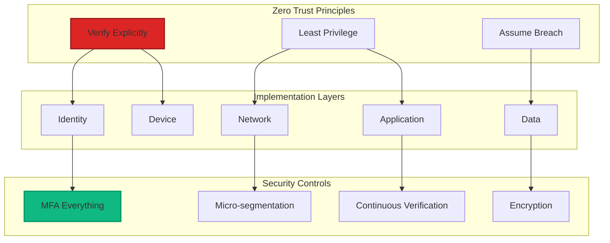
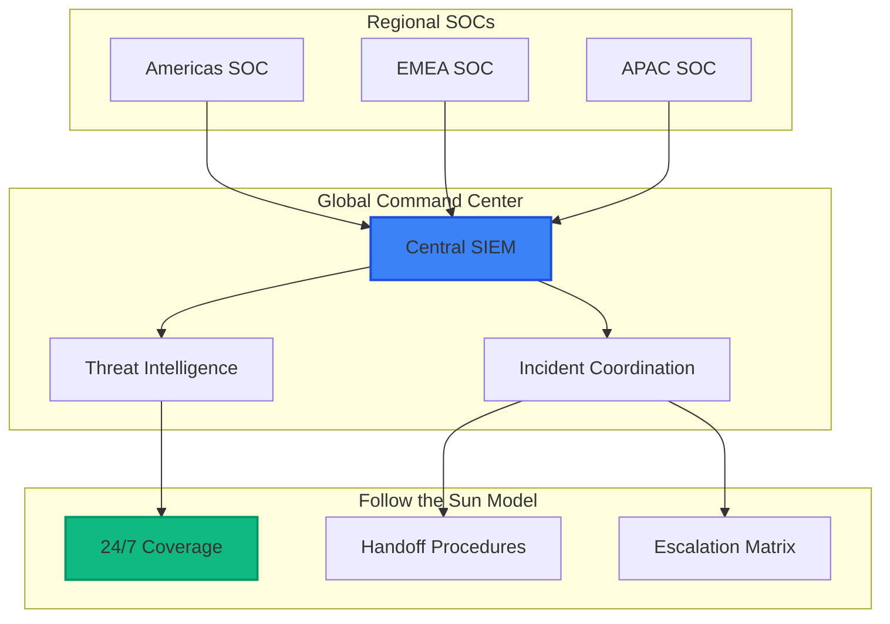

# Module 10: Advanced Scenarios and Best Practices

## 📋 Module Overview

**Duration**: 2.5 hours  
**Level**: Advanced  
**Prerequisites**: 
- Completed Modules 01-09
- Production experience helpful
- Understanding of enterprise architecture
- Familiarity with compliance frameworks

## 🎯 Learning Objectives

By the end of this module, you will:
- Implement zero trust security architecture
- Handle compliance requirements (SOC2, ISO 27001, etc.)
- Design disaster recovery for security systems
- Scale security operations for enterprise
- Implement advanced threat hunting
- Create a security center of excellence

## 📚 Module Contents

1. [Zero Trust Implementation](#zero-trust-implementation)
2. [Compliance and Governance](#compliance-and-governance)
3. [Enterprise Scale Security](#enterprise-scale-security)
4. [Advanced Threat Scenarios](#advanced-threat-scenarios)
5. [Security Center of Excellence](#security-center-of-excellence)
6. [Exercises](#exercises)

## Zero Trust Implementation

### Zero Trust Architecture



### Implementing Zero Trust for DevOps

```python
# zero_trust_framework.py
from typing import Dict, List, Any, Optional
from dataclasses import dataclass
from enum import Enum
import jwt
import asyncio

class TrustLevel(Enum):
    NONE = 0
    LOW = 1
    MEDIUM = 2
    HIGH = 3
    FULL = 4

@dataclass
class SecurityContext:
    """Security context for zero trust evaluation"""
    user_identity: Dict[str, Any]
    device_info: Dict[str, Any]
    network_location: Dict[str, Any]
    request_context: Dict[str, Any]
    risk_signals: List[Dict[str, Any]]

class ZeroTrustEngine:
    """Zero Trust decision engine for DevOps"""
    
    def __init__(self, config: Dict[str, Any]):
        self.config = config
        self.policy_engine = PolicyEngine()
        self.risk_calculator = RiskCalculator()
        self.identity_verifier = IdentityVerifier()
        
    async def evaluate_access(self, context: SecurityContext) -> Dict[str, Any]:
        """Evaluate access request using zero trust principles"""
        
        # Step 1: Verify identity explicitly
        identity_score = await self.verify_identity(context.user_identity)
        
        # Step 2: Assess device trust
        device_score = await self.assess_device(context.device_info)
        
        # Step 3: Evaluate network context
        network_score = await self.evaluate_network(context.network_location)
        
        # Step 4: Calculate risk score
        risk_score = await self.risk_calculator.calculate(
            identity_score,
            device_score,
            network_score,
            context.risk_signals
        )
        
        # Step 5: Apply least privilege
        permissions = await self.apply_least_privilege(
            context.request_context,
            risk_score
        )
        
        # Step 6: Assume breach - add monitoring
        monitoring_level = self.determine_monitoring_level(risk_score)
        
        return {
            'decision': 'allow' if risk_score.trust_level >= TrustLevel.MEDIUM else 'deny',
            'trust_level': risk_score.trust_level,
            'permissions': permissions,
            'monitoring': monitoring_level,
            'session_restrictions': self.get_session_restrictions(risk_score),
            'audit_requirements': self.get_audit_requirements(risk_score)
        }
        
    async def verify_identity(self, identity: Dict[str, Any]) -> IdentityScore:
        """Multi-factor identity verification"""
        factors = []
        
        # Password/Certificate
        if identity.get('certificate'):
            factors.append(await self.verify_certificate(identity['certificate']))
        
        # MFA Token
        if identity.get('mfa_token'):
            factors.append(await self.verify_mfa(identity['mfa_token']))
        
        # Behavioral analysis
        if identity.get('session_history'):
            factors.append(await self.analyze_behavior(identity['session_history']))
        
        # Biometric (if available)
        if identity.get('biometric'):
            factors.append(await self.verify_biometric(identity['biometric']))
        
        return IdentityScore(
            verified=all(factors),
            confidence=sum(f.confidence for f in factors) / len(factors),
            factors=factors
        )
        
    async def assess_device(self, device: Dict[str, Any]) -> DeviceScore:
        """Assess device security posture"""
        checks = []
        
        # Device compliance
        checks.append(await self.check_compliance(device))
        
        # Security software
        checks.append(await self.verify_security_software(device))
        
        # Patch level
        checks.append(await self.check_patch_level(device))
        
        # Jailbreak/Root detection
        checks.append(await self.detect_compromise(device))
        
        return DeviceScore(
            compliant=all(c.passed for c in checks),
            health_score=sum(c.score for c in checks) / len(checks),
            issues=[c.issue for c in checks if not c.passed]
        )

class PolicyEngine:
    """Policy engine for zero trust decisions"""
    
    def __init__(self):
        self.policies = self.load_policies()
        
    async def evaluate_policies(self, context: SecurityContext) -> List[PolicyResult]:
        """Evaluate all applicable policies"""
        applicable_policies = self.get_applicable_policies(context)
        results = []
        
        for policy in applicable_policies:
            result = await self.evaluate_policy(policy, context)
            results.append(result)
            
            # Stop on critical policy failure
            if policy.critical and not result.passed:
                break
                
        return results
        
    def get_applicable_policies(self, context: SecurityContext) -> List[Policy]:
        """Get policies applicable to the context"""
        return [
            policy for policy in self.policies
            if self.matches_context(policy, context)
        ]
```

### Zero Trust for CI/CD

```yaml
# zero-trust-pipeline.yaml
name: Zero Trust CI/CD Pipeline

on:
  pull_request:
    types: [opened, synchronize]
  workflow_dispatch:

jobs:
  identity-verification:
    runs-on: ubuntu-latest
    outputs:
      trust-level: ${{ steps.verify.outputs.trust-level }}
    steps:
      - name: Verify Developer Identity
        id: verify
        uses: ./actions/zero-trust-identity
        with:
          require-mfa: true
          require-signed-commits: true
          allowed-domains: |
            - "@company.com"
            - "@trusted-partner.com"
          
      - name: Check Developer Permissions
        uses: ./actions/rbac-check
        with:
          required-role: "developer"
          repository: ${{ github.repository }}
          
  device-attestation:
    runs-on: ubuntu-latest
    needs: identity-verification
    if: needs.identity-verification.outputs.trust-level != 'none'
    steps:
      - name: Verify Build Environment
        uses: ./actions/device-attestation
        with:
          require-hardened-runner: true
          allowed-regions: "us-east-1,eu-west-1"
          
  code-security-scan:
    runs-on: ubuntu-latest
    needs: device-attestation
    permissions:
      contents: read
      security-events: write
    steps:
      - name: Checkout with Limited Scope
        uses: actions/checkout@v3
        with:
          fetch-depth: 0
          token: ${{ secrets.ZERO_TRUST_PAT }}
          
      - name: Multi-Layer Security Scan
        run: |
          # Static analysis
          ./scripts/run-security-scans.sh --zero-trust-mode
          
          # Dependency verification
          ./scripts/verify-dependencies.sh --require-signatures
          
          # Secret scanning with zero-trust rules
          ./scripts/scan-secrets.sh --block-on-detection
          
  runtime-verification:
    runs-on: ubuntu-latest
    needs: code-security-scan
    steps:
      - name: Deploy to Isolated Environment
        uses: ./actions/zero-trust-deploy
        with:
          environment: "zero-trust-sandbox"
          network-policy: "deny-all"
          runtime-protection: "enabled"
          
      - name: Runtime Security Tests
        run: |
          # Behavioral analysis
          ./tests/runtime-security-tests.sh
          
          # Attack simulation
          ./tests/breach-simulation.sh
          
      - name: Generate Attestation
        uses: ./actions/generate-attestation
        with:
          include-sbom: true
          sign-with-key: ${{ secrets.SIGNING_KEY }}
```

## Compliance and Governance

### Compliance Framework Integration

```python
# compliance_framework.py
class ComplianceFramework:
    """Multi-framework compliance management"""
    
    def __init__(self):
        self.frameworks = {
            'SOC2': SOC2Framework(),
            'ISO27001': ISO27001Framework(),
            'HIPAA': HIPAAFramework(),
            'PCI-DSS': PCIDSSFramework(),
            'GDPR': GDPRFramework()
        }
        
    async def assess_compliance(self, framework: str) -> ComplianceReport:
        """Assess compliance for specific framework"""
        if framework not in self.frameworks:
            raise ValueError(f"Unsupported framework: {framework}")
            
        framework_impl = self.frameworks[framework]
        
        # Collect evidence
        evidence = await self.collect_evidence(framework_impl.required_evidence)
        
        # Run controls assessment
        control_results = await framework_impl.assess_controls(evidence)
        
        # Generate findings
        findings = self.analyze_gaps(control_results)
        
        # Create remediation plan
        remediation = self.create_remediation_plan(findings)
        
        return ComplianceReport(
            framework=framework,
            assessment_date=datetime.utcnow(),
            overall_score=self.calculate_score(control_results),
            control_results=control_results,
            findings=findings,
            remediation_plan=remediation,
            evidence_collected=evidence
        )
        
    async def continuous_compliance_monitoring(self):
        """Continuous compliance monitoring"""
        while True:
            for framework_name, framework in self.frameworks.items():
                try:
                    # Check for control changes
                    changes = await self.detect_control_changes(framework_name)
                    
                    if changes:
                        # Re-assess affected controls
                        affected_controls = self.get_affected_controls(changes)
                        await self.reassess_controls(framework, affected_controls)
                        
                    # Check for policy violations
                    violations = await self.check_policy_violations(framework)
                    
                    if violations:
                        await self.handle_violations(violations)
                        
                except Exception as e:
                    logger.error(f"Compliance monitoring error for {framework_name}: {e}")
                    
            await asyncio.sleep(300)  # Check every 5 minutes

class SOC2Framework:
    """SOC2 Type II compliance implementation"""
    
    def __init__(self):
        self.trust_service_criteria = {
            'CC1': 'Control Environment',
            'CC2': 'Communication and Information',
            'CC3': 'Risk Assessment',
            'CC4': 'Monitoring Activities',
            'CC5': 'Control Activities',
            'CC6': 'Logical and Physical Access Controls',
            'CC7': 'System Operations',
            'CC8': 'Change Management',
            'CC9': 'Risk Mitigation'
        }
        
    async def assess_controls(self, evidence: Dict[str, Any]) -> Dict[str, ControlResult]:
        """Assess SOC2 controls"""
        results = {}
        
        # CC6: Logical and Physical Access Controls
        results['CC6.1'] = await self.assess_access_control(evidence)
        results['CC6.2'] = await self.assess_authentication(evidence)
        results['CC6.3'] = await self.assess_authorization(evidence)
        
        # CC7: System Operations
        results['CC7.1'] = await self.assess_vulnerability_management(evidence)
        results['CC7.2'] = await self.assess_monitoring(evidence)
        results['CC7.3'] = await self.assess_incident_response(evidence)
        
        # CC8: Change Management
        results['CC8.1'] = await self.assess_change_control(evidence)
        
        return results
```

### Compliance Dashboard

```kusto
// Compliance Score Calculation
let ComplianceScore = 
ComplianceAssessment
| where TimeGenerated > ago(7d)
| summarize 
    TotalControls = count(),
    PassedControls = countif(Status == "Pass"),
    FailedControls = countif(Status == "Fail"),
    NotApplicable = countif(Status == "N/A")
    by Framework, ControlFamily
| extend 
    ApplicableControls = TotalControls - NotApplicable,
    CompliancePercentage = (PassedControls * 100.0) / (TotalControls - NotApplicable)
| project 
    Framework,
    ControlFamily,
    CompliancePercentage = round(CompliancePercentage, 1),
    ControlStatus = strcat(PassedControls, "/", ApplicableControls)
| order by Framework, ControlFamily;

// Compliance Trends
let ComplianceTrends =
ComplianceAssessment
| where TimeGenerated > ago(90d)
| summarize 
    Score = (countif(Status == "Pass") * 100.0) / count()
    by Framework, bin(TimeGenerated, 1d)
| project 
    Framework,
    Date = TimeGenerated,
    Score = round(Score, 1),
    Trend = iff(Score > prev(Score, 1), "Improving", "Declining");
```

## Enterprise Scale Security

### Multi-Tenant Security Architecture

```python
# enterprise_security_platform.py
class EnterpriseSecurityPlatform:
    """Enterprise-scale security platform"""
    
    def __init__(self, config: Dict[str, Any]):
        self.config = config
        self.tenant_manager = TenantManager()
        self.resource_pools = ResourcePoolManager()
        self.scaling_engine = AutoScalingEngine()
        
    async def onboard_tenant(self, tenant_config: Dict[str, Any]) -> Tenant:
        """Onboard new tenant with isolation"""
        
        # Create isolated namespace
        namespace = await self.create_tenant_namespace(tenant_config)
        
        # Deploy security stack
        security_stack = await self.deploy_security_stack(namespace)
        
        # Configure RBAC
        await self.configure_tenant_rbac(namespace, tenant_config['users'])
        
        # Set up data isolation
        await self.configure_data_isolation(namespace)
        
        # Initialize monitoring
        await self.setup_tenant_monitoring(namespace)
        
        tenant = Tenant(
            id=tenant_config['id'],
            namespace=namespace,
            security_stack=security_stack,
            created_at=datetime.utcnow()
        )
        
        await self.tenant_manager.register(tenant)
        
        return tenant
        
    async def scale_security_operations(self, metrics: Dict[str, Any]):
        """Auto-scale security operations based on load"""
        
        # Analyze current load
        load_analysis = await self.analyze_load(metrics)
        
        # Determine scaling needs
        scaling_decisions = self.scaling_engine.decide(load_analysis)
        
        for decision in scaling_decisions:
            if decision.action == 'scale_up':
                await self.scale_up_component(decision.component, decision.factor)
            elif decision.action == 'scale_down':
                await self.scale_down_component(decision.component, decision.factor)
            elif decision.action == 'redistribute':
                await self.redistribute_load(decision.component)
                
    async def create_tenant_namespace(self, config: Dict[str, Any]) -> str:
        """Create isolated tenant namespace"""
        namespace_yaml = f"""
apiVersion: v1
kind: Namespace
metadata:
  name: tenant-{config['id']}
  labels:
    tenant-id: {config['id']}
    security-profile: {config.get('security_profile', 'standard')}
---
apiVersion: networking.k8s.io/v1
kind: NetworkPolicy
metadata:
  name: tenant-isolation
  namespace: tenant-{config['id']}
spec:
  podSelector: {{}}
  policyTypes:
  - Ingress
  - Egress
  ingress:
  - from:
    - namespaceSelector:
        matchLabels:
          tenant-id: {config['id']}
  egress:
  - to:
    - namespaceSelector:
        matchLabels:
          tenant-id: {config['id']}
  - to:
    - namespaceSelector:
        matchLabels:
          name: shared-services
    ports:
    - protocol: TCP
      port: 443
"""
        await self.apply_kubernetes_manifest(namespace_yaml)
        return f"tenant-{config['id']}"
```

### Global Security Operations



## Advanced Threat Scenarios

### APT Detection and Response

```python
# apt_detection_system.py
class APTDetectionSystem:
    """Advanced Persistent Threat detection system"""
    
    def __init__(self):
        self.ml_models = {
            'lateral_movement': LateralMovementDetector(),
            'data_exfiltration': DataExfiltrationDetector(),
            'persistence': PersistenceDetector(),
            'c2_communication': C2Detector()
        }
        self.threat_intel = ThreatIntelligenceIntegration()
        
    async def detect_apt_activity(self, events: List[SecurityEvent]) -> List[APTIndicator]:
        """Detect potential APT activity"""
        indicators = []
        
        # Run ML models
        for model_name, model in self.ml_models.items():
            predictions = await model.predict(events)
            
            for prediction in predictions:
                if prediction.confidence > 0.8:
                    indicators.append(APTIndicator(
                        type=model_name,
                        confidence=prediction.confidence,
                        evidence=prediction.evidence,
                        mitre_tactics=prediction.mitre_mapping
                    ))
                    
        # Correlate with threat intelligence
        enriched_indicators = await self.threat_intel.enrich(indicators)
        
        # Look for kill chain progression
        kill_chain = self.analyze_kill_chain(enriched_indicators)
        
        if kill_chain.is_complete or kill_chain.high_confidence:
            await self.trigger_apt_response(kill_chain)
            
        return enriched_indicators
        
    def analyze_kill_chain(self, indicators: List[APTIndicator]) -> KillChainAnalysis:
        """Analyze indicators for kill chain progression"""
        kill_chain_stages = {
            'reconnaissance': [],
            'weaponization': [],
            'delivery': [],
            'exploitation': [],
            'installation': [],
            'command_control': [],
            'actions_on_objectives': []
        }
        
        # Map indicators to kill chain stages
        for indicator in indicators:
            stages = self.map_to_kill_chain(indicator)
            for stage in stages:
                kill_chain_stages[stage].append(indicator)
                
        # Calculate progression
        active_stages = sum(1 for stage, indicators in kill_chain_stages.items() if indicators)
        total_stages = len(kill_chain_stages)
        
        return KillChainAnalysis(
            stages=kill_chain_stages,
            progression=active_stages / total_stages,
            is_complete=active_stages >= 5,
            high_confidence=any(
                len(indicators) >= 3 for indicators in kill_chain_stages.values()
            )
        )
```

### Supply Chain Attack Protection

```yaml
# supply-chain-protection.yaml
apiVersion: security.microsoft.com/v1
kind: SupplyChainPolicy
metadata:
  name: comprehensive-supply-chain-protection
spec:
  dependencies:
    scanning:
      enabled: true
      frequency: "continuous"
      vulnerabilityThreshold: "medium"
      licenseCheck: true
      
    allowlist:
      registries:
        - "registry.npmjs.org"
        - "pypi.org"
        - "repo.maven.apache.org"
      
    signatures:
      requireSigned: true
      trustedKeys:
        - "npm:keybase.io/npm"
        - "pypi:keybase.io/pypi"
        
  artifacts:
    signing:
      required: true
      attestation:
        - type: "provenance"
        - type: "vulnerability-scan"
        - type: "sbom"
        
    verification:
      chainOfCustody: true
      integrityChecks: true
      
  runtime:
    monitoring:
      behaviorAnalysis: true
      anomalyDetection: true
      
    protection:
      blockUnsigned: true
      isolateUnknown: true
```

## Security Center of Excellence

### Building a Security CoE

```python
# security_coe_framework.py
class SecurityCenterOfExcellence:
    """Framework for Security Center of Excellence"""
    
    def __init__(self):
        self.pillars = {
            'people': PeoplePillar(),
            'process': ProcessPillar(),
            'technology': TechnologyPillar(),
            'governance': GovernancePillar()
        }
        self.metrics = SecurityMetricsFramework()
        self.maturity_model = SecurityMaturityModel()
        
    async def assess_current_state(self) -> MaturityAssessment:
        """Assess current security maturity"""
        assessments = {}
        
        for pillar_name, pillar in self.pillars.items():
            assessment = await pillar.assess()
            assessments[pillar_name] = assessment
            
        overall_maturity = self.maturity_model.calculate(assessments)
        
        return MaturityAssessment(
            date=datetime.utcnow(),
            pillar_scores=assessments,
            overall_score=overall_maturity,
            recommendations=self.generate_recommendations(assessments)
        )
        
    def create_roadmap(self, current_state: MaturityAssessment, target_state: str) -> SecurityRoadmap:
        """Create security improvement roadmap"""
        roadmap = SecurityRoadmap()
        
        # Phase 1: Foundation (0-3 months)
        roadmap.add_phase(Phase(
            name="Foundation",
            duration="3 months",
            initiatives=[
                Initiative("Establish Security Champions", "people", priority="high"),
                Initiative("Implement Basic Automation", "technology", priority="high"),
                Initiative("Define Core Processes", "process", priority="high")
            ]
        ))
        
        # Phase 2: Standardization (3-6 months)
        roadmap.add_phase(Phase(
            name="Standardization",
            duration="3 months",
            initiatives=[
                Initiative("Standardize Security Tools", "technology", priority="medium"),
                Initiative("Implement Security Training", "people", priority="high"),
                Initiative("Create Policy Framework", "governance", priority="high")
            ]
        ))
        
        # Phase 3: Optimization (6-12 months)
        roadmap.add_phase(Phase(
            name="Optimization",
            duration="6 months",
            initiatives=[
                Initiative("Advanced Automation", "technology", priority="medium"),
                Initiative("Metrics & KPIs", "governance", priority="high"),
                Initiative("Continuous Improvement", "process", priority="medium")
            ]
        ))
        
        return roadmap

class SecurityMetricsFramework:
    """Comprehensive security metrics framework"""
    
    def get_kpis(self) -> Dict[str, KPI]:
        return {
            'vulnerability_management': KPI(
                name="Mean Time to Remediate",
                target="< 30 days for critical",
                formula="avg(remediation_date - detection_date)",
                frequency="weekly"
            ),
            'incident_response': KPI(
                name="Mean Time to Detect",
                target="< 1 hour",
                formula="avg(detection_time - incident_start)",
                frequency="daily"
            ),
            'security_coverage': KPI(
                name="Security Tool Coverage",
                target="> 95%",
                formula="(protected_assets / total_assets) * 100",
                frequency="monthly"
            ),
            'training_completion': KPI(
                name="Security Training Completion",
                target="> 90%",
                formula="(trained_employees / total_employees) * 100",
                frequency="quarterly"
            )
        }
```

### Security Innovation Lab

```yaml
# security-innovation-lab.yaml
apiVersion: v1
kind: ConfigMap
metadata:
  name: security-innovation-lab
data:
  charter: |
    # Security Innovation Lab Charter
    
    ## Mission
    Drive security innovation through research, experimentation,
    and rapid prototyping of emerging security technologies.
    
    ## Focus Areas
    1. AI/ML for Security
       - Automated threat detection
       - Predictive security analytics
       - AI-powered incident response
    
    2. Zero Trust Architecture
       - Identity-based perimeters
       - Continuous verification
       - Micro-segmentation
    
    3. Cloud-Native Security
       - Container security
       - Serverless protection
       - Service mesh security
    
    4. DevSecOps Automation
       - Security as Code
       - Policy automation
       - Automated remediation
    
    ## Success Metrics
    - Innovation adoption rate
    - Time to production
    - Security improvement metrics
    - Cost reduction through automation
```

## 📝 Exercises

### Exercise 1: Implement Zero Trust Architecture (30 minutes)

**Objective**: Build zero trust controls for your application

1. Implement identity verification:

```python
# exercises/zero_trust_implementation.py
class ZeroTrustImplementation:
    async def verify_request(self, request):
        # Implement:
        # 1. Multi-factor authentication check
        # 2. Device compliance verification
        # 3. Network location assessment
        # 4. Risk scoring
        # 5. Adaptive access control
        pass
```

2. Create policy engine
3. Test with various scenarios
4. Document trust decisions

**Deliverable**: Working zero trust implementation

### Exercise 2: Compliance Automation (30 minutes)

**Objective**: Automate compliance checking

1. Choose a framework (SOC2, ISO 27001)
2. Implement automated controls:

```python
# exercises/compliance_automation.py
async def check_soc2_compliance():
    controls = {
        'CC6.1': check_access_controls(),
        'CC7.1': check_vulnerability_management(),
        'CC8.1': check_change_management()
    }
    # Your implementation
```

3. Generate compliance report
4. Create remediation workflow

**Deliverable**: Automated compliance checker

### Exercise 3: Build APT Detection System (25 minutes)

**Objective**: Create advanced threat detection

1. Implement behavioral detection:

```kusto
// APT Detection Query
let APTIndicators =
SecurityEvent
| where TimeGenerated > ago(7d)
| where EventID in (4624, 4625, 4648, 4688, 4697)
| summarize 
    LoginCount = countif(EventID == 4624),
    FailedLogins = countif(EventID == 4625),
    ProcessCreation = countif(EventID == 4688),
    ServiceInstalls = countif(EventID == 4697)
    by Computer, Account, bin(TimeGenerated, 1h)
| where LoginCount > 50 or ServiceInstalls > 0
// Add your detection logic
```

2. Create correlation rules
3. Test with simulated APT
4. Document findings

**Deliverable**: APT detection rules and report

### Exercise 4: Enterprise Scale Design (30 minutes)

**Objective**: Design enterprise security architecture

1. Create multi-tenant design:
   - Tenant isolation
   - Resource pooling
   - Scaling strategy
   - Cost optimization

2. Implement PoC
3. Load test the design
4. Create scaling playbook

**Deliverable**: Enterprise architecture design

### Exercise 5: Security CoE Blueprint (25 minutes)

**Objective**: Create Security Center of Excellence plan

1. Assess current maturity
2. Define target state
3. Create roadmap:
   - People development
   - Process improvement
   - Technology adoption
   - Governance framework

4. Define success metrics
5. Create communication plan

**Deliverable**: CoE implementation blueprint

## 🎯 Module Summary

### Key Takeaways

1. **Zero Trust is essential** for modern security architecture
2. **Compliance can be automated** with proper frameworks
3. **Enterprise scale requires** careful planning and isolation
4. **Advanced threats need** sophisticated detection methods
5. **Security CoE drives** continuous improvement

### Skills Acquired

- ✅ Implementing Zero Trust architecture
- ✅ Automating compliance frameworks
- ✅ Designing enterprise-scale security
- ✅ Detecting advanced threats
- ✅ Building Security Centers of Excellence
- ✅ Creating security roadmaps

## 📚 Additional Resources

### Frameworks and Standards
- [NIST Zero Trust Architecture](https://www.nist.gov/publications/zero-trust-architecture)
- [ISO 27001:2022](https://www.iso.org/standard/82875.html)
- [MITRE ATT&CK Framework](https://attack.mitre.org/)

### Best Practices
- [Microsoft Security Best Practices](https://docs.microsoft.com/security/compass/compass)
- [Cloud Security Alliance](https://cloudsecurityalliance.org/)
- [OWASP Security Guidelines](https://owasp.org/)

### Advanced Topics
- [Threat Hunting Handbook](https://www.threathunting.net/)
- [Security Chaos Engineering](https://github.com/chaosengineering/chaos-engineering)
- [DevSecOps Maturity Model](https://www.devsecops.org/maturity-model)

## ✅ Workshop Completion Checklist

Congratulations on completing the Secure Code AI Workshop! Ensure you have:

- [ ] Implemented Zero Trust controls
- [ ] Automated compliance checking
- [ ] Built threat detection systems
- [ ] Designed enterprise architecture
- [ ] Created Security CoE plan
- [ ] Completed all 50 exercises

## 🏆 Certificate of Completion

Upon completing all modules and exercises, you've earned the **Secure Code AI Workshop Certificate**. Share your achievement:

```markdown
🏆 Secure Code AI Workshop Graduate 🏆
- ✅ 10 Modules Completed
- ✅ 50 Exercises Finished
- ✅ Multi-cloud Security Implemented
- ✅ AI-Powered Security Mastered
- ✅ Enterprise Security Architected

#SecureCodeAI #DevSecOps #CloudSecurity
```

## 🚀 What's Next?

### Continue Your Journey

1. **Join the Community**
   - [Workshop Alumni Network](https://github.com/YOUR-USERNAME/secure-code-ai-workshop/discussions)
   - [Security Champions Program](./docs/champions-program.md)

2. **Advanced Certifications**
   - Microsoft Security Engineer (AZ-500)
   - GitHub Advanced Security Certification
   - Certified Kubernetes Security Specialist

3. **Contribute Back**
   - Share your dashboards
   - Contribute new exercises
   - Mentor new participants

### Stay Updated

- Watch this repository for updates
- Join our monthly security webinars
- Participate in security hackathons

---

## 🙏 Thank You!

Thank you for participating in the Secure Code AI Workshop. Your commitment to security excellence makes the digital world safer for everyone.

Remember: **Security is not a destination, it's a journey. Keep learning, keep securing, keep innovating!**

---

**Questions?** Reach out in [Discussions](https://github.com/YOUR-USERNAME/secure-code-ai-workshop/discussions) or connect on [LinkedIn](https://linkedin.com).

---

## 🧭 Navigation

| Previous | Up | Next |
|----------|----|----- |
| [← Module 09: Security Dashboards](module-09-dashboards.md) | [📚 All Modules](../README.md#-learning-path) | [🏠 Back to Home](../README.md) |

**Quick Links**: [🚀 Quick Start](../docs/QUICK_START.md) • [📖 Workshop Overview](../docs/secure-code-ai-workshop.md) • [🏆 Share Your Success](https://github.com/paulasilvatech/Secure-Code-AI-Dev/discussions)
